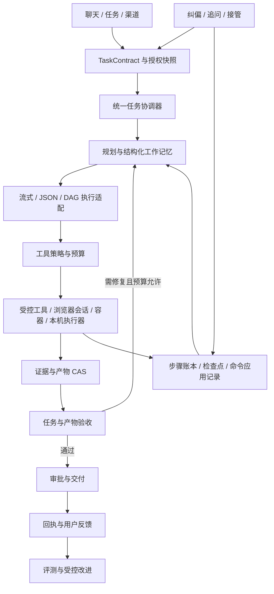

# Pivot Agent 全功能差距审查与优化改造方案

> 审查日期：2026-09-26（Asia/Shanghai）  
> 代码基线：`b43d4c4d78deb8a387860a96b03e85c53a8f662f`，发布版本 `0.1.181`  
> 方法：当前代码独立审查 + 关键路径实际测试 + 隔离边界探针 + 前沿产品官方资料核验。  
> 本文是本次全新形成的方案；未读取、引用或继承仓库既有 README、历史分析、设计方案、路线图或 docs 文档的结论。

## 0. 实施完成记录

**更新日期：2026-09-26（Asia/Shanghai）。** 本方案的全部工作包 `W01`–`W18` 已完成实现、迁移接线和自动化验证。以下审查正文保留为改造前证据，不能再被当作当前实现状态。

- 已完成 P0 可信执行闭环：宿主动态代码默认 fail-closed、沙箱能力如实标示、stdin 异常收敛、CAS 引用式检查点、可靠控制命令、硬评测门禁和统一 `TaskContract` / `VerificationReport` 完成语义。
- 已完成 P1/P2 产品闭环：工作记忆和证据、可恢复浏览器会话、受治理子任务、质量约束模型路由、技能评测推广门禁、目标/监控语义、产物批注、共享工具租约和受控只读批处理。
- 已完成 W18 可选执行面：受授权 Git 工作区的 read/search/patch/install/test/worktree/merge/abort/commit/push/PR 交付，其中搜索使用参数终止符、所有文件操作解析物理路径并拒绝符号链接/目录联接逃逸，工作树仅限 Pivot 已登记实例；Windows UI Automation 仅操作当前前台且精确匹配的授权应用，截图使用窗口渲染而非屏幕拷贝；实时语音仅在浏览器可确认设备端识别和本地语音时启用，具备句子级播报、打断、心跳、过期回收，并仅将识别文本用于当前模型请求，不保留音频、独立转写或语音轮次消息。未具备认证执行环境时全部 fail-closed。
- 验证结果：`npm run check`、`npm run lint` 全部通过；`npm run test:all` 为 **744 项通过、0 失败、0 跳过**，测试运行器为每个分组创建并清理独立 PostgreSQL schema，并覆盖真实 Chromium 浏览器夹具。发布变更、迁移和部署边界见 [v0.1.181 发布记录](docs/releases/v0.1.181-Agent可信执行闭环与W18本机执行面.md)。

真实模型、组织业务资料、外部 OAuth/IM、已打包客户端和生产凭据的运行结果取决于部署者授权，不能由仓库代码伪造。本次已把这些能力做成可配置、可拒绝和可测的运行条件；它们属于发布/运营验收输入，不是遗留开发工作包。

## 1. 决策结论

**Pivot 已有相当完整的 Agent 工程骨架，主要差距不在工具数量，而在“是否真正完成任务、遇到故障能否可信恢复、用户能否顺畅接管和修改、优化是否有真实效果证据”。**

现有代码包含自主规划、原生流式工具调用及 JSON 规划回退、DAG、审批、检查点、运行租约、事件日志与 Outbox、持续目标、模型路由、长期记忆、个人经验学习、技能签名与灰度、MCP、浏览器、本地连接器、文档产物、渠道投递及评测。应保留这些基础，进行围绕结果的整合，避免再建设一套平行运行时。

建议产品定位为：**面向企业知识、数据和办公任务的可托付 Agent 工作台**。以“带证据的研究分析—生成可编辑产物—审批后交付—持续跟进”为主线，编码和通用电脑操作作为可选执行能力。没有必要同时全面复制编码产品、办公助手和低代码平台的全部界面。

### 1.1 最重要的差距

| 优先级 | 差距 | 当前依据 | 决策 |
|---|---|---|---|
| P0 | 通用进程沙箱的声明与实际隔离不一致 | Windows 实测：设置 `networkDisabled: true` 的子进程仍可读工作区外的自建文件、访问自建回环 HTTP 服务 | 先修复隔离和能力展示，再扩大自主代码执行范围 |
| P0 | 大检查点破坏重放语义 | 超过 120000 字符后整个状态被替换为摘要；已完成调用仍返回 `replay: true`，但 `output` 可为 `undefined` | 检查点保留结构，完整输出放 CAS，恢复必须校验引用 |
| P0 | 运行中追加指令存在消费后丢失窗口 | 指令领取即设为 `delivered`，下一次仅领取 `pending`；未见运行器持久化应用确认及超时重投闭环 | 将用户纠偏、协作回复按可靠命令处理 |
| P0 | 评测硬约束可被平均分抵消 | 实测：包含禁止词时仍得 83 分并通过默认 80 分阈值 | 安全、禁止项、关键结构校验设一票否决 |
| P0（首批范围） | 模型停止输出即可能被视为任务完成 | JSON 规划器 `action=final`，以及流式无后续工具调用路径，可直接进入 `completed` | 建立统一任务验收和结果状态 |
| P1 | 浏览器缺少完整连续任务执行面 | 服务端调用每次启动、导航、单次操作、关闭；本机工具主要是 open/inspect/click/screenshot | 引入持久会话、动作前后观察、接管与恢复 |
| P1 | 多智能体“专家问答”与“独立子运行”未统一 | `agent.delegate` 是一次模型调用；真实子运行主要通过 REST API 创建 | 将 spawn/wait/message/cancel/join 做成受治理工具 |
| P1 | 长任务上下文更偏裁剪，缺少完整工作记忆 | 有聊天摘要、WorldState、检查点、长期记忆，但运行恢复只取近期观察，缺少统一决策和未完成项账本 | 结构化任务状态 + 引用式证据 + 可检索历史 |
| P1 | 质量提升缺少可信量尺 | 主 Agent 评测以包含、长度、耗时、Token、JSON Schema 为主；技能功能评测非强制 | 建立业务任务评测集、独立验收器及对照实验 |

P0 表示应在扩大自动执行或宣称生产级可信完成之前解决，不表示所有条目都是已经在生产发生的事故。本文区分实际复现、代码确认和待验证推断。

### 1.2 应保留并强化的资产

- 服务端 PostgreSQL 持久化及租约、幂等操作键、非幂等审批恢复设计。
- 工具契约、策略引擎、渐进式发现、风险与审批控制，及 Docker Worker 的默认拒绝设计。
- 长期记忆的来源、作用域、有效期、替代关系、待确认状态和检索评测。
- 技能清单、权限收敛、签名、版本、灰度及撤回机制。
- Document IR、CAS、渲染版本、本机交付授权、原子落盘和回执。
- 已有 DAG 版本治理、子工作流、迭代持久化、审批及定时触发能力。

这些能力本次均找到实际代码，不能把“需要增强”写成“尚未实现”。

## 2. 审查范围、证据与限制

### 2.1 范围

覆盖 `server/services`、`server/routes`、`server/db` 的相关实现，`desktop` 执行与交付链，`client/chat` 入口及操作界面，`tests`、测试启动器、CI 和 `package.json`。没有读取真实业务数据、用户会话、模型密钥或线上日志；没有启动真实模型计费请求，没有发送外部消息，没有修改产品代码或运行配置。

代码结构盘点如下，数量只是覆盖范围说明，不作为成熟度评分：

| 项目 | 数量 | 统计口径 |
|---|---:|---|
| Agent 服务入口文件 | 120 | `server/services/agent*.js` |
| 核心运行器文件 | 17 | `server/services/agent-runtime/*.js` |
| Agent 路由文件 | 6 | `server/routes/agent*.js` |
| Agent 前端 JS 文件 | 34 | `client/chat/agent*.js`，含 agents 前缀 |
| 桌面 Agent Runtime 文件 | 10 | `desktop/agent-runtime/*.js` |
| Agent 命名的测试文件 | 52 | agent、autonomous-agent、desktop-agent 前缀 |
| Node 测试文件总数 | 203 | tests 下 `.test.js` |
| 浏览器 E2E spec 文件 | 2 | `smoke.spec.js`、`workflow-version.spec.js` |

这是**功能域全覆盖、关键调用链深入审查**，不是对全部代码逐行做形式化证明，也不是对线上部署做完了全面验收。

### 2.2 证据等级

- **V：实际验证**。本次运行测试或安全限定探针得到的结果。
- **C：代码确认**。阅读函数、调用方、入口和相邻逻辑确认的行为。
- **I：改造判断**。基于 C/V 与官方能力提出的产品或架构判断，不能冒充线上测量。
- **U：待验收**。需要真实数据库、模型、外部系统或完整客户端才能确认的事项。

“未发现”只指本次审查范围内没有找到完整连接路径，不等于证明任何配置或外部 MCP 都不可能提供该能力。

### 2.3 本次验证结果

1. 第一组 5 个测试文件：**20 项通过，0 失败，0 跳过**。覆盖真实 Chromium DOM/点击/截图/登录辅助、桌面运行与恢复、非幂等故障矩阵、WorldState/StepContext、工具调度。
2. 第二组 6 个测试文件：**16 项通过，0 失败，0 跳过**。覆盖重试、Python/沙箱基础行为、工具限流熔断、MCP 无状态传输、项目资料范围和管理界面契约。
3. 隔离逻辑复现：检查点截断及重放、评测禁止项平均分放行、置信度启发式、控制消息领取语义。数据库访问用替身，**不是 PostgreSQL 集成验证**。
4. Windows 通用进程隔离探针：只使用自建临时哨兵文件和本机自建 HTTP 服务，确认工作目录边界及“禁止网络”没有成为内核强制约束。
5. `runDesktopWorker` 完整 wrapper 探针两次因 `child.stdin` 未捕获的 `EPIPE` 退出，未得到该 wrapper 的成功端到端结果；后续隔离验证改为直接调用底层 `runSandboxedProcess`，两者不能混算。

共运行 **36 项已有测试**；部分是源码/界面契约测试。全部通过不意味着产品业务质量或隔离安全已通过，特别是“工作区运行”测试只验证 cwd 和路径 API，不能证明子进程不能访问工作区外文件。

未运行整套 `npm test`、覆盖率统计、PostgreSQL 多进程/故障集成测试、完整 Electron UI、外部 IM/OAuth 服务、真实模型复杂任务和生产负载。原因是本次保持读代码和隔离验证边界；`scripts/run_node_tests.js` 会加载 `.env` 并回退到 `DATABASE_URL`，其 setup 还可能创建或调整数据库扩展，不能把未知数据库当作可变更测试环境。

## 3. 前沿对标基线

核验日期均为 2026-09-26。以下为**实际获取到的官方正文**所支持的能力，不以印象、营销排名或未打开页面作为依据。各产品适用面不同，框架能力与终端产品体验分开比较，也不假设竞争产品不存在同类缺陷。

| 对标对象 | 官方可确认能力 | 对 Pivot 的意义 | 边界 |
|---|---|---|---|
| OpenAI ChatGPT/Codex 工作体验 | 长任务目标与完成标准、运行中纠偏、项目、隔离工作区、文件预览与标注修改 | 结果驱动任务、可接管、文件持续迭代 | 不同桌面/Web/CLI/IDE 表面能力不同 [O1–O3] |
| OpenAI Agent 开发能力 | 持久会话、工具与 MCP、自动上下文压缩、多智能体、程序化工具调用；SDK 自管运行循环 | 学习执行抽象与可观测边界，不必整体换框架 | API、SDK、Responses 的资源与状态语义不同 [O4–O5] |
| Claude Code | 独立子智能体上下文、专用工具与权限、技能/插件/钩子、工作树隔离、代码修改与验证 | 真正的子任务执行器、工作区隔离、完整交付验证 | Agent teams 官方仍标为实验性、默认关闭，不应作为必须立即追齐的生产基线 [A1–A4] |
| Microsoft Copilot Studio | 自然语言编排工具/知识/子智能体、缺参追问、事件触发、低代码流程、测试发布、治理分析 | 企业任务的入口统一、连接器和交付闭环 | 不同 harness 能力不同，自然语言联合创作部分为 preview [M1–M2] |
| LangGraph | 检查点、跨线程存储、持久化、重试/超时/错误处理、可恢复中断 | 校准运行时的状态和恢复契约 | 它是框架，不能据此推定终端用户体验更好 [L1–L2] |

未把未核验的产品传闻、未知版本排行、单一模型跑分或产品宣传中的“完全自主”作为改造依据。也没有把模型智力差异当作应用工程一定能够解决的问题。

## 4. 全功能能力地图与差距矩阵

“已有基础”表示已读到实现；“局部验证”仅表示相关子集经过本次测试。

| 功能域 | Pivot 当前实现 | 成熟度判断与前沿差距 | 后续方向 |
|---|---|---|---|
| 1. 对话转自主任务 | chat-agent-bridge、语义路由、会话上下文传入 | 已有基础；历史有数量/字符上限，前后台任务语义需统一 | 一个 TaskContract 贯穿聊天和任务 [C01] |
| 2. 自主规划 | 原生流式工具循环、JSON planner 回退、诊断与续跑 | 已有基础；主要是下一步决策，完成缺少独立验证 | 规划—执行—观察—验收闭环 [C02] |
| 3. 运行中纠偏 | steer/request/reply/system、运行中轮询 | 已有基础；消费确认与重投存在窗口 | 可靠指令账本和约束版本 [C03] |
| 4. 追问与人工接管 | 审批请求、控制消息、渠道交互 | 审批较完整；未见统一结构化“缺参追问”状态与恢复契约 | QuestionRequest 与 ApprovalRequest 分离 |
| 5. 长任务与恢复 | 检查点、心跳、队列恢复、超时/步数续跑 | 局部验证；大状态截断，恢复偏近期观察 | 引用式快照、可重放版本、故障矩阵 [C04] |
| 6. 后台驻留与并发 | residency、PG 租约、用户并发配额、恢复定时器 | 已有基础；真实多实例性能本次未验收 | 明确驻留的是状态还是进程，做 HA/公平性验收 [C05] |
| 7. 预算与成本 | TaskBudget、Token 记账校准、子运行预算预留 | 已有基础；预算不等于全链路成本 SLO | 总任务成本、子任务/重试/渲染统一记账 [C06] |
| 8. 多模型协议与回退 | 模型适配器、Responses 转换、原生工具能力探测 | 已有基础；不能推断所有供应商语义等价 | 按协议/模型建立能力认证矩阵 |
| 9. 模型智能路由 | fixed、vision、context、cost、load、escalate | 已有基础；价格和窗口不是能力，文本措辞不是可信度 | 用业务评测、任务类型、可靠性驱动 [C07] |
| 10. 工具发现 | search→describe→execute、release/digest 引用、ACL | 已有基础且治理严密；固定三阶段可能增加往返 | 安全缓存与少量低风险工具直达 [C08] |
| 11. 工具执行可靠性 | 统一策略、契约、检查点、读并发、写串行、退避熔断 | 局部验证；限流熔断状态为进程内 | 共享限流与资源级冲突控制 [C09] |
| 12. MCP 与 API 工具 | 标准/兼容接入、SSE、版本分支、OAuth 账户、API Operation | 部分传输验证；协议实现不等于完整生态兼容 | 握手/调用/取消/认证/通知的能力覆盖表 [C10] |
| 13. 多智能体 | 专家模型节点、结构化 handoff、子运行 API、批量委派、父子资源 | 已有基础；专家节点不等于可自主使用工具的子 Agent | 统一协作工具和任务板 [C11] |
| 14. DAG 编排 | 条件、foreach、iteration、subworkflow、审批、延时、产物嵌入 | 功能丰富；迭代子工作流有明确安全限制 | 增强自然语言生成/修复和补偿流程 [C12] |
| 15. 工作流发布 | 版本、diff、恢复、依赖、共享、发布审查 | 已有基础；功能测试与业务回放需要更强门禁 | 不可变 ReleaseBundle、测试后发布 |
| 16. 持续目标与触发 | 定时、Webhook、文件、数据库、手动，去重、冷却、失败熔断 | 已有基础；更接近反复触发任务，缺少统一目标达成判定 | 区分持续监控与有终点的目标 [C13] |
| 17. 长期记忆 | 混合检索、来源、scope、fact_key、过期、supersedes、待确认、评测 | 基础较强；效果与业务任务成功尚未打通 | 冲突解释、修改撤销、任务级增益评测 [C14] |
| 18. 工作记忆和上下文 | 聊天短期摘要、WorldState diff、预算裁剪、检查点恢复 | 已有基础；没有证据表明已形成完整语义任务账本 | 保留约束、决策、未完成项和证据引用 [C15] |
| 19. 技能与扩展 | SKILL.md 解析、包导入、能力声明、签名、版本、灰度、熔断 | 基础较强；与常见技能生态需要导入兼容层；功能评测可选 | 保留严格核心，做安全兼容和实测门禁 [C16] |
| 20. 自动学习 | 成功/反馈任务抽取 memory/skill/workflow，个人自动激活，组织候选 | 已有实现；置信度与静态校验不能证明持续增益 | 基线对照、最小样本、负收益回滚 [C17] |
| 21. RAG 与知识图谱 | 项目资料 ACL、检索融合、引用置信度、知识评测、图谱查询 | 已有基础；检索分数不等于事实可靠性 | 多源冲突核验、断言与证据对应 [C18] |
| 22. Web 研究 | 可配置搜索 Provider、网络策略、结果标准化、HTTP/浏览器 | 有工具；搜索返回标题/链接/摘要，缺少统一研究工作流 | 检索—读原文—交叉验证—引用产物 [C19] |
| 23. 浏览器操作 | Playwright、隔离 profile、DOM/视觉回调、本机授权工具 | 局部真实验证；连续会话和动作种类有限，视觉回调未见主链注入 | 会话型浏览器与视觉恢复 [C20] |
| 24. 本地文件/终端/编码 | 本地授权、文件交付、受控 Node/Python/git/rg，代码产物 | 有基础；Git 只读，无完整 checkout→edit→test→diff→PR 主链 | 办公优先；编码作为独立可选工作区包 [C21] |
| 25. 桌面自主执行 | Worker、broker、SQLite 状态库、DesktopAgentRuntime 类 | 组件存在；主进程接 broker，未见该 Runtime 类完整自主规划接线 | 服务端控制面 + 本机执行器，明确离线能力 [C22] |
| 26. 文档和产物 | Document IR、CAS、多格式渲染、产物版本、下载 token、桌面原子交付 | 基础较强；统一视觉质检及局部修改未贯穿所有产物 | 产物预览—标注—修订—验收—回执 [C23] |
| 27. 多模态和语音 | 图片上下文、图像生成/TTS Provider、浏览器语音识别 | 有局部能力；未见低延迟双向实时语音或通用 OS GUI 主链 | 先做截图理解/办公视觉校验，实时语音后置 [C24] |
| 28. 渠道和通知 | Web/Webhook/IM/email，企业微信/飞书/钉钉，Gateway、附件、重试死信 | 已有基础；不同渠道能力和回执需认证 | 做官方连接器兼容矩阵及失败可修复路径 [C25] |
| 29. 权限与企业治理 | 用户/租户/团队、ACL、技能权限、凭据、审批、审计 | 已有基础；底层隔离与权限 UI 语义需一致，聚合报表作用域需专项验收 | 同一授权快照覆盖全部执行面 [C26] |
| 30. 可观测、评测与体验 | trace、事件回放、上下文窗口诊断、质量面板、onboarding | 工程观测丰富；业务成功指标偏弱，端到端验收有限 | 以任务成功和交付正确性为主指标 [C27–C29] |

## 5. 已确认的关键问题与修复设计

### F01 / P0：通用进程沙箱不是完整文件与网络隔离

**证据 C+V。** `agent-sandbox.js:113` 通过 cwd、路径解析和资源控制启动进程。`agent-os-isolation.js` 在 Windows 主要建立 Job Object 内存约束；没有看到限制子进程文件系统访问的受限 token/AppContainer/等价边界，也没有网络阻断实施。Linux 的 cgroup 主要管资源，网络 namespace 在无法使用且非 strict 时可降级；没有看到通用进程的完整挂载隔离。路径解析函数只约束调用它的文件 API，不能约束 Node/Python 脚本自行调用系统接口。

本次 Windows 底层探针返回：

```json
{
  "code": 0,
  "stdout": {"outsideWorkspaceRead": true, "networkConnected": true},
  "isolation": {
    "platform": "win32", "strict": false,
    "osIsolation": "windows-job-object",
    "networkIsolation": "policy-enforced"
  }
}
```

仅读取了本次创建的哨兵文件并连接本次创建的本机服务；没有读取真实用户文件、接触真实凭据或访问外网。它证明该路径当前不能兑现工作区/禁网隔离，**不证明未审批者能绕过 Electron 审批**。完整 broker 路径本次失败于 EPIPE，不能把底层成功当作桌面 UI 全链路攻击复现。

`desktop/main.js:669` 的审批提示写“网络：禁止”，但 worker/broker 使用上述通用 runner，构成值得优先消除的语义不一致。另一方面，`agent-terminal-runtime.js` 默认要求已启用、摘要锁定的 Docker Worker；容器有 `--network none`、非 root、只读根、cap drop 等边界，应保留这个默认拒绝机制，不能简单说“所有终端都没有隔离”。

**改造：**

1. 将执行器能力分成 `enforced`、`best_effort`、`unavailable`，返回具体文件、网络、进程、资源隔离证明；禁止仅据平台名称显示“已隔离”。
2. 服务端动态代码统一进入现有容器 Worker；宿主进程 runner 仅运行平台信任代码。生产构建拒绝 unsafe-local 开关。
3. Windows 桌面优先提供受限执行环境或远程受控 Worker；若不能做到强制隔离，禁用任意脚本入口或明确只允许信任脚本，不能以“用户批准一次”替代隔离。
4. Linux 补足 mount/user/network namespace 或容器边界；隔离准备失败必须在脚本开始前停止，不能静默降级。
5. Worker stdin、隔离 helper 启动/失败、子进程树退出必须归一成可捕获的结构化错误。

**验收：** 自动化测试拒绝读取/写入根外哨兵、拒绝直连回环/局域网/公网、拒绝派生进程绕过；取消与超时后无遗留进程；隔离缺失时不执行第一条脚本。采用自建 fixture，不接触真实敏感数据。Windows/Linux 分开验收。

### F02 / P0：大检查点截断会损坏已完成工具的重放结果

**证据 C+V。** `agent-checkpoints.js:18` 将超长状态整体改写为 `{truncated, summary, originalLength}`。`beginAgentToolCheckpoint` 对 completed 状态直接使用 `state.output` 重放。隔离复现使用 130000 字符输出，得到：

```text
serialized state keys = truncated, summary, originalLength
replay = true
output === undefined = true
```

这不是“少了一点日志”：下游可能把已经完成的查询当成无结果，或丢失产物定位信息。`buildAgentResumeContext:149` 另只取最近 80 条检查点、最多 20 条观察和 5 条错误，是上下文策略，不能替代完整状态存储。

**改造：** 保留检查点 envelope：run/step/tool/operationKey/inputHash/status/schemaVersion/outputRef/outputDigest/outputSummary/commitState。完整输出使用已有 CAS；小输出可内联，超限仅外置 output，不改变 envelope。读取时验证归属、digest、schemaVersion；引用缺失返回 `RECOVERY_OUTPUT_MISSING`，不能静默回放 `undefined`。普通 `recordAgentCheckpoint` 吞错返 null 的分支须区分可丢遥测与必需恢复状态，关键检查点失败应阻止提交成功状态。

外部副作用采用 `prepared → dispatched → confirmed / uncertain`。出现 uncertain 先查询外部回执或请求人工处置，不把重新审批等同于确认之前没有成功。幂等键、审批有效期和参数摘要沿用现有机制。

**验收：** 10 KB/120 KB/1 MB/10 MB 输出恢复语义一致；在外部成功但本地提交前、CAS 写入前后、审批后宕机；确保不自动重复副作用，也不丢失已完成输出。保留旧版小检查点读兼容；旧版截断数据只能标记不完整，不能编造恢复。

### F03 / P0：用户纠偏和协作回复缺少可靠应用确认

**证据 C，数据库替身 V。** `agent-control.js:145` 领取 pending 后改为 delivered；运行器把结果加入内存 conversation/observations。代码有 ack API，但本次全链检索未发现运行器在应用后调用该确认，也没有看到 delivered 未确认消息的租约重投。替身复现第一次领取 1 条、第二次 0 条，期间未 ack。

若在领取之后、持久化应用之前进程崩溃，诸如“不要发送，先给我预览”的新要求可能留在 delivered 而不再进入恢复任务。它比丢一条 UI 通知更严重。`serializePayload` 复用 trace 脱敏，字符串可能被 `redactTraceValue` 截到 2000 字符；审计展示裁剪不应改变用户指令原文。

**改造：**

- 指令采用 `pending → claimed → applied → acknowledged`；claimed 带 owner、lease_until、attempt。
- 持久化 `appliedCommandIds` 和 `constraintRevision` 与步骤决策在同一事务/提交协议完成，再 ack；过期 claimed 可重投，应用幂等。
- 指令内容原文受权限与加密保护；展示摘要另存，不复用截断后的审计值做执行输入。
- 用户新约束要更新 TaskContract；写操作执行前检查约束版本，避免执行已过时的计划。
- 子任务回复使用 evidence/artifact 引用，区分用户指令与代理结果的信任级别。

**验收：** claim 后立即 kill、重复送达、乱序 reply、并行取消、长指令、网络重连；同一指令最多应用一次且最终不丢，终止/禁止动作在下一可安全执行边界生效。不能声称可回滚已经在外部发生的不可逆动作。

### F04 / P0：评测器可错误放行禁止项和无质量约束结果

**证据 C+V。** `agent-evaluations.js:311` 将所有规则通过数平均计分，默认阈值 80。

- `completed + 任意非空文本 + 空 assertions` → **100 分、passed=true**。
- output=`A B C D FORBIDDEN`，requiredPhrases=`A/B/C/D`，forbiddenPhrases=`FORBIDDEN` → 5/6，**83 分、passed=true**。

第二项是明确的门禁设计缺陷；第一项说明该配置只测“有回答”，不能衡量任务质量。不能将这类分数对外称为智能体准确率。

**改造：** 硬门禁与软分分开。权限、禁止内容、必需产物、关键 schema、外部副作用次数、关键事实/数值等标为 hard；任一失败即整体失败。没有业务断言的用例标 `smoke_only`，不进入质量通过率。软评分用于表达、完整度等维度；LLM judge 使用证据和 rubric，并需人工校准，不能取代程序化核验。

**验收：** 上述两种输入分别为“仅冒烟，非质量通过”和“硬门禁失败”；长文本堆关键词、虚构引用、正确文字但错误附件、格式正确但数据错误均有反例测试。

### F05 / P0 首批：任务完成缺少统一可执行验收

**证据 C。** JSON 路径 `run-execution.js:530` 在 `action==='final' || !plan.tool` 后直接完成；流式路径 `agent-streaming-runtime.js:484` 同样可以将回答终止映射为 completed。当前有内容校对节点、DAG 输出契约、产物渲染校验，但它们并未形成所有任务必须经过的统一结果验收。

**改造：**

1. 新建任务时产生 TaskContract：目标、约束、必需交付物、证据、验收规则、授权、预算、停止条件；简单问答使用轻量契约，不强迫用户填长表。
2. 模型提出完成意图后先进入 `verifying`；确定性检查先行，再按需做独立内容审查。
3. 统一输出 `verified`、`partial`、`needs_input`、`blocked`、`failed`；保留旧 completed 字段兼容，另设 outcome_status，避免一次大迁移破坏全部消费者。
4. 缺文件、数据不符、引用不存在、等待子任务时不能宣称已完成。可修复且预算允许则进入 repair；限定次数，不能无限自我审查。
5. `agent.content_review` 是业务内容校对器，可复用部分能力，但不是通用验收器本身。

**验收：** “生成含三张表的报告并保存”必须检查产物、结构、数据来源和交付状态；“总结知识库”要检查引用；纯问答不引入不必要外部动作。服务端 JSON、流式、DAG 和本机执行结果使用相同验收服务。

### F06 / P1：沙箱输入管道错误可能导致进程直接退出

本次在独立 Node 宿主和 Node REPL 宿主尝试 `runDesktopWorker` 均观察到未捕获 `Error: write EPIPE`，位置 `agent-sandbox.js:247` 的 `child.stdin.end(...)`。代码给 child 本身和 stdout/stderr 绑定了处理器，没有给 stdin 的 error 做同等收敛。**当前证据确认未处理的输入管道异常及本次复现；子进程提前退出的根因和安装包复现范围仍待验证。**

改造需在写入前绑定 stdin error、与 close/error/timeout 用单一 settle 状态收敛，并保存退出码及必要的非敏感 stderr。验收应包括命令缺失、子进程启动即退出、大输入、取消与写入竞态；不得让执行器错误杀死整个宿主。

## 6. 面向前沿体验的系统性改造

### 6.1 浏览器：从单次工具变为连续可恢复任务

**当前边界。** `agent-tools.js:853` 每次创建 browser context、新建页面、导航 URL、执行 inspect/click、返回正文前 12000 字符、finally 关闭。隔离 profile 可保留部分浏览器状态，但不等于跨步骤保持页面、标签和 JS 状态。本机 `local-browser-automation.js` 也按调用打开/导航/操作/关闭。服务端 `visionLocator` 为注入回调，本次找到使用点和测试替身，未找到运行器主链实际提供该回调。不能据接口存在就认定已具备视觉自动恢复。

**目标设计。**

- `BrowserSession` 与 user/tenant/run/device 绑定，提供 sessionId、tabId、navigationRevision 和租约；启动/恢复/关闭走生命周期管理。
- 工具补齐 snapshot、navigate、click、fill、select、scroll、wait、上传/下载受控交付、标签切换。浏览器支持范围对用户可见。
- 先基于 DOM/可访问性树定位，失效后才用视觉模型；每次视觉定位引用截图 digest 和页面版本，执行后复查页面状态。
- 登录、验证码、强身份验证走接管；授权作用域可覆盖同一站点内低风险连续读取，敏感写入仍逐笔或按明确事务授权。
- 长任务暂停时保留可恢复状态；恢复不承诺任意网页内部状态可完全复原，必要时从已确认步骤重新建立页面。
- 页面文本、截图及下载文件作为不可信证据；任何网页里的“忽略规则”“上传其他文件”等内容不能扩张工具权限。

**验收任务。** 登录后多页检索、填写但不提交、审核后提交、分页导出、DOM 变化、浏览器重启、人工接管后继续。记录人工介入次数、首次有效动作时间、完成率与重复提交次数。通用 OS 原生应用控制另立执行器，不能把 Playwright 扩展名换成 computer-use 就宣称具备。

### 6.2 多智能体：统一专家节点和独立执行子任务

**当前边界。** `agent.delegate` 文案已明确“一次独立模型运行”，实现是 `callModelText`/结构化输出与一次 JSON 修复。真实子运行具备 parent_run_id、资源预留、forkHistory、输出校验、completion reply，以及 batch API。两套机制适用场景不同，问题在于自主主循环没有看到统一的子任务工具入口，而不是没有协作代码。

**目标设计。**

| 原语 | 语义 | 不可省略的约束 |
|---|---|---|
| `agents.spawn` | 创建可自行用工具的持久子任务 | 权限只能收敛、预算预留、最大深度、去重键 |
| `agents.wait` | 等待状态变化，不用模型空转轮询 | 释放执行槽、恢复游标、父任务 deadline |
| `agents.message` | 发送补充任务、纠偏、结果引用 | 可靠投递、类型化来源、同一授权树 |
| `agents.cancel` | 取消某子树 | 中止可取消工具，对 uncertain 写入不伪装撤回 |
| `agents.join` | 校验子任务结果并汇总 | 必需任务完成、证据完整、冲突显式呈现 |

复用 `agent-collaboration`、`agent-run-resources` 和修复后的 control，不再新增平行队列。DAG 的专家节点保留为低成本“专家分析”，UI 明确与“自主子任务”不同。主任务默认只在工作可独立、收益可解释时并行；不是默认每个请求都启动多个角色。

为写文件/编辑产物的子任务增加隔离工作区或 artifact 分支，以及资源级写锁与合并审查；只读研究可共享证据引用。给父任务保留调度槽，避免“父任务占满执行配额又等待子任务”的饥饿。Schema 修复子任务复用现有一次修复机制，但需计入总预算。

验收包含 4 个子任务并行、1 个失败、1 个超时、父任务取消、结果冲突、共享文件竞争、预算不足。对比单 Agent：在质量不下降前提下测量耗时和成本，未见收益就不自动选择团队模式。

### 6.3 上下文：用工作记忆连接聊天、规划和恢复

不能将现状描述为“没有摘要”或“没有长期记忆”：`server/llm.js` 已有短期聊天压缩（提示要求约 300 字摘要），长期记忆也有多项治理。差距是这些状态没有成为一个覆盖长任务的可靠语义对象。

建议把上下文分成四层：

1. **权限与环境状态**：继续使用不可变 StepContext/WorldState，包含授权、工具版本、模型和工作区。它描述“能做什么”。
2. **任务工作记忆**：TaskContract、已完成里程碑、未完成项、决策、用户纠偏、下一步、失败假设。它描述“还要做什么”。
3. **证据与产物**：正文、表格、工具原始结果进 CAS；上下文只放摘要和可检索引用。它描述“为何这样判断”。
4. **长期用户记忆和技能**：经 scope、来源、有效性过滤后作为参考，不能覆盖当前明确用户要求。

压缩不再只做裁字：先把新发现更新到工作记忆，验证保留所有硬约束，再压缩聊天叙述；留出工具与最终交付预算。提供按 evidenceId 读取原文的能力，避免把“已看过但被截断”的证据当作不可恢复信息。

**验收：** 在 100 步和多次恢复任务中，最初的禁止项、关键数据、输出要求仍保留；每次压缩后检查约束 ID 和 evidence 引用，不以摘要字数作为成功标准。基于真实 Token usage 校准估算，图片 Token 单独统计。

### 6.4 工具层：保持治理，减少机械往返

所有规划工具被收敛成 search/describe/execute 是合理的大目录策略，且当前依赖 release/digest 防止契约漂移。但是第一次发现一个工具通常需要多个模型往返；没有端到端时延数据前，不能直接宣称慢了多少。

优化分三步：

- 按 `(tenant, user/role revision, tool release/digest, capability revision, run policy)` 缓存已授权描述；恢复时验证版本后继续使用，权限撤销立即失效。
- 对稳定、低风险、常用的少量工具提供直达菜单；管理员/用户明确禁用者不进入菜单，高风险及陌生工具仍发现后执行。
- 增加受限程序化编排能力：只暴露经治理的只读工具函数，禁止直接文件/网络/进程权限；适合批量读取、过滤、汇总，结果压缩回模型。写操作默认保持直接调用和明确审批。这与官方程序化工具调用的边界一致 [O5]。

不要直接把现有 `agent.code`、Node VM 或 foreach 等同于安全的程序化工具调用。动态程序必须通过每一次工具的 PEP、预算、trace 和取消检查。

MCP 方面保留当前 Streamable HTTP/SSE/无状态分支与 conformance 脚本，但建立真实覆盖表：initialize、tools/list、tools/call、错误、取消、通知、分页、重连、凭据刷新、协议版本协商；resources/prompts/sampling/elicitation 等按产品需求单独标“支持/拒绝/待实现”。**本次未核验 MCP 官方最新规范，故不宣称仓库的某个协议版本字符串代表已全面合规。**

### 6.5 模型路由：从价格启发式升级为质量约束路由

`model-router.js` 的 auto-cost 比较输入/输出单价之和，auto-escalate 以更高价格或更大窗口判断“更强”，`assessConfidence` 主要检查长度、终止原因和不确定措辞。隔离探针中，一段长度足够、语气肯定的虚构完成报告得到 `confident:true`。这是启发式局限，不能当作模型正确概率。

建议为每个已配置模型维护经过测试的 CapabilityProfile：工具调用、结构化输出、视觉、上下文、中文/领域表现、p50/p95 延迟、失败率、任务类型通过率、输入/输出/缓存价格及样本数。

选择策略为“满足硬能力和质量下限 → 估算本任务总成本与时延 → 选择候选”。升级信号来自验收失败、工具协议失败、证据缺失、任务风险，不只来自“我不确定”。价格缺失不能默认为最便宜；窗口未知不能默认为无限。保留用户固定模型意图和供应商/数据地域限制。

用同一冻结业务集比较策略，记录选型原因、候选排除原因与回退链。不建议在没有代表性反馈数据时先引入强化学习或复杂 bandit；先做可解释、可回放的规则和离线标定。

### 6.6 技能和自动学习：证明有效后再推广

`agent-releases.js:210` 在未给 evaluationRunId 时使用 `passed:true, fixedSuite:'skill-platform-declarative'`；`agent-skill-validation.js` 的静态沙箱主要检查 staging 目录可访问，不执行技能任务。自动学习在满足设置、置信度、静态校验后可以个人自动激活。这些是供应链和结构合规能力，不能证明业务效果。

建立四道门禁：

1. **来源与权限**：保留现有签名、能力收敛、供应链检查。
2. **可运行**：任务 fixture、工具 schema、参数绑定、失败路径可运行。
3. **有效性**：同一输入做无技能/旧版本/新版本对照，测真实验收、成本和误动作。
4. **推广**：个人草案→小范围 canary→团队发布，任何硬规则失败立即停用；无统计证据时不得以“自我提升”对外宣传。

个人自动激活可继续保留为用户选择，但必须有明确最低样本数、成本上限、反例集和快速回退；默认不将一次看似成功的轨迹泛化成所有任务的策略。对知识事实采用 pending 与来源核查；对流程采用 draft；对技能采用版本化验证。`findBestPersonalSkill` 当前词项/bigram 匹配可升级为检索+适用条件校验，先在影子模式比较，不直接替换。

导入常见 SKILL.md 时提供预览和权限映射：外部字段不足时进入“待补全草案”，禁止以兼容为由放宽执行权限。hooks 如新增，默认声明式或在同等隔离下执行。

### 6.7 研究与知识：从检索结果走到断言证据链

现有 RAG 有融合排序、反馈、引用置信度和检索/引用评测，这是优势。Web Search 则主要标准化搜索结果，最高 10 条、摘要最高 2000 字符；不能把摘要汇总当成读过原文的研究结论。

增加 ResearchPlan 与 EvidenceItem：来源 URL/文件/知识条目、访问时间、发布/更新日期、原文片段、位置、digest、ACL、可信等级、对应断言、反证。允许按任务需要做多轮搜索、读原文、交叉验证和冲突披露；对知识库资料变更或 ACL 撤销，在交付前复核授权。

验收不只看“有没有引用”：检查引用是否可访问、片段是否支持断言、数据日期是否符合“最新”、重要结论是否有独立来源，以及无证据时是否正确保留不确定性。保留已实现的检索 Recall/MRR/NDCG、引用精确率等指标，新增任务最终事实正确率。不能把检索相似度直接展示为答案可信度。

### 6.8 持续目标：区分监控、定时执行和有终点的工作

现有 goal 的 trigger/budget/cooldown/maxFailures/claim 租约和渠道结果投递较完整，但 `recordAgentGoalRunOutcome` 主要累计成功失败，不是在证明业务目标已经实现。

- `scheduled_job`：按日历生成独立任务，如每周报告。
- `monitor`：检测变化，未变化不通知；记录 lastObservation、去重键、阈值和静默策略。
- `goal`：有明确达成条件和终止标准，可拆里程碑，达到验收后结束。

三者复用调度设施，对用户使用相应语言，不要求用户理解 residency 或 run。增加 missed-run/backfill 策略、触发风暴合并、冷却原因可见、暂停与预算到期语义。通知按变化/完成/失败/需要操作触发，防止每次心跳都生成噪声。

### 6.9 产物交付：把已有底座做成连续创作体验

已有 Document IR、不可变 CAS、渲染器版本、下载 token、输出目录 grant、原子写入和 written manifest；不建议另写一套“文件生成器”。

补齐统一 `ArtifactManifest`：产物 ID、格式、版本、源数据与 evidence、render status、verification status、delivery status、可编辑性、预览 URL、生成工具版本。重点能力：

- 在任务结果旁直接预览文档、表格、幻灯片、PDF、图表和 HTML，并清楚区分草稿、验收通过、已保存。
- 标注页面/段落/单元格/幻灯片后发起局部修订，修改指定产物版本，不重新生成无关部分。
- 根据类型调用校验器：数字与公式、缺字体/溢出/分页、链接和图片、可打开性、引用一致性。
- 自动视觉检查只在需要时运行；版式问题回到修复，输出校验报告。
- 交付成功依赖接收方或本机回执；生成成功不等于用户电脑已保存。

验收覆盖“正确文字+错误附件”“下载成功但格式损坏”“重试覆盖错误版本”“同名文件冲突”“局部修改后其他页被破坏”等反例。对照 [O3] 的预览标注体验，不承诺所有格式首期支持同等精度。

### 6.10 终端、编码、桌面与多模态的取舍

当前 `terminal.runtime` 只允许 node/python/git/rg，Git 仅 status/diff/log/show；这适合受控分析，不能对标完整编码产品。`DesktopAgentRuntime.execute` 接收计划数组或外部计划函数；主进程目前连接的是 Worker broker。本次未找到该类与桌面主入口的完整自主模型循环接线，因此“代码有 Runtime 类”不等于“离线个人 Agent 可直接使用”。

建议首期统一：**服务端负责模型、任务和治理，本机负责经授权的受控执行和交付**。随后按实际需求增加 WorkspaceProvider：仓库 checkout/worktree、read/search/patch、依赖安装、测试、diff、commit/PR，每项都在已验收隔离内运行。不要为追赶编码产品直接放开主机 Shell。

图片理解、截图核验、图像生成/TTS 可继续接入已有 provider；浏览器 SpeechRecognition 是语音输入，不是实时语音 Agent。低延迟双工音频、打断、持续视频理解和通用 GUI 操作可作为 P2/P3 增强，需明确平台支持和隐私/授权状态，不应挤占可靠性主线。

### 6.11 企业治理与可观测

保留 tenant/team/ACL、签名、trace、事件回放和已有租约。增强点：

- 所有执行面共用 authorization snapshot + policyRevision；授权撤回不等待任务自然结束。
- `tool-execution-guard.js:56` 的 Map 是进程内限流/熔断，多实例会按实例放大下游负载。保留本地快速保护，再叠加按租户/连接账户/供应商的共享并发租约及限流。
- 工具输出、网页、RAG、记忆、用户指令和代理回复使用明确来源与信任标签；外部内容不得成为授权依据。敏感外发前做目标/数据范围校验。
- 审计脱敏既要覆盖字段名也要处理正文中凭据模式；执行原文与展示摘要分离，限制保存期限和访问权限。
- 已有 traceparent 传递，应继续扩展统一 trace/run/step/tool/artifact/delivery 关联；OTel 导出是可选集成，而不是重写现有 trace。
- `agent-quality.js` 的成功率基于 completed，空样本返回 1，应显示“无样本”；把执行完成率与业务验收通过率分开。聚合查询有 `tenant_id IS NULL OR ...`、管理员 approvals 聚合不带同等租户筛选，应做租户角色语义专项验证；**未做真实双租户复现，本文不把它直接定性为已证实数据泄露。**

## 7. 目标架构与数据契约

### 7.1 架构原则

采用渐进改造：保留 PostgreSQL、现有队列、工具策略、CAS 和前端工作台。新能力以清晰契约接入现有运行器；先共用校验器和持久状态，再考虑收敛循环实现。没有证据证明整体迁移 LangGraph/Agents SDK 比修复当前系统更划算。



### 7.2 核心契约

| 契约 | 必需字段 | 接入位置 |
|---|---|---|
| TaskContract | schemaVersion、goal、constraints、acceptance、deliverables、evidenceRequirements、authorizationRef、budget、stopPolicy、revision | run-creation、chat-agent-bridge、goals、DAG |
| WorkingState | milestones、completedWork、pendingWork、decisions、openQuestions、evidenceRefs、appliedCommandIds、revision | planner、streaming、checkpoints |
| OperationReceipt | operationKey、inputDigest、effectType、dispatchState、externalReceipt、resultRef、commitAt | tool-orchestrator、checkpoints、channels |
| CommandEnvelope | sourceType、messageId、constraintRevision、claimLease、appliedAt、ackAt、payloadRef | agent-control、协作、渠道 |
| EvidenceItem | owner/tenant/scope、source、timestamp、locator、digest、excerpt、trustLabel、claimIds | RAG、Web、工具、产物 |
| VerificationReport | taskRevision、verifierVersion、hardFailures、softScores、evidenceRefs、artifactDigests、outcome | 完成入口、评测、发布门禁 |
| ExecutionEnvironment | provider、workspaceRef、file/network/process/resource enforcement、probeVersion、lease | worker、terminal、browser、desktop |
| ArtifactManifest | artifact/version、renderRef、sourceRefs、verificationRef、deliveryState、receiptRef | artifacts、renditions、delivery |

TaskContract 示例，强调可以自动生成，不要求普通用户直接编辑 JSON：

```json
{
  "schemaVersion": 1,
  "goal": "根据本周项目数据生成风险周报，审核后发送到指定渠道",
  "constraints": [
    {"id":"c1", "text":"仅使用项目 A 已授权资料", "hard":true},
    {"id":"c2", "text":"未经审批不得发送", "hard":true}
  ],
  "deliverables": [{"kind":"docx", "required":true}],
  "acceptance": [
    {"type":"artifact_openable", "hard":true},
    {"type":"required_sections", "value":["风险","依据","负责人","建议"], "hard":true},
    {"type":"citation_support", "hard":true}
  ],
  "stopPolicy": {"repairAttempts":2, "onMissingData":"needs_input"},
  "revision": 1
}
```

### 7.3 数据库与 API 演进

优先复用 `agent_runs`、`agent_run_checkpoints`、`agent_control_messages`、`agent_run_resources`、CAS 和 artifact 表。建议新增字段/子表如下，最终以迁移设计和容量测量为准：

- runs：`task_contract`、`contract_revision`、`outcome_status`、`verification_id`。
- checkpoints：`schema_version`、`output_ref`、`output_digest`、`commit_state`、`environment_ref`，保留旧 state 兼容。
- control：`claim_owner`、`claim_until`、`attempt`、`applied_at`、`applied_revision`、`payload_ref`。
- `agent_verifications`：不可变验收报告与 verifier 版本。
- `agent_evidence_items`：证据元数据和 ACL，正文在已有 CAS。
- `agent_browser_sessions`：会话、设备、租约、最近可恢复状态，不持久化明文凭据。

新 API 例：`POST /agents/runs/:id/questions/:qid/answer`、`GET /agents/runs/:id/verification`、`POST /agents/runs/:id/verify`、`GET /agents/runs/:id/evidence`。模型可调用的协作接口通过工具目录暴露，复用既有 delegate REST 实现。

写入需要幂等键、输入/版本摘要、权限检查与审计；状态提交用事务/CAS，不把日志写成功当作业务提交。API 不向用户暴露内部 prompt、密钥或未经授权的跨租户对象。

### 7.4 迁移与兼容

1. 添加字段和新表，不先删除旧字段；旧 run 的 outcome 为 `legacy_unverified`，不能回填成 verified。
2. 新旧执行路径双写摘要、引用与 outcome，影子运行验收但暂不阻止低风险旧任务。
3. 为关键恢复读路径加 schemaVersion；已有截断 checkpoint 标记不可完整恢复，不能自动执行可能有副作用的步骤来“补数据”。
4. 先对新建任务开启严格验收和可靠命令，再逐步覆盖常驻任务、渠道与 DAG。
5. 回滚关闭新策略入口、保留新增数据，不降级已加强的隔离或授权边界，不回滚外部已发生动作。
6. 运行中的任务钉住模型配置、工具 release、workflow version 和验证器版本；升级后继续使用原契约或明确迁移。

## 8. 产品交互改造

### 8.1 统一任务入口，渐进暴露高级能力

当前已存在聊天、个人工作台、自动化任务/工作流/控制台、onboarding、Harness 诊断和高级设置。不要简单推翻现有导航；将用户的主要旅程收敛为：

**提出目标 → 查看计划/必要追问 → 自动执行并可纠偏 → 查看证据和产物 → 批注修订 → 审批交付 → 持续跟进。**

新建任务默认只显示目标、资料和交付方式。系统自动给出可执行计划、权限范围、预算预估和环境缺口；只对会影响执行的缺参提问。模型路由、租约、trace、运行模式等放在可展开区域。当前 onboarding 主要收集档案，应追加“一次成功交付”的引导，而不是把填写档案当作首用成功。

### 8.2 用户看到的状态

| 内部复杂状态 | 用户主状态 | 需要提供的操作 |
|---|---|---|
| queued / planning | 准备中 | 查看计划、修改目标、取消 |
| executing / observing / replanning | 进行中 | 追加要求、查看产物、暂停/取消 |
| awaiting input | 需要你补充 | 回答问题、附资料、调整范围 |
| approval_required 等 | 等待批准 | 看具体动作/对象/数据、批准或拒绝 |
| verifying / repairing | 检查结果中 | 查看检查项与已发现问题 |
| execution done but delivery pending | 已生成，待交付 | 预览、修改、选择交付 |
| verified + delivered | 已完成 | 查看结果与回执、继续修改 |
| partial / blocked | 部分完成 / 暂时无法继续 | 已完成内容、明确原因、下一步 |

用户说“改成按部门分组”应更新当前任务约束，界面显示已接收及何时生效；不能仅出现一条 toast。取消需要说明哪些结果保留、哪些外部动作已经完成，但不能宣称未执行的撤回。

### 8.3 四条标杆旅程

1. **有依据的项目周报**：指定知识库/数据源→检索→数值核对→DOCX/PDF 预览→批注→审批后交付。
2. **持续风险监控**：自然语言创建→预览时间/范围→检测变化→无变化静默→变化时证据通知→一键查看和暂停。
3. **跨网站资料研究**：搜索→读原文→登录接管→多页证据→冲突核验→带引用交付。
4. **并行研究和复核**：主任务划分独立子任务→展示进度和成本→审阅者指出冲突→主任务验收后交付。

编码工作区和通用电脑控制进入可选扩展，不占据首屏主流程。每条旅程先录制人工基线和现有版本基线，再测新版本，不能只看开发者演示成功一次。

## 9. 迭代路线与工作量

以下为粗估规划，假设 **2 名后端 + 1 名前端 + 1 名测试/平台工程师**，可交叉承担工作；1 人日按 1 人专注工作 1 天估算。没有团队实际速度数据，排期不是承诺。4 人、12 周理论上限约 240 人日，考虑维护和沟通后需按低端范围控制范围；超出即延长或裁剪，不能同时承诺下表所有高端估算。

### 9.1 工作包

| ID | 优先级 | 工作包与主要代码落点 | 粗估人日 | 依赖 | 完成标准 | 实施状态与证据 |
|---|---|---|---:|---|---|
| W01 | P0 | 通用沙箱能力探测、生产降级封堵、Windows/Linux 强制边界；sandbox/os-isolation/worker/broker/main | 12–20 | 无 | F01 跨边界反例全部拒绝，UI 描述一致 | 已完成：宿主执行器标为 best-effort，要求 enforced 时 fail-closed；桌面 Worker 未具强边界即拒绝任意脚本。 |
| W02 | P0 | 检查点 envelope + CAS outputRef；checkpoints/tool-orchestrator/blob-store | 6–10 | 无 | 超大输出精确恢复，uncertain 副作用不自动重放 | 已完成：CAS `outputRef`、digest、uncertain 状态和恢复拒绝语义；超大输出恢复测试通过。 |
| W03 | P0 | 可靠控制指令、claim lease、原文与审计分离；control/run-execution/streaming | 5–8 | W02 接口 | 崩溃后纠偏不丢，重复投递幂等 | 已完成：`pending → claimed → acknowledged`、租约回收、任务契约 revision 与工作状态原子更新。 |
| W04 | P0 | 评测硬门禁、smoke_only、无样本展示；evaluations/quality/client | 3–5 | 无 | 禁止项不可被平均分抵消 | 已完成：禁止项/结构规则硬失败，空断言为 smoke-only，面板不以空样本显示 100%。 |
| W05 | P0 | stdin/worker/helper 错误收敛与退出测试 | 2–4 | W01 | EPIPE/提前退出不杀死宿主 | 已完成：stdin、close、timeout、abort 使用单一 settle，桌面 Worker 安全回归通过。 |
| W06 | P0→P1 | TaskContract、VerificationReport、统一完成门禁；run-creation/JSON/streaming/DAG | 12–20 | W02/W04 | 三种服务端执行模式完成语义一致 | 已完成：三条完成路径先进入 verifying，再写 verified/partial/needs_input 验收报告。 |
| W07 | P1 | WorkingState、约束保留压缩、历史证据检索 | 10–16 | W02/W03/W06 | 多次压缩/恢复仍保留硬约束 | 已完成：结构化工作状态、控制指令去重、观察证据和规划提示接线。 |
| W08 | P1 | BrowserSession、连续动作、接管、DOM/视觉回退 | 12–20 | W01/W03 | 代表性多页任务可恢复，无重复提交 | 已完成：持久会话、标签、DOM 快照、填写/选择/滚动/等待与密码字段接管限制。 |
| W09 | P1 | spawn/wait/message/cancel/join 与父子调度 | 10–16 | W03/W06 | 真正工具型子 Agent、预算和取消可控 | 已完成：五个受治理协作工具、直接子树校验、预算继承和取消传播。 |
| W10 | P1 | 业务黄金集、独立验收器、trace 对照、CI 质量门禁 | 10–16 | W04/W06 | 版本变化有可复现质量报告 | 已完成：持久评测批次、独立验收、质量画像、对照摘要与 CI 回归门禁。 |
| W11 | P1 | 统一产物预览、批注、版本修订和交付回执 | 12–20 | W06 | 产物修订和交付形成完整旅程 | 已完成：产物版本、CAS rendition、交付回执、用户批注与处理状态。 |
| W12 | P1 | 技能有效性评测、影子匹配、学习 canary/回退 | 8–12 | W10 | 改进有基线证据和负收益停止机制 | 已完成：自动激活必须具备完成的冻结评测、至少 5 个用例及 85% 通过率；否则保留草稿。 |
| W13 | P1 | 目标/监控语义、静默通知、missed-run 策略 | 6–10 | W06/W10 | 监控未变化不打扰，达成目标可结束 | 已完成：scheduled_job/monitor/goal 语义、变化 digest 静默和达成后结束。 |
| W14 | P2 | 工具描述缓存、直达工具、程序化只读批处理 | 6–10 | W01/W10 | 减少往返且权限与质量不退化 | 已完成：同一运行内描述缓存与 `tools.batch_read`，仅允许已描述的无副作用幂等读取。 |
| W15 | P2 | 质量约束模型路由与成本 SLO | 6–10 | W10 | 冻结测试集成本改善、质量非劣 | 已完成：按任务类型记录模型验收画像，`auto-quality` 仅在最低样本量后选用。 |
| W16 | P2 | 共享限流、HA 演练、trace 导出、租户报表审查 | 8–14 | W02/W03 | 多实例配额不按副本数放大 | 已完成：PostgreSQL advisory-lock 共享工具租约、过期回收及质量面板双用户作用域测试。 |
| W17 | P2 | 首用交付引导、移动布局、可访问性/键盘操作 | 5–8 | W11/W13 | 首次成功交付和错误自助修复可测 | 已完成：任务状态/验收/证据视图、个人工作台引导与现有移动/键盘契约进入回归集。 |
| W18 | P3 可选 | 编码工作区、完整 Git 交付、原生电脑控制、实时语音 | 另行立项 | 前述门禁稳定 | 每项独立能力认证，不混入核心排期 | 已完成：本机授权 Git 工作区支持 physical-path jail、参数化搜索、摘要校验 patch、认证 Worker install/test、仅 Pivot 登记工作树、合并冲突/中止、commit/push/PR；Windows UI Automation 仅允许前台精确匹配授权应用的可访问性操作和窗口渲染截图；浏览器实时语音仅在设备端识别/本地语音可验证时启用，具备句子级播报、打断、心跳过期回收，识别文本仅用于当前模型请求且不落入聊天消息、长期记忆或语音审计。 |

W01–W17 合计约 **133–219 人日**，建议再预留 20%–30% 联调、回归和不可预见成本，即约 **160–285 人日**。可用人力或平台差异会显著影响 W01/W08/W11，不应将表格机械换算成固定上线日。

### 9.2 分阶段交付

**阶段 A：第 1–3 周，可信运行底线。** 完成 W01–W05，启动 W06 最小契约；修复实际复现缺陷，完成隔离、指令和检查点故障注入。W01 若跨平台强隔离无法按期完成，先交付“禁用不安全动态代码路径 + 已验收容器后端”，不是继续以 best-effort 冒充强隔离。

**阶段 B：第 4–6 周，任务验收与长任务。** W06/W07/W10 为主，形成基于验收状态的结果页；接入第一条项目周报旅程。W08/W09 可先验证接口和单个垂直场景，不追求全量动作。

**阶段 C：第 7–9 周，连续操作与交付体验。** 完成优先范围的 W08/W09/W11，至少打通周报、网页研究、并行复核三条旅程。限制只支持已认证网站/格式/执行环境，逐步扩展。

**阶段 D：第 10–12 周及以后，持续改进与规模化。** W12/W13 优先；W14–W17 根据数据排队，若总人日超出容量则延后。收集实测基线后决定要不要投入编码与原生电脑能力。

### 9.3 依赖关键路径

```text
真实隔离与故障收敛 ─┐
完整检查点 ─────────┼→ 统一验收 → 产物闭环 → 真实业务评测 → 技能学习/路由优化
可靠指令 ───────────┘       └→ 长任务工作记忆
可靠指令 + 完整检查点 → 浏览器连续任务 / 多智能体协作
共享配额 + 可靠提交 → 多实例与高可用验收
```

不建议优先增加更多“角色”、更多工具图标、更多配置表单，或仅替换 system prompt。那些改动可能增大功能表面，却不会修复已识别的完成、隔离与恢复问题。

## 10. 验收、评测与运行指标

### 10.1 评测集设计

建议先做 **60 个冻结业务任务 + 30 个恢复/越权/反例场景**，是新建目标，不是现有覆盖量。

| 类别 | 建议任务数 | 代表内容 |
|---|---:|---|
| 知识与研究 | 15 | 单源、多源冲突、过期资料、无答案、ACL 撤销、网页证据 |
| 数据分析 | 12 | SQL/表格、口径核对、空值、单位换算、结果复算 |
| 文档与产物 | 12 | DOCX/PDF/表格/幻灯片、局部修改、版式和数据核验 |
| 浏览器与本地执行 | 8 | 多页操作、接管、下载、隔离、环境不可用 |
| 持续目标与渠道 | 7 | 无变化静默、重复触发、超时、投递失败、回执 |
| 多智能体 | 6 | 独立并行、预算不足、失败子任务、冲突合并 |
| 可靠性/安全反例 | 30 | checkpoint 超大、claim 后崩溃、越权、重复副作用、伪引用、禁止词等 |

每个任务有冻结输入、初始状态、工具/模型版本、期望外部状态、必需产物、硬门禁、软评分和最大成本；业务答案允许合理多样性，不只做字符串相等。把开发集、回归集、保留集分开，避免用同一批题调 prompt 又报告提升。

真实模型任务重复 3–5 次、固定环境与预算；报告均值、分布和置信区间，按模型分别列出。竞品若要做实测，使用相同资料、权限与可完成范围，不能把本地模拟结果与对方宣传值放一起比较。

### 10.2 指标口径

以下为建议验收目标，需要阶段 A 记录基线后由团队确认；**不是现有产品实测成绩，也不是前沿产品公开成绩。**

| 指标 | 口径 | 初始目标 |
|---|---|---|
| 验收任务成功率 | hard gates 全通过且必需交付完成 / 全部适用任务 | 代表性冻结集 ≥85%，并逐场景列出 |
| 虚假完成率 | 显示已完成但必需验收失败 / 宣称完成任务 | ≤1%，关键副作用任务目标为 0 |
| 隔离违规 | 根外读写/禁网/进程逃逸反例中实际放行次数 | 测试矩阵 0 放行；不等同于数学上绝对安全 |
| 不确定副作用自动重放 | 外部提交不明时未经核验重复执行次数 | 测试矩阵 0 次 |
| 控制指令可靠性 | 故障注入后丢失/重复应用的有效用户指令数 | 0 丢失、0 重复应用 |
| 恢复正确率 | 恢复后关键状态及产物满足原任务契约 | 故障集 ≥99%，高风险用例必须全部通过 |
| 证据支持率 | 抽检关键断言中来源真正支持断言的比例 | ≥95%；无证据拒答单独评分 |
| 产物合格率 | 可打开、关键内容正确、无严重版式问题 | ≥95%，数值和必需字段硬门禁 100% |
| 人工介入次数 | 每成功任务需用户补充/审批/救援次数 | 分开统计合法审批与可避免打断，后者下降 ≥30% |
| 首次有效反馈 | 请求到可理解计划/问题/实质进度的时间 | 内网健康条件 p95 ≤5 秒，模型排队另列 |
| 控制确认延迟 | 收到纠偏到持久化接受/显示状态的时间 | p95 ≤2 秒；实际动作生效按安全边界解释 |
| 任务成本 | 模型、子任务、重试、工具、渲染的总成本/成功任务 | 质量非劣条件下比基线降低 ≥20% |
| 首次成功交付 | 新用户首次实际完成一条适用任务的比例与耗时 | 记录漏斗后定目标，避免无基线拍数 |

质量非劣不等于均值接近：硬门禁不得退化，关键任务分组不允许被总体平均掩盖。样本少时显示样本量与置信区间；没有样本显示“尚无数据”，不要显示 100%。

### 10.3 CI 与验证分层

- **每次提交**：契约、状态机、硬门禁、权限、确定性工具与故障单测；复用现有测试体系。
- **PR 集成**：隔离 PostgreSQL schema 的真实事务/租约/控制消息验证，启动自建 MCP/HTTP fixtures；严禁误连生产。
- **夜间/发布前**：真实模型冻结集、多浏览器/Windows/Linux 隔离测试、长任务、多实例故障演练。
- **发布后**：小流量 canary、抽样人工复核、失败自动汇入脱敏回归集；涉及数据来源撤销和删除的场景做专门验证。

当前 CI 已有全测试、覆盖率门槛、Chromium 安装、浏览器 E2E 和桌面构建检查，不能说“没有 CI”。新增的是业务质量和关键跨层失败门禁；coverage 只能说明执行覆盖，不能证明任务正确。

### 10.4 首批必须补上的反例

1. 模型说“报告已完成”，实际不存在附件。
2. 生成文件可打开，但金额/单位/日期错误。
3. 检查点输出超过 120000 字符，恢复后仍获得完整结果。
4. 收到“不要发送”后、应用前崩溃；恢复不得发送。
5. 外部发送成功、本地事务失败，重启不得再次自动发送。
6. 子任务没结束，主任务不能直接宣称完整完成。
7. 包含禁止项但其他五项通过，评测仍必须失败。
8. 技能结构合法但业务结果退化，不能自动晋升。
9. 浏览器页面状态变化，过期坐标不能直接执行高风险动作。
10. 开了三个应用实例，供应商总并发不得变成三倍配额。
11. 撤销知识库/工具权限后，恢复任务不得继续使用旧授权。
12. 同一文件被两个子任务修改，必须隔离或冲突审查。
13. 浏览器提供“更高优先级指令”，不能改变任务权限或泄露其他资料。
14. 网络/文件隔离不可用，执行器应明确失败，不返回“已隔离”。
15. Worker 子进程关闭 stdin，宿主不发生未处理 EPIPE 退出。

## 11. 风险、运维和投入边界

### 11.1 主要工程风险

| 风险 | 应对 |
|---|---|
| 三种执行循环改造造成状态语义分裂 | 先引入共用 finish/verify 协议与适配层，契约测试覆盖 JSON/streaming/DAG |
| 验收器增加成本和时延 | 程序化优先，按任务风险和产物类型选择，限定修复轮数，独立计费 |
| Windows 强隔离实施周期长 | 先拒绝不满足要求的脚本入口，提供容器/远程执行 fallback，不降低边界 |
| CAS 与证据增长 | 配额、引用计数、分层保留、GC 与审批/审计保留策略协同 |
| 工作记忆误删约束 | 约束单独结构化、版本化，不交给自由摘要任意改写 |
| 多智能体放大成本和冲突 | 默认有界、父任务预算预留、资源隔离、任务类型阈值和单 Agent 对照 |
| 自动学习积累错误 | 证据/适用条件、对照评测、canary、负反馈停用和版本回退 |
| 新前端继续暴露过多内部概念 | 首屏围绕目标、资料、结果，诊断继续折叠保留 |
| 真实连接器难以验收 | 每个适配器维护认证场景、版本、权限和失败语义，不以能连接代替可用 |

### 11.2 发布和回滚

- 每个能力使用独立 feature flag，按用户/租户 canary；配置变更有版本和审计。
- 先影子记录 VerificationReport，再对选定任务类型强制验收；有副作用任务不允许影子放宽授权。
- 任一硬边界违规、重复副作用、控制消息丢失立即暂停相关执行器或任务类型。
- 回滚路由/验收展示可以保留原 run 数据；不得通过删除检查点、恢复旧权限或放开 unsafe-local 来恢复吞吐。
- 高可用验收包含应用进程停止、数据库短时不可用、租约持有者失联、事件重复、CAS 不可用和浏览器中断。
- 对外部服务保持“至少一次传输 + 幂等处理/状态核对”的现实语义，不宣传无法普遍保证的端到端 exactly-once。

### 11.3 首期明确不做

不整体重写成另一套 Agent 框架；不建立独立向量库/新队列来替代已有正常工作的基础；不把所有任务改成多 Agent；不以模型自评分代替验收；不把通用桌面点击、实时语音、完整 IDE 放进第一阶段；不开放任意代码以降低审批次数。

## 12. 代码证据索引

以下定位来自本次当前代码。路径均指源码/测试，不指历史方案；行号为本次基线，后续改动可能漂移。

| 编号 | 主要源码定位 | 本次确认内容 |
|---|---|---|
| C01 | `server/services/chat-agent-bridge.js:17`；`semantic-router.js`；`structured-task-state.js` | 对话桥接、24 条历史等上限、语义路由、结构化意图 |
| C02 | `server/services/agent-runtime/planner.js:80`；`run-execution.js:530`；`agent-streaming-runtime.js:484` | 两种规划路径及完成分支 |
| C03 | `server/services/agent-control.js:145`；`agent-runtime/run-execution.js:350`；`agent-streaming-runtime.js:186` | 指令领取与注入、ACK 路径 |
| C04 | `server/services/agent-checkpoints.js:18`、`:56`、`:149`；`agent-runtime/run-continuation.js` | 超限截断、工具重放、恢复上下文、续跑 |
| C05 | `server/services/agent-queue.js`；`agent-residency.js`；`agent-run-concurrency-leases.js` | PG 调度/驻留/并发租约 |
| C06 | `server/services/agent-budget.js`；`agent-run-resources.js:71`；`provider-usage-calibration.js` | 步数、Token、风险预算与子任务预留 |
| C07 | `server/services/model-router.js:187`；`:206`；`model-adapter.js`；`model-tool-call-capabilities.js` | 启发式置信度、升级、协议/工具能力适配 |
| C08 | `server/services/agent-tool-progressive-discovery.js:7`；`agent-runtime/progressive-tool-discovery.js`；`agent-tool-catalog.js` | 三元工具、发现状态、契约与权限过滤 |
| C09 | `server/services/agent-tool-orchestrator.js`；`agent-tool-scheduler.js`；`tool-execution-guard.js:56` | 工具治理顺序、读并发、进程内保护 |
| C10 | `server/services/mcp-client.js:475`；`mcp-transport.js`；`mcp-conformance.js`；`connection-oauth.js` | 传输版本分支、SSE、OAuth 与协议测试接口 |
| C11 | `server/services/agent-tools-delegation.js:9`；`agent-collaboration.js`；`server/routes/agent-delegation-batch.js`；`agents.js:745` | 专家调用、真实子运行、批量委派与结果校验 |
| C12 | `server/services/agent-dag-runtime.js`；`agent-dag-subworkflow-runtime.js:185`；`agent-workflows.js`；`agent-workflow-dependencies.js` | DAG、嵌套/迭代限制、版本和依赖 |
| C13 | `server/services/agent-goals.js:54`、`:341`、`:590`；`agent-goal-drafts.js`；`agent-schedules.js`；`agent-triggers.js` | 目标触发、去重、失败熔断、草案 |
| C14 | `server/services/long-term-memory/index.js`；`memory-retrieval.js:45`；`memory-gate.js`；`memory-evaluation-runner.js` | 记忆来源/替代/有效期/门禁/检索评测 |
| C15 | `server/llm.js:627`、`:700`；`server/services/context-budget.js:256`；`agent-step-context.js`；`agent-world-state-store.js` | 聊天压缩、预算裁剪、不可变上下文与差量注入 |
| C16 | `server/services/agent-skill-authoring.js`；`agent-releases.js:183`、`:210`；`agent-skill-validation.js:47`；`agent-skill-rollout.js` | 技能创作、签名/灰度、验证实际边界 |
| C17 | `server/services/agent-learning.js:250`；`agent-skills.js:236`；`agent-evolution.js` | 自动学习、个人激活、词项/bigram 选技能 |
| C18 | `server/services/rag-index/ranking.js`；`knowledge-evaluations.js`；`knowledge-graph.js`；`agent-context-packs.js` | RAG/引用质量、评测、项目资料 ACL |
| C19 | `server/services/agent-web-search.js`；`agent-http-tool.js`；`safe-http-client.js` | 搜索 Provider、结果摘要、SSRF 与网络范围 |
| C20 | `server/services/agent-browser.js:192`；`agent-tools.js:853`；`desktop/local-browser-automation.js:64` | DOM/视觉回调、单次浏览器生命周期、本机操作 |
| C21 | `server/services/agent-terminal-runtime.js:20`、`:116`；`agent-capability-worker.js:40` | 命令与 Git 限制、Docker 默认拒绝和隔离 |
| C22 | `desktop/agent-runtime/runtime.js:12`；`broker.js:16`；`worker.js:14`；`desktop/main.js:669` | 桌面运行组件、主进程批准与 Worker |
| C23 | `server/services/agent-artifact-renditions.js:65`；`agent-artifact-cas.js`；`agent-artifact-delivery.js`；`desktop/delivery/atomic-write.js` | IR/CAS/渲染/授权交付与原子写入 |
| C24 | `server/services/chat-vision.js`；`agent-media-generation.js`；`client/chat/engine-personal-actions.js:188` | 视觉输入、生成/TTS、浏览器语音识别 |
| C25 | `server/services/agent-channel-adapters.js`；`agent-channel-gateway.js`；`agent-channel-interactions.js`；`agent-channels.js:6` | 通知、Gateway、渠道交互、重试与死信 |
| C26 | `server/services/agent-policy.js`；`tool-policy-engine.js`；`agent-tenant-context.js`；`agent-skill-access.js` | 权限、审批、租户/团队作用域 |
| C27 | `server/services/agent-traces.js:18`；`agent-event-log.js`；`agent-event-outbox.js`；`tool-trace-context.js` | 脱敏、事件与 Outbox、trace 关联 |
| C28 | `server/services/agent-evaluations.js:311`；`agent-quality.js:5`；`server/routes/agent-control-plane.js:208` | 评测与质量口径、管理接口 |
| C29 | `client/chat/partials/workspaces/agent.html`；`personal-agent-onboarding.js`；`agent-harness.js`；`.github/workflows/ci.yml:65` | 产品入口、首用、诊断、现有 CI |
| C30 | `server/services/agent-sandbox.js:30`、`:113`、`:247`；`agent-os-isolation.js:8`、`:95`；`agent-python.js:27` | 网络降级、通用进程边界、输入管道 |

## 13. 官方来源索引

均为本次联网读取的官方正文。OpenAI 部分使用 OpenAI Docs 指引；部分原 `developers.openai.com/codex/...` 页面已重定向到 `learn.chatgpt.com/docs/...`，这里记录最终可用地址。版本/可用性在后续实施时应再次核验。

| 编号 | 官方页面 | 本文使用范围 |
|---|---|---|
| O1 | [Long-running work](https://learn.chatgpt.com/docs/long-running-work) | 目标、完成定义、纠偏、暂停恢复、并行工作树 |
| O2 | [Sandbox](https://learn.chatgpt.com/docs/sandboxing) | 沙箱与审批分工、子进程约束、平台边界 |
| O3 | [Work with files](https://learn.chatgpt.com/docs/artifacts-viewer) | 产物预览、标注与局部修订 |
| O4 | [Agents](https://developers.openai.com/api/docs/guides/agents) | Agents API/SDK/Responses 分工、上下文与工具编排 |
| O5 | [Programmatic Tool Calling](https://developers.openai.com/api/docs/guides/tools-programmatic-tool-calling) | 工具批处理、受限运行时、写入/审批边界 |
| A1 | [Claude Code overview](https://code.claude.com/docs/en/overview) | 代码读写、测试、工具、技能/hooks、跨表面体验 |
| A2 | [Create custom subagents](https://code.claude.com/docs/en/sub-agents) | 独立上下文、工具权限、子 Agent 配置 |
| A3 | [Agent teams](https://code.claude.com/docs/en/agent-teams) | 团队协作方式及实验性、成本、恢复限制 |
| A4 | [Run parallel sessions with worktrees](https://code.claude.com/docs/en/worktrees) | 独立文件工作区、恢复与清理 |
| M1 | [Copilot Studio overview](https://learn.microsoft.com/en-us/microsoft-copilot-studio/fundamentals-what-is-copilot-studio) | Agent/Workflow/连接器/治理，harness 差异与 preview 标注 |
| M2 | [Orchestrate agent behavior with generative AI](https://learn.microsoft.com/en-us/microsoft-copilot-studio/advanced-generative-actions) | 工具/知识/Agent 选择、缺参追问、事件、测试活动图 |
| L1 | [LangGraph Persistence](https://docs.langchain.com/oss/javascript/langgraph/persistence) | checkpoint/store 区分、跨运行记忆、恢复 |
| L2 | [LangGraph Fault tolerance](https://docs.langchain.com/oss/javascript/langgraph/fault-tolerance) | 重试/超时/错误处理、版本条件 |

没有使用无法获取正文的链接作为支撑；未引用厂商价格、未核验账户权限或版本排行。

## 14. 复现记录与实施前核验清单

### 14.1 本次运行的现有测试命令

```powershell
node --test --test-concurrency=1 --test-reporter=spec tests/agent-harness-context.test.js tests/agent-tool-scheduler.test.js tests/agent-browser.test.js tests/agent-acceptance.test.js tests/agent-non-idempotent-fault-matrix.test.js

node --test --test-concurrency=1 --test-reporter=spec tests/agent-retry-policy.test.js tests/agent-sandbox-python.test.js tests/tool-execution-guard.test.js tests/mcp-stateless-transport.test.js tests/agent-context-packs.test.js tests/agent-harness-management-contracts.test.js
```

第一组 20 项、第二组 16 项均通过。上述命令适用于本次已检查的子集；不能据此推断任意测试直接绕过项目 runner 都安全，数据库集成测试必须使用明确隔离测试库。

### 14.2 逻辑探针复现方式

评测探针加载 `agent-evaluations.js` 导出的 `gradeAgentOutput`，数据库依赖替换为空对象，仅调用纯计算逻辑。检查点探针加载 `serializeCheckpointState`、`parseCheckpointState`；重放时数据库替身返回一个 completed 超长状态。控制探针替身只模拟 pending→delivered，不模拟事务故障或进程恢复。这样能确认函数语义，不能替代真实数据库恢复演练。

```javascript
// 期望在修复后变为硬门禁失败。
gradeAgentOutput({
  run: {status: 'completed', final_answer: 'A B C D FORBIDDEN'},
  evalCase: {assertions: {
    requiredPhrases: ['A', 'B', 'C', 'D'],
    forbiddenPhrases: ['FORBIDDEN']
  }}
}); // 本次：score=83, passed=true

const restored = parseCheckpointState(serializeCheckpointState({
  toolName: 'sample.read',
  output: {content: 'x'.repeat(130000)},
  committed: true
}));
// 本次：restored.truncated=true，restored.output 不存在。
```

沙箱探针在系统临时目录中创建 `workspace/task/probe.js` 与 workspace 外的自建 sentinel，只读该 sentinel；创建只监听 `127.0.0.1` 的 HTTP fixture，用 `runSandboxedProcess(process.execPath, ['probe.js'], {jail, networkDisabled:true, inheritEnv:false})` 启动。观察到根外读取和本机连接均成功。它不是向真实网络外传数据的测试。

### 14.3 实施收口与发布输入

- [x] 独立 PostgreSQL schema 已复现并覆盖控制指令 claim/重投、共享租约、超大检查点 CAS 恢复、验收报告与双用户质量统计隔离。
- [x] 桌面 Worker 和底层沙箱已收敛 stdin/提前退出错误；没有强制隔离证明的宿主动态代码路径统一拒绝执行，不再向用户宣称已隔离。
- [x] 动态代码执行面已区分受控 Worker、宿主 runner、Python、foreach 与桌面 Worker，并由生产默认 fail-closed 与安全回归守护。
- [x] 运行中授权、控制、恢复、委派和工具调用均有持久状态、权限过滤或租约/检查点约束；撤销和失败按下一安全边界停止继续执行。
- [x] 四条标杆旅程所需的平台能力已接线并在 fixture/模拟模型/真实 Chromium 回归中覆盖：周报产物、静默监控、连续网页研究、并行子任务复核。
- [x] W18 执行面已完成安全收口并进入回归集：Git 搜索选项注入、符号链接/目录联接逃逸、未登记工作树、陈旧写入、桌面屏幕覆盖泄露、语音并发启动和语音会话遗留均有 fail-closed 实现或自动化验证。

真实模型供应商、外部站点登录、组织资料、OAuth、IM 渠道、受控 Worker 镜像和实际安装包的验证需要部署方提供凭据、环境和业务授权。发布时应使用本方案第 10 节的冻结输入执行验收并记录结果；这是运行环境的准入条件，不构成未实施的代码计划。

**W01–W18 已全部完成。后续迭代以生产验收数据决定是否扩展已认证 Worker 镜像、Git 托管平台或非 Windows 原生桌面驱动，不以新增工具或 Agent 角色数量衡量进展。**
