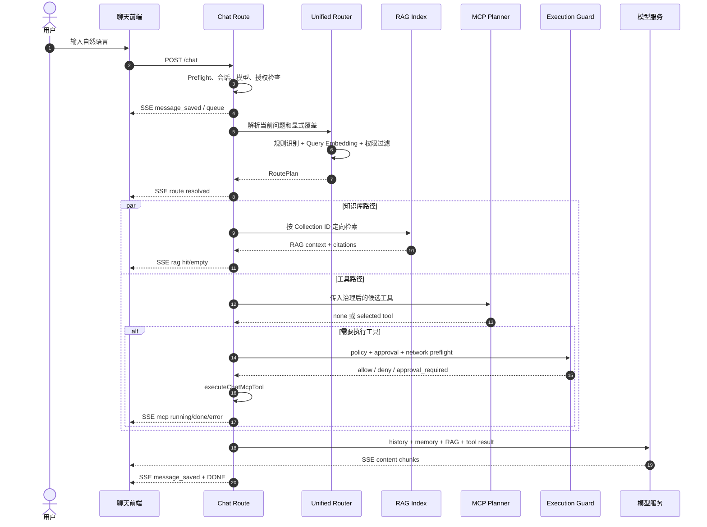

# Pivot 对话、知识库与工具库自适应路由整合方案

> **文档定位**：Pivot 对话中枢的知识库、工具库与对话体验统一改造方案  
> **制定日期**：2026 年 9 月  
> **文档状态**：已实施；保留灰度、影子与安全回退策略  
> **适用范围**：普通聊天、知识库检索、MCP 工具调用、显式能力选择、流式状态反馈  
> **核心目标**：让用户以自然语言发起请求，由系统在权限、授权和风险策略约束下，自适应决定是否检索知识库、是否准备工具候选，并把结果可靠地组织成最终回答。

---

## 一、执行摘要

### 1.0 实施状态（v0.1.145）

本方案的核心产品能力已在当前项目实现：

1. 已增加统一语义路由、Collection Catalog、MCP Tool Catalog 与类型化开关；
2. 已接入普通聊天上下文链路，复用 Query Embedding，按实际整数 Collection ID 定向检索；
3. 已让工具路由仅缩小已完成 Capability 与用户白名单过滤的工具候选集，最终调用继续经过既有 MCP Planner、执行策略、审批与网络预检；
4. 普通会话已默认进入自适应路由，保留 `@` Collection/工具显式覆盖、SSE 路由胶囊与会话历史路由摘要；
5. 已持久化 Collection 目录向量和脱敏后的路由摘要，增加批量化路由指标、管理端可观测性与安全 MCP Resources；
6. 已接入会话隔离的 Responses Prompt Cache 请求与不支持端点的安全重试降级；
7. 已通过 PostgreSQL 双栈迁移、权限隔离、聊天/MCP/RAG 回归、项目静态门禁与完整项目检查。
8. 聊天输入区已收敛为默认自适应模式；一级菜单仅保留附件。裸“@”同时展示知识库与当前白名单内的工具，显式指定和回答中的工具授权提示仍提供必要控制。

仍由既有受控能力承担的部分包括：数据分析工作台的 DuckDB 只读查询与图表、桌面/Agent Worker 沙箱、显式 Agent 模式下的连续多工具编排与 Handoff。普通聊天不会暗中升级为后台 Agent，也不会绕过 MCP 授权。

### 1.1 结论

本方案建议将 Pivot 的“对话、知识库、工具库”整合为一个**统一能力路由层**，但不把知识检索和工具执行混成同一种动作：

```text
用户输入
  ↓
意图解析与显式指令识别
  ├── 知识库路由：选择可访问的 Collection 与检索范围
  └── 工具路由：发现候选工具并交给现有 MCP Planner 判断
          ↓
权限、授权、白名单、审批与网络策略检查
          ↓
知识检索与工具执行
          ↓
统一上下文组装
          ↓
模型回答与 SSE 状态反馈
```

自适应路由负责“发现、排序和缩小范围”，不负责绕过既有安全边界，也不应直接替代现有 MCP 执行链路。

### 1.2 本方案解决的问题

当前 Pivot 已具备 RAG、MCP、上下文预算、长期记忆、Agent 沙箱和流式聊天等能力，但这些能力仍主要由用户通过对话前的开关和范围选择进行组合。用户需要提前知道：

- 当前问题是否需要知识库；
- 应该选择哪一个知识库 Collection；
- 是否需要打开工具库；
- 应该允许哪些工具；
- 普通聊天和 Agent 模式应如何选择。

这造成了三类体验问题：

1. 用户忘记打开知识库或工具库时，首问无法完成；
2. 用户打开全部能力时，检索范围和工具候选过大，增加上下文噪声；
3. 简单闲聊、写作和翻译请求也可能触发不必要的检索或工具规划。

### 1.3 核心设计判断

以下判断是本方案的前提：

1. **RAG 自动路由可以先落地**，因为现有 `retrieveContext` 已支持 Collection 范围和 Query Vector 复用；
2. **工具自动发现可以落地，但必须复用现有 MCP Planner 和执行策略**；
3. **工具自动发现不等于工具自动执行**。外部 MCP 仍受会话授权、Capability 治理、白名单、审批和网络策略约束；
4. **普通聊天不自动升级为后台 Agent**。持久 Agent run 仍应保持用户显式选择的契约；
5. **Prompt Caching 和低延迟只能作为待测目标**，不能在没有供应商计量和项目基线的情况下写成固定收益承诺。

---

## 二、当前项目基线与边界

### 2.1 当前聊天请求状态

聊天请求由 `server/services/chat-preflight.js` 解析，当前主要字段包括：

```js
{
  sessionId,
  modelId,
  content,
  displayContent,
  chatMode,
  ragEnabled,
  ragScope,
  mcpEnabled,
  mcpConfirmed,
  mcpToolAllowlist
}
```

现有约束：

- `mcpEnabled` 必须同时满足 `mcpConfirmed` 才会进入工具流程；
- `ragEnabled` 控制本轮是否允许知识库检索；
- `ragScope` 支持 `collectionIds` 和 `tagNames`；
- `mcpToolAllowlist` 是用户侧工具白名单，不能被自动路由扩大。

因此，新方案应增加独立的 `autoRouteEnabled` 或服务端配置，而不是改变上述字段的含义。

### 2.2 当前 RAG 链路

当前普通聊天的上下文组装位于：

- `server/services/chat-context-assembler.js`
- `server/services/rag-index/index.js`
- `server/services/rag-index/embedding-client.js`
- `server/services/knowledge-access.js`

现有能力：

1. `retrieveContext(userId, query, topK, options)` 支持 `scope.collectionIds` 和 `scope.tagNames`；
2. `retrieveContext` 支持通过 `options.queryVector` 复用已生成的 Query Embedding；
3. 文档检索阶段可以应用 `buildDocumentAccessFilter(user)`；
4. Collection 访问控制由 `buildCollectionAccessFilter(user)` 提供；
5. RAG 已有关键词、向量、图谱、反馈排序、MMR 和缓存等能力；
6. Query Embedding 当前通过 HTTP 服务获得，并带有短期缓存与并发控制。

需要特别注意：项目中的 Collection ID 是整数，不应使用方案示例中的 `col_fin_2026` 这类字符串作为实际 `collectionIds`。

### 2.3 当前 MCP 工具链路

当前普通聊天的工具流程位于：

- `server/services/mcp-client.js`
- `server/services/capability-market.js`
- `server/services/chat-mcp-intent.js`
- `server/services/chat-mcp-context.js`
- `server/services/chat-context-assembler.js`

实际执行顺序为：

```text
listCachedMcpTools
  ↓
filterMcpToolsByCapability
  ↓
filterChatMcpToolsByAllowlist
  ↓
chat-mcp-intent 规则过滤与确定性回退
  ↓
MCP Planner 独立模型请求
  ↓
executeChatMcpTool
  ↓
执行策略、审批、网络预检
  ↓
工具结果注入最终回答上下文
```

当前 Planner 的特点：

- 采用独立的低输出预算模型请求；
- 以严格 JSON 判断 `none` 或 `tool`；
- 当前普通聊天一轮最多选择一个工具；
- 对数据库查询、报表目录、本机浏览器等场景存在确定性回退；
- 工具执行并不直接由语义路由器完成。

新方案应把语义路由放在这条链路的前面，作为**候选集缩小器**，而不是重写整个工具执行架构。

### 2.4 当前普通聊天与 Agent 模式边界

`server/routes/chat/index.js` 当前只有在用户显式选择 `chatMode: 'agent'` 时，才会创建持久 Agent run，并通过 `agent_handoff` SSE 事件交给后台运行。

因此：

- 普通聊天的自动工具调用可以纳入本方案；
- 普通聊天不应因为语义判断而自动创建持久 Agent run；
- 专业代码重构、长文档审查、复杂运维等需要连续步骤的任务，应建议用户切换 Agent 模式，或另行设计明确的 Agent 入口。

### 2.5 当前前端实际入口

方案实施不能引用不存在的 `client/chat/input.js` 或 `client/chat/partials/chat-input-area.html`。当前相关入口主要是：

- `client/chat/engine.js`：发送请求与解析 SSE；
- `client/chat/engine-mcp-tools.js`：MCP 授权、工具状态与自动启用辅助；
- `client/chat/app-workspaces.js`：输入框、工具开关和知识库范围控件；
- `client/chat/partials/workspaces/chat-shell.html`：聊天工具栏；
- `client/chat/styles/base/input.css`；
- `client/chat/chat.shell.css`。

---

## 三、总体目标与非目标

### 3.1 总体目标

1. 用户无需预先判断知识库范围，系统可根据问题自动选择可访问 Collection；
2. 用户无需手动浏览全部工具，系统可根据问题缩小工具候选集；
3. 工具调用继续经过现有授权、Capability、审批和网络安全检查；
4. 知识检索、工具调用、长期记忆和对话历史可以按统一预算加入模型上下文；
5. 用户能看到系统本轮做了什么、为什么做，以及是否因为授权或权限被阻止；
6. 用户可以通过显式指令、固定范围、工具白名单和开关纠正自动路由；
7. 自动路由具备影子模式、回退路径、审计和可量化验收指标。

### 3.2 非目标

本阶段不包含：

1. 用新框架替换当前 MCP Client、MCP Planner 或 Agent Runtime；
2. 将所有知识库文档完整放入模型静态 Prompt；
3. 让普通聊天绕过 MCP 会话授权直接调用外部工具；
4. 让普通聊天自动创建持久 Agent run；
5. 在没有真实评测的情况下承诺固定的 93% 命中率、95% 工具准确率或固定 30ms 端到端延迟；
6. 立即将 DuckDB/Python 沙箱包装为无限制的通用代码执行工具；
7. 立即把所有 Collection 作为 MCP Resources 暴露给模型。

---

## 四、统一能力路由模型

### 4.1 能力类型

统一路由层将能力分为四类：

| 能力 | 作用 | 默认行为 | 执行边界 |
|---|---|---|---|
| 对话能力 | 写作、翻译、总结、解释、普通问答 | 直接进入模型 | 不访问外部资源 |
| 知识库能力 | 从 Pivot Collection 检索资料 | 自动判断是否检索 | 仅可访问用户有权范围 |
| 工具库能力 | 查询数据库、访问本机授权资源、生成图表等 | 先发现候选，再由 Planner 决定 | 授权、治理、审批、网络策略 |
| Agent 能力 | 连续规划、长任务、后台运行 | 用户显式选择 | Agent Runtime 的完整策略 |

### 4.2 路由计划契约

建议新增内部契约 `RoutePlan`，不直接暴露给客户端作为执行指令：

```js
{
  version: 1,
  mode: 'auto', // auto | explicit | disabled
  query: {
    textHash: 'sha256:...',
    source: 'current_prompt'
  },
  rag: {
    action: 'retrieve', // skip | retrieve | blocked
    collectionIds: [12, 18],
    tagNames: [],
    confidence: 0.88,
    reasonCode: 'collection_semantic_match',
    queryVector: [...],
    fallback: 'keyword_or_unscoped'
  },
  tools: {
    action: 'propose', // skip | propose | execute | blocked
    candidates: [
      {
        fullName: 'mcp.1.query',
        score: 0.91,
        reasonCode: 'strong_data_query_intent'
      }
    ],
    confidence: 0.91,
    consent: 'confirmed',
    allowlistApplied: true
  },
  overrides: {
    explicitCollections: [],
    explicitTools: [],
    excludedCapabilities: []
  }
}
```

注意：`queryVector` 仅在服务端内部使用，不应通过 SSE 返回，也不应持久化到普通消息内容中。

### 4.3 能力决策优先级

所有自动路由必须遵循以下优先级：

```text
用户显式禁用
  > 用户显式指定范围或工具
  > 用户工具白名单
  > Capability 治理
  > MCP 会话授权
  > 风险审批与网络策略
  > 自动语义路由
```

这意味着：

- 用户关闭 RAG 后，自动路由不得重新打开 RAG；
- 用户关闭 MCP 或未确认授权时，自动路由最多产生“候选待授权”状态，不得执行外部工具；
- 显式选择工具不能绕过 Capability 或审批；
- 自动路由不能扩大用户已有白名单；
- 工具执行阶段必须再次校验权限，不能只相信路由阶段的过滤结果。

---

## 五、总体架构与时序

### 5.1 分层架构

```text
┌──────────────────────────────────────────────────────────┐
│ Client Chat Shell                                        │
│ 输入、@ 指令、能力开关、路由胶囊、RAG/MCP 状态事件        │
└─────────────────────────┬────────────────────────────────┘
                          │ POST /api/chat + SSE
┌─────────────────────────▼────────────────────────────────┐
│ Chat Route / Preflight                                    │
│ 会话、模型、授权、能力开关、显式覆盖、输入合法性检查       │
└─────────────────────────┬────────────────────────────────┘
                          │
┌─────────────────────────▼────────────────────────────────┐
│ Unified Semantic Router                                   │
│ 规则识别、Query Embedding、Collection 匹配、工具候选排序   │
└───────────────┬──────────────────────┬───────────────────┘
                │                      │
┌───────────────▼──────────────┐ ┌─────▼──────────────────┐
│ Adaptive RAG Route            │ │ Tool Candidate Route    │
│ Collection + Tag + Vector    │ │ MCP catalog + rules     │
│ Access filter + confidence   │ │ capability + allowlist  │
└───────────────┬──────────────┘ └─────┬──────────────────┘
                │                      │
                │                 ┌────▼──────────────────┐
                │                 │ Existing MCP Planner   │
                │                 │ none/tool + fallback   │
                │                 └────┬──────────────────┘
                │                      │
                │                 ┌────▼──────────────────┐
                │                 │ Execution Guard        │
                │                 │ policy/approval/network│
                │                 └────┬──────────────────┘
                │                      │
                └──────────────┬───────┘
                               ▼
┌──────────────────────────────────────────────────────────┐
│ Context Assembler                                         │
│ history + memory + RAG context + tool result + world state │
│ existing context budget and trimming policy                │
└─────────────────────────┬────────────────────────────────┘
                          ▼
                    LLM Streaming
```

### 5.2 推荐时序



### 5.3 并行与串行规则

默认情况下，RAG 路由和工具候选发现可以并行；但工具执行不一定与 RAG 检索并行：

- 工具不依赖 RAG 内容：可以并行准备；
- 工具参数需要知识库内容：先完成 RAG，再调用工具；
- 工具返回数据后再生成图表：继续沿用当前数据工具后的图表补充链路；
- 复杂多步骤任务：建议进入显式 Agent 模式，而不是在普通聊天中隐式创建后台任务。

---

## 六、知识库自适应路由设计

### 6.1 Collection Catalog

新增 `KnowledgeCatalogIndex`，但它是路由层的元目录，不是新的知识内容存储系统。每条记录建议包含：

```js
{
  collectionId: 12,
  userId: 7,
  name: '财务预算与费用报销管理制度',
  description: '...',
  documentCount: 18,
  readyDocumentCount: 18,
  semanticSummary: '...',
  domainTags: ['财务', '报销', '预算'],
  vector: Float32Array,
  embeddingModel: 'nomic-embed-text',
  embeddingDimensions: 768,
  sourceUpdatedAt: '...',
  indexVersion: 1
}
```

Collection ID 必须使用数据库中的整数 ID。目录索引不得包含用户不可访问的 Collection。

### 6.2 目录生成与刷新

第一阶段不要在每次聊天时重新生成摘要。建议：

1. Collection 创建时生成初始摘要；
2. 文档新增、删除、重建索引或集合描述变更时标记为 dirty；
3. 后台任务异步重建摘要和向量；
4. 进程内索引采用版本化替换，避免读请求看到半更新状态；
5. 多进程部署时，使用数据库版本号、进程间通知或定时刷新保持一致；
6. Embedding 模型或维度变化时，整批重建，不允许混用旧向量。

### 6.3 访问控制

Collection 目录阶段使用集合级访问规则，检索阶段继续使用文档级访问规则：

```text
Collection Catalog：buildCollectionAccessFilter(user)
RAG Chunk Retrieval：buildDocumentAccessFilter(user)
```

权限过滤必须发生在 Top-K 截取之前。不能先从全量 Collection 取 Top-K，再删除无权项，否则会导致合法 Collection 被错误挤出候选集。

### 6.4 置信度与门禁

建议第一版采用三段式决策：

| 分数区间 | 处理方式 |
|---|---|
| 高于高阈值 | 自动定向检索 Top 1～2 个 Collection |
| 处于灰区 | 保留现有用户范围或进行有限范围检索，并标记低置信度 |
| 低于低阈值 | 跳过 RAG，按普通对话继续 |

不建议只依赖固定 `0.65` 阈值。不同 Embedding 模型、语言、领域和 Collection 数量会改变分数分布。阈值应通过离线样本和影子模式校准。

### 6.5 RAG 调用要求

路由器已经生成 Query Embedding 时，必须复用同一个向量：

```js
const ragContext = await retrieveContext(
  userId,
  effectivePrompt,
  null,
  {
    user: req.user,
    scope: {
      collectionIds: routePlan.rag.collectionIds,
      tagNames: routePlan.rag.tagNames
    },
    queryVector: routePlan.rag.queryVector
  }
);
```

如果 Query Embedding 服务不可用，应按以下顺序回退：

1. 复用短期 Query Embedding 缓存；
2. 使用现有关键词/图谱检索能力；
3. 如果用户显式指定了 Collection，则在指定范围内走关键词检索；
4. 如果用户未指定且无法可靠判断范围，则跳过自动 RAG，不扩大到全库盲搜。

### 6.6 MCP Resources 的长期方向

MCP Resources 可作为长期统一接口，但不作为本阶段普通聊天自动检索的前置依赖。后续若按 Collection 暴露资源，应满足：

- URI 使用整数 Collection ID，例如 `pivot-rag://collection/12`；
- `resources/list` 只返回当前用户可访问的资源；
- `resources/read` 必须再次校验访问权限；
- Resource 读取应产生审计记录；
- 资源读取结果不能绕过现有 RAG 的引用和上下文预算控制。

---

## 七、工具自适应路由设计

### 7.1 工具路由的正确定位

工具路由分为两个阶段：

```text
阶段一：候选发现
  规则 + 语义索引 + 权限过滤 + 白名单过滤

阶段二：受控执行
  现有 MCP Planner + 执行策略 + 审批 + 网络预检 + 工具调用
```

语义路由器不能直接调用 `executeMcpTool`，也不能绕过 `executeChatMcpTool`。

### 7.2 Tool Catalog

工具目录从现有 `listCachedMcpTools(null, user)` 获取基础数据，建议增加独立的语义元数据缓存：

```js
{
  fullName: 'mcp.1.query',
  name: 'query',
  serverId: 1,
  serverName: '业务数据库',
  serverType: 'database',
  description: '执行只读数据查询',
  semanticSignature: '查询、统计、筛选、分组和汇总数据库中的业务数据',
  category: 'data_query',
  vector: Float32Array,
  input_schema: { type: 'object' },
  capabilityVersion: '...',
  governanceVersion: '...',
  updatedAt: '...'
}
```

语义签名可以由工具名称、description、serverName 和人工维护分类组成。第一版不要求引入复杂的工具向量数据库。

### 7.3 工具索引刷新

以下情况应刷新 Tool Catalog：

- MCP Server 注册、删除或状态变化；
- `tools/list` 刷新工具缓存；
- 工具描述或 JSON Schema 变化；
- 工具治理策略变化；
- 本机桌面连接器设备上下线或授权变化。

多租户场景下，工具索引可以共享公开元数据，但候选过滤必须按当前用户重新执行，不能把某用户的可用工具列表直接复用给另一用户。

### 7.4 混合候选算法

建议使用规则和语义的混合排序：

```text
candidateScore =
  0.45 * semanticScore
  + 0.35 * ruleScore
  + 0.10 * sourceMatchScore
  + 0.10 * historicalSuccessScore
```

权重仅作为初始配置，必须通过真实日志校准。

规则通道继续复用 `chat-mcp-intent.js` 的能力，例如：

- SQL、表名、统计、分组、字段 → 数据查询工具；
- 本机、授权目录、文件、报表 → 本机文件工具；
- 明确 HTTP 网站访问 → 浏览器工具；
- 图表、趋势图、可视化 → 图表工具；
- 报告、周报、月报、导出文档 → 报告工具。

### 7.5 候选集与 Planner

自动路由不应把所有工具完整 Schema 直接传给主模型。推荐：

1. 先获取可访问工具；
2. 应用 Capability 过滤；
3. 应用用户白名单；
4. 应用规则与语义 Top-K；
5. 将候选工具传给现有 `maybeBuildMcpChatContext()`；
6. 由 Planner 返回 `none` 或一个工具；
7. 由 `executeChatMcpTool()` 做最终执行。

这可以减少 Planner 的候选规模，同时保持当前工具调用的确定性回退和安全逻辑。

### 7.6 工具执行状态

工具路由应区分以下状态：

| 状态 | 含义 | 是否执行 |
|---|---|---|
| `skipped` | 判断为不需要工具 | 否 |
| `candidate_only` | 找到工具，但未获得会话授权 | 否 |
| `filtered` | 工具被权限、白名单或治理过滤 | 否 |
| `planning` | 正在由 Planner 判断 | 否 |
| `running` | 已通过执行策略，正在调用 | 是 |
| `approval_required` | 需要人工审批 | 否，等待审批 |
| `done` | 工具成功返回 | 已完成 |
| `error` | 工具或策略失败 | 未完成 |

### 7.7 工具与数据分析沙箱

项目已有 `agent-sandbox.js`、`agent-os-isolation.js` 和 `agent-data-adapter.js`，但这些能力主要服务于受控 Agent/数据分析流程，并不自动等价于普通聊天可直接调用的通用 Python 工具。

因此建议：

- Phase 2 先复用已有数据库、报表和图表工具；
- Phase 3 再评估是否新增受控 `execute_python_analysis`；
- 新工具必须绑定 Workspace Jail、输入文件白名单、执行时限、输出大小、网络策略和审计记录；
- 不允许通过普通聊天把任意本机路径传给沙箱。

---

## 八、对话上下文与结果整合

### 8.1 上下文组成

最终模型上下文由现有 Context Assembler 统一管理：

```text
系统指令与安全规则
  ↓
会话历史
  ↓
长期记忆
  ↓
RAG 引用上下文
  ↓
工具调用结果
  ↓
World State / Agent step context
  ↓
最新用户问题
```

实际顺序应以事实优先和上下文预算为准，不应为了追求“缓存前缀”而把用户权限敏感内容或易变化的工具结果放进公共静态前缀。

### 8.2 结果优先级

回答时的事实优先级建议为：

```text
本轮成功工具结果
  > 本轮 RAG 引用内容
  > 当前会话历史
  > 长期记忆
  > 模型常识
```

如果工具失败，模型不得自行编造工具结果；如果 RAG 没有命中，模型应按普通对话继续，但不应声称答案来自知识库。

### 8.3 上下文预算

继续复用 `server/services/context-budget.js`，不要在方案层重新定义一套与现有代码冲突的固定比例。

现有预算逻辑已经能够：

- 保留系统消息和最新用户消息；
- 对 RAG、MCP、长期记忆内容分别裁剪；
- 在超限时删除较早历史；
- 发送 `context_budget` SSE 事件。

新路由需要补充的是：

1. 给路由事件和 RAG/MCP 上下文添加统一来源标记；
2. 将候选工具 Schema 大小计入预算；
3. 对工具结果设置单独最大字符数；
4. 记录路由前后 Token 估算值；
5. 不把 Collection Catalog 全量注入模型上下文。

### 8.4 Query Embedding 复用

同一轮请求中，路由、RAG 和工具语义匹配应尽量共享一个 Query Embedding。推荐：

```js
const queryVector = await getOrCreateRouteQueryVector(prompt, userId);

const [ragDecision, toolDecision] = await Promise.all([
  resolveRagRoute(prompt, queryVector, user),
  resolveToolRoute(prompt, queryVector, user)
]);
```

如果工具和 Collection 的 Embedding 模型不同，则必须分开生成，并在目录元数据中记录模型版本和向量维度。

---

## 九、显式控制与前端体验

### 9.1 默认智能自适应

普通会话应默认使用自适应路由，不要求用户在发送前选择“知识库”或“工具”。输入区一级菜单仅保留附件；服务端总开关、影子模式和安全降级仍是管理员控制面的一部分。

```text
默认：按问题在可访问资料中决定是否检索，并发现已授权工具候选
@ 指定：显式限定某个 Collection 或工具，且不扩大权限
工具授权：候选命中后由用户明确确认，重新发送后才能进入 MCP 执行链路
Agent 模式：仅由用户切换，用于持久的多步骤任务
```

### 9.2 `@` 显式指令

输入框支持 `@` 补全时，建议把指令解析为独立的 `routeOverrides`，不要仅靠修改最终发送文本来表达控制意图：

```js
{
  routeOverrides: {
    collections: [12],
    tools: ['mcp.1.query'],
    excludedTools: ['mcp.2.write']
  }
}
```

显示给模型的用户原文仍应保留用户自然语言，不把内部 ID、权限字段和路由分数拼入用户消息。

### 9.3 SSE 事件契约

当前前端已经处理 `rag`、`mcp`、`context_budget` 和 `agent_handoff` 等事件。新增统一路由事件：

```json
{
  "type": "route",
  "status": "resolved",
  "mode": "auto",
  "rag": {
    "status": "matched",
    "collections": [
      { "id": 12, "name": "财务制度", "confidence": 0.88 }
    ]
  },
  "tools": {
    "status": "candidate",
    "candidates": [
      { "name": "数据库查询", "fullName": "mcp.1.query", "confidence": 0.91 }
    ]
  }
}
```

安全要求：

- 不返回完整工具 Schema；
- 不返回服务地址、凭证、数据库连接信息；
- 不返回被过滤工具的名称，避免侧信道暴露权限；
- 低置信度时展示“可能需要知识库/工具”，不要展示确定性结论。

### 9.4 前端改造位置

建议修改：

- `client/chat/engine.js`：发送 `autoRouteEnabled`、`routeOverrides`，处理 `route` 事件；
- `client/chat/engine-mcp-tools.js`：保留 MCP 授权与工具状态逻辑；
- `client/chat/app-workspaces.js`：管理自适应状态、显式范围和工具固定项；
- `client/chat/partials/workspaces/chat-shell.html`：增加自适应状态入口；
- `client/chat/styles/base/input.css`：增加 `@` 菜单和能力状态样式；
- `client/chat/chat.shell.css`：增加路由胶囊样式。

---

## 十、安全、权限与审计

### 10.1 RAG 权限

必须同时保证：

1. Collection 目录按集合访问规则过滤；
2. Chunk 检索按文档访问规则过滤；
3. `collectionIds` 必须归一化为正整数；
4. 自动路由不能把用户不可见 Collection 写入 SSE；
5. 缓存 Key 必须包含用户/租户/权限范围，不能跨用户复用敏感结果；
6. RAG 引用来源应继续通过现有引用聚合逻辑输出。

### 10.2 工具权限

工具候选和执行都必须经过：

```text
工具缓存可见性
  ↓
Capability 治理
  ↓
用户工具白名单
  ↓
MCP 会话授权
  ↓
工具执行策略
  ↓
风险审批
  ↓
网络预检
  ↓
实际调用
```

`filterMcpToolsByCapability()` 只能作为候选过滤步骤，不能代替执行时的最终校验。

### 10.3 审计字段

建议为每轮聊天追踪增加：

```js
{
  routeMode,
  ragDecision,
  ragCollectionIds,
  ragConfidence,
  toolCandidateNames,
  toolSelectedName,
  toolConfidence,
  toolDecisionReason,
  consentState,
  allowlistApplied,
  policyDecision,
  approvalDecision,
  routeLatencyMs,
  embeddingLatencyMs,
  ragLatencyMs,
  toolPlanningLatencyMs,
  toolExecutionLatencyMs,
  fallbackReason
}
```

不得把完整用户输入、工具敏感参数或工具返回的敏感内容无界写入日志。日志应使用已有脱敏和截断策略。

---

## 十一、后端实施清单

### 11.1 新增模块

建议新增：

```text
server/services/semantic-router.js
server/services/knowledge-catalog-index.js
server/services/mcp-tool-catalog-index.js
```

其中：

- `semantic-router.js`：编排本轮路由计划，不直接执行工具；
- `knowledge-catalog-index.js`：维护 Collection 元目录和向量索引；
- `mcp-tool-catalog-index.js`：维护工具语义元数据和候选索引。

### 11.2 修改模块

```text
server/services/chat-preflight.js
server/services/chat-context-assembler.js
server/services/chat-mcp-intent.js
server/services/chat-mcp-context.js
server/services/rag-index/index.js
server/services/rag-documents.js
server/services/mcp-client.js
server/routes/chat/index.js
```

### 11.3 推荐接入点

在 `assembleChatContext()` 中接入路由计划：

```js
const routePlan = await semanticRouter.resolveRoutePlan({
  prompt: effectiveUserPrompt,
  user: req.user,
  state,
  modelCfg,
  signal
});

writeSse(JSON.stringify(buildRouteEvent(routePlan)));

const ragPromise = routePlan.rag.action === 'retrieve'
  ? retrieveContext(userId, effectiveUserPrompt, null, {
      user: req.user,
      scope: {
        collectionIds: routePlan.rag.collectionIds,
        tagNames: routePlan.rag.tagNames
      },
      queryVector: routePlan.rag.queryVector
    })
  : Promise.resolve(null);

const toolList = routePlan.tools.action === 'propose'
  ? routePlan.tools.candidates
  : [];

// 继续交给现有 MCP Planner 与执行链
const mcpContext = await maybeBuildMcpChatContext({
  modelCfg,
  history: visionHistory,
  userPrompt: effectiveUserPrompt || modelContent,
  tools: toolList,
  user: req.user,
  writeSse,
  log: req.log,
  signal
});
```

生产实现需要补充：

- `mcpEnabled`、`mcpConfirmed`、`mcpToolAllowlist` 的严格门禁；
- 用户显式范围覆盖自动范围；
- 路由异常时安全降级；
- Query Embedding 超时和取消信号；
- 目录索引未初始化时的冷启动策略。

### 11.4 不建议的实现

以下实现禁止采用：

```js
// 不建议：路由器直接执行工具
await executeMcpTool(routePlan.tools.selected, input, user);

// 不建议：自动路由直接打开外部 MCP
state.mcpEnabled = true;
state.mcpConfirmed = true;

// 不建议：将所有工具 Schema 注入主模型
tools = await listCachedMcpTools(null, user);

// 不建议：权限过滤发生在 Top-K 之后
const topK = allTools.sort(score).slice(0, 5);
const accessible = topK.filter(hasPermission);
```

---

## 十二、数据库、缓存与索引设计

### 12.1 Collection 元数据

可以先复用现有 `knowledge_collections.name`、`description`、文档统计和更新时间，不急于扩展数据库字段。若生产规模需要持久化目录向量，建议新增独立表：

```text
knowledge_collection_catalog
- collection_id
- tenant/user scope
- semantic_summary
- domain_tags
- embedding_model
- embedding_dimensions
- embedding_vector
- source_version
- updated_at
```

向量字段应按当前数据库能力选择；如果运行环境不统一，可先采用 JSON/二进制存储并由进程内索引加载，后续再迁移 pgvector。

### 12.2 工具元数据

工具 Schema 已存在于 MCP 缓存中，语义索引不应复制完整敏感配置。建议持久化或缓存：

- 工具全名；
- 服务类型；
- 描述与语义签名；
- 分类标签；
- Schema 摘要哈希；
- 向量模型和版本；
- 更新时间。

完整 Schema 仍从当前工具缓存读取，并在交给 Planner 前再次校验。

### 12.3 缓存隔离

RAG 结果缓存和路由缓存至少应考虑：

```text
user/tenant scope
collection scope
tag scope
capability version
embedding model/version
query normalization
```

不能因为路由索引是共享的，就共享包含用户私有数据的检索结果。

---

## 十三、分阶段实施路线

### Phase 0：观测与影子路由

目标：不改变用户实际行为，只记录系统建议。

工作项：

1. 建立 Collection Catalog 和 Tool Catalog；
2. 记录自动路由建议的 Collection、工具、分数和原因；
3. 与现有用户手动范围、实际 RAG 命中和实际工具选择对比；
4. 建立 Embedding、索引、规则、Planner 和执行延迟基线；
5. 评估权限过滤是否完整。

退出条件：影子路由无越权记录，关键场景召回率和误路由率可测。

### Phase 1：自适应 RAG

目标：只自动优化知识库范围。

工作项：

1. 接入 `semantic-router.js`；
2. 使用整数 Collection ID；
3. 复用 Query Vector；
4. 接入集合级和文档级权限过滤；
5. 增加 RAG 路由 SSE；
6. 提供自动路由关闭开关；
7. Embedding 异常时安全回退。

退出条件：不改变显式 `ragScope` 行为，RAG 失败不影响普通对话，权限测试通过。

### Phase 2：工具候选发现

目标：缩小工具 Planner 的候选集，不改变执行安全链路。

工作项：

1. 将规则通道和 Tool Catalog 语义通道合并；
2. 在 Capability 和白名单过滤后取 Top-K；
3. 将候选集传给现有 MCP Planner；
4. 保留确定性数据、报表和浏览器回退；
5. 增加工具候选、过滤和 Planner 结果事件；
6. 记录工具候选召回、误选、未授权和执行失败。

退出条件：未授权工具不执行，现有 MCP 安全测试和回归测试不退化。

### Phase 3：统一前端体验

目标：把 RAG、工具和普通对话状态统一展示。

工作项：

1. 增加智能自适应状态按钮；
2. 增加 `@` Collection/工具补全；
3. 增加路由胶囊；
4. 支持用户排除本轮误命中的能力；
5. 支持从历史消息查看路由摘要；
6. 保留原有知识库和工具面板。

### Phase 4：高级能力评估

仅在前述阶段稳定后评估：

- MCP Resources Collection 化；
- 受控数据分析沙箱工具；
- 显式的 Agent Handoff 入口；
- 多工具序列调用；
- Prompt Cache 供应商适配；
- 跨进程目录索引同步。

---

## 十四、测试与验收标准

### 14.1 路由正确性

至少覆盖：

| 场景 | 预期 |
|---|---|
| 你好、闲聊 | 跳过 RAG 和工具 |
| 写作、翻译 | 默认跳过 RAG 和工具 |
| 明确询问企业制度 | 命中对应 Collection |
| 同义词、错别字、跨领域词 | 不越过权限，低置信度时安全回退 |
| 明确 SQL/统计请求 | 提供数据工具候选 |
| 明确生成图表 | 提供图表工具候选 |
| 本机报表目录查询 | 仅提供已授权本机工具 |
| MCP 未确认 | 不执行外部工具 |
| 显式工具白名单 | 只允许白名单工具 |
| 显式关闭能力 | 自动路由不得重新开启 |
| Agent 模式 | 保持现有 Agent handoff 行为 |

### 14.2 安全验收

1. 无权 Collection 不出现在路由候选和 SSE；
2. 无权工具不进入 Planner；
3. 路由器不能伪造 `mcpConfirmed`；
4. 工具执行仍经过 `executeChatMcpTool`；
5. 高风险工具仍会进入审批；
6. 网络策略拒绝后不得执行；
7. 多用户并发时缓存不串租户；
8. 取消请求后 Embedding、RAG 和工具任务能终止或安全收敛；
9. 工具结果和路由日志完成脱敏与长度限制。

### 14.3 性能验收

不预先写死最终收益，采用分层指标：

```text
Catalog 内存匹配耗时
Query Embedding 耗时
路由总耗时
RAG 检索耗时
Tool Planner 耗时
Tool 执行耗时
首字节/首 Token 延迟
完整请求耗时
```

建议目标：

- Catalog 纯内存比对纳入毫秒级预算；
- Query Embedding 延迟单独统计，不并入“纯路由耗时”；
- 路由异常不得阻塞普通对话；
- 自动路由开启后，P95 首 Token 延迟不能显著劣化；
- 工具候选规模应小于全量工具规模，并验证 Planner 输入 Token 下降。

### 14.4 质量验收

至少建立以下指标：

- Collection 命中率；
- Collection Precision@K / Recall@K；
- 工具候选召回率；
- 工具误触发率；
- 工具规划成功率；
- 工具执行成功率；
- 无授权阻断率；
- 用户纠正率；
- RAG 空检索率；
- 自动路由回退率；
- 每轮输入 Token 和工具 Schema Token；
- 实际缓存命中 Token 和成本。

所有“93%”“95%”“60%”等数字都应在真实评测后填写，不作为开发前提。

---

## 十五、灰度、回滚与运维

### 15.1 Feature Flags

建议至少增加：

```text
PIVOT_CHAT_AUTO_ROUTE_ENABLED
PIVOT_CHAT_AUTO_RAG_ENABLED
PIVOT_CHAT_AUTO_TOOL_DISCOVERY_ENABLED
PIVOT_CHAT_ROUTE_SHADOW_MODE
PIVOT_CHAT_ROUTE_MAX_TOOL_CANDIDATES
PIVOT_CHAT_ROUTE_RAG_THRESHOLD
```

具体配置应通过现有设置体系或环境变量管理，避免将实验参数硬编码在路由模块中。

### 15.2 回滚策略

出现以下情况时自动降级：

- 路由模块初始化失败；
- 目录索引版本不兼容；
- Embedding 服务连续超时；
- 工具误触发率超过阈值；
- 权限过滤异常；
- Planner 错误率显著升高；
- SSE 路由事件导致前端解析异常。

降级后：

- RAG 回到现有 `ragEnabled + ragScope` 流程；
- MCP 回到现有全量治理后 Planner 流程；
- 不删除用户已有配置；
- 所有降级原因写入受控观测日志。

---

## 十六、风险与应对

| 风险 | 表现 | 应对 |
|---|---|---|
| Embedding 服务变慢 | 普通聊天首字延迟增加 | 超时、缓存、关键词回退、影子模式 |
| Collection 语义相似 | 命中错误知识库 | 灰区不自动缩小、加入标签/规则和用户纠正 |
| 工具候选误判 | Planner 选错工具 | 规则优先、低置信度仅候选、保留确定性回退 |
| 权限变化未同步 | 索引出现过期候选 | 每轮重新权限过滤，索引只保存元数据 |
| 工具描述质量差 | 语义匹配不稳定 | 人工语义签名、分类和离线评测 |
| 工具 Schema 过大 | Planner 上下文膨胀 | Top-K、Schema 截断检查、预算计量 |
| 多进程索引不一致 | 不同实例路由不同 | 版本号、定时刷新、失效通知 |
| 自动 Handoff 误触发 | 普通聊天变成长任务 | 本阶段禁止隐式创建 Agent run |
| 缓存前缀频繁变化 | 缓存命中不稳定 | 静态内容稳定化，使用供应商真实 usage 验证 |

---

## 十七、最终落地原则

Pivot 的最终交互应体现为：

```text
用户只需要表达目标
系统自动发现相关知识和能力
权限与授权决定能力边界
Planner 决定工具是否真的需要调用
执行策略决定工具能否真正运行
上下文组装器负责把事实交给模型
SSE 胶囊让用户知道系统做了什么
用户始终可以关闭、指定、排除和纠正
```

最重要的工程原则是：

> **自动路由可以减少用户选择，但不能减少安全校验；可以缩小候选集，但不能替代最终执行策略；可以优化上下文，但不能改变普通聊天、MCP 授权和 Agent 模式的既有契约。**

本方案建议先完成影子路由和可观测性，再逐步启用自适应 RAG、工具候选发现和前端统一体验，最后再评估 Resources、沙箱代码执行和 Agent Handoff 等高级能力。
