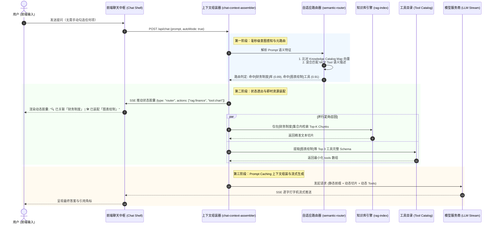

# Pivot 对话自适应感知与动态路由改造综合技术方案

> **文档定位**：Pivot (智枢) AI 智能中枢核心对话体验升级规范  
> **制定日期**：2026年9月  
> **文档状态**：综合架构设计定稿 / 实施指南  
> **适用范围**：Pivot 对话中枢（server/routes/chat、server/services、desktop/agent-runtime、client/chat）
>
> **实施更新（v0.1.149）**：对话层已经默认启用智能自适应路由，并通过 @ 入口支持知识库和工具的可浏览选择。本次同步补全工作流数据工具：新增整体“数据汇总”能力，升级“数据分组汇总”为多指标模式。它们沿用工具目录、权限策略、中文展示、参数 Schema 与审计链路，不改变动态工具发现的授权边界。

---

## 目录
- [一、 现状痛点与战略演进定位](#一-现状痛点与战略演进定位)
  - [1.1 传统“手动勾选”模式的三大系统性缺陷](#11-传统手动勾选模式的三大系统性缺陷)
  - [1.2 改造核心目标与总体设计原则](#12-改造核心目标与总体设计原则)
- [二、 Codex 与 Claude 最前沿架构深度解构与理念映射](#二-codex-与-claude-最前沿架构深度解构与理念映射)
  - [2.1 Claude (Anthropic) 体系核心启示：MCP 统一化、延迟检索与缓存优化](#21-claude-anthropic-体系核心启示mcp-统一化延迟检索与缓存优化)
  - [2.2 Codex / OpenAI 体系核心启示：符号骨架图、代码即工具与代理交接](#22-codex--openai-体系核心启示符号骨架图代码即工具与代理交接)
  - [2.3 顶尖技术理念对 Pivot 的系统映射矩阵](#23-顶尖技术理念对-pivot-的系统映射矩阵)
- [三、 Pivot 总体架构设计与时序数据流](#三-pivot-总体架构设计与时序数据流)
  - [3.1 系统分层定位与架构拓扑](#31-系统分层定位与架构拓扑)
  - [3.2 核心时序交互图 (Sequence Diagram)](#32-核心时序交互图-sequence-diagram)
- [四、 知识库自适应元路由与两阶段精准召回 (Adaptive RAG)](#四-知识库自适应元路由与两阶段精准召回-adaptive-rag)
  - [4.1 知识库骨架地图 (Knowledge Catalog Map)](#41-知识库骨架地图-knowledge-catalog-map)
  - [4.2 意图识别与置信度门禁 (Confidence Gating)](#42-意图识别与置信度门禁-confidence-gating)
  - [4.3 集合级元路由与定向 Chunk 召回](#43-集合级元路由与定向-chunk-召回)
  - [4.4 长期演进：知识库包装为标准 MCP Resources](#44-长期演进知识库包装为标准-mcp-resources)
- [五、 工具即时发现与代码化吞噬 (JIT Tool Discovery & Code-as-Tools)](#五-工具即时发现与代码化吞噬-jit-tool-discovery--code-as-tools)
  - [5.1 MCP 工具语义元索引 (Tool Catalog Vector Index)](#51-mcp-工具语义元索引-tool-catalog-vector-index)
  - [5.2 混合路由算法 (Hybrid Router) 与 Top-K 动态挂载](#52-混合路由算法-hybrid-router-与-top-k-动态挂载)
  - [5.3 数据与计算类工具的代码化吞噬 (复用 DuckDB / Python 沙箱)](#53-数据与计算类工具的代码化吞噬-复用-duckdb--python-沙箱)
  - [5.4 跨专业领域场景的 Agent Handoffs 委托机制](#54-跨专业领域场景的-agent-handoffs-委托机制)
- [六、 双轨制人机协同与 Glass-Box 渐进透出交互](#六-双轨制人机协同与-glass-box-渐进透出交互)
  - [6.1 默认“智能感知 (Auto-Pilot)”模式](#61-默认智能感知-auto-pilot模式)
  - [6.2 确定性强控：“@”快捷语法与显式钉选 (Explicit Override)](#62-确定性强控快捷语法与显式钉选-explicit-override)
  - [6.3 交互状态透明化：SSE 路由决策与执行胶囊](#63-交互状态透明化sse-路由决策与执行胶囊)
- [七、 上下文工程与性能预算优化 (Prompt Caching & Budgeting)](#七-上下文工程与性能预算优化-prompt-caching--budgeting)
  - [7.1 遵循 Prompt Caching 原则的上下文编排规范](#71-遵循-prompt-caching-原则的上下文编排规范)
  - [7.2 动态上下文预算与智能剪枝 (Context Budget & Pruning)](#72-动态上下文预算与智能剪枝-context-budget--pruning)
  - [7.3 极低延迟保证：本地内存向量比对 (<30ms)](#73-极低延迟保证本地内存向量比对-30ms)
- [八、 Pivot 系统工程落地改造清单](#八-pivot-系统工程落地改造清单)
  - [8.1 后端服务模块改造明细](#81-后端服务模块改造明细)
  - [8.2 前端界面与交互改造明细](#82-前端界面与交互改造明细)
- [九、 安全防护、权限边界与策略执行点 (PEP) 协同](#九-安全防护权限边界与策略执行点-pep-协同)
- [十、 分阶段实施路线图与验收标准](#十-分阶段实施路线图与验收标准)
  - [10.1 阶段划分 (Phase 1 ~ Phase 3)](#101-阶段划分-phase-1--phase-3)
  - [10.2 核心量化收益指标](#102-核心量化收益指标)

---

## 一、 现状痛点与战略演进定位

### 1.1 传统“手动勾选”模式的三大系统性缺陷
在 Pivot 当前的聊天实现中，知识库（RAG）和工具（MCP Tools）必须依赖用户在对话前显式配置与勾选：
* 知识库依赖 `ragEnabled` 与 `ragScope`（指定 Collection）；
* 工具依赖 `mcpEnabled` 与 `mcpToolAllowlist`（从工具池中勾选具体项）。

这种**“人工静态预置”**的设计存在根本性缺陷：
1. **认知负荷高，违背自然交互**：用户提问前必须准确预判“这个问题属于哪本制度手册”、“需要调用哪个工具”。大量普通用户因忘记开启知识库或工具，导致模型直接回答“我缺乏权限/我不知道”，首问体验极差。
2. **上下文膨胀与注意力稀释（Lost in the Middle）**：若用户为省事勾选“全部工具”，数十个工具的完整 JSON Schema 会瞬间挤占数千 Token，导致模型推理注意力分散、甚至触发死循环或参数调用幻觉。
3. **刚性失灵与算力浪费**：开启知识库后，即便用户仅仅发送“你好”或“帮我润色这段文字”，系统仍会机械地执行一次向量检索；未勾选工具时，即使模型意识到需要实时计算，也无法动态调取能力。

### 1.2 改造核心目标与总体设计原则
本方案的核心战略定位是：**让机器去适应人，而非让人迁就机器**。
* **默认自适应（Autonomous Perception）**：用户无需做任何勾选，直接输入自然语言，系统在背后自主感知意图、自适应检索知识库、即时动态装配所需工具。
* **双轨制人机可控（Explicit Override）**：算法自适应作为默认底色，但保留人类最高指挥权。用户通过 `@` 语法或手动锁定面板可 100% 强制指定知识库与工具。
* **透明可信（Glass-Box Disclosure）**：拒绝黑盒暗箱操作，通过轻量级状态胶囊实时透出“已自动感知并关联 XX 知识库 / XX 工具”，让用户一目了然。
* **极致性能与低成本（Zero External Latency & Token Economy）**：路由决策采用轻量内存向量匹配，耗时小于 30ms；通过 JIT 过滤，单次请求 Prompt Token 节省 60% 以上。

---

## 二、 Codex 与 Claude 最前沿架构深度解构与理念映射

为确保改造方案的先进性与前瞻性，我们深度解构了 Anthropic (Claude) 和 OpenAI (Codex) 体系在上下文感知与工具调用方面的顶级实践：

```
                ┌────────────────────────────────────────────────────────┐
                │          当代前沿大模型工程体系两大演进支柱            │
                ├───────────────────────────┬────────────────────────────┤
                │     Anthropic (Claude)    │      OpenAI (Codex/GPT)    │
                │ • Model Context Protocol  │ • Repo Map 全局符号骨架    │
                │ • Tool Search (延迟发现)  │ • Code-as-Tools (代码沙箱) │
                │ • Prompt Caching 静态缓存 │ • Agent Handoffs (子代理)  │
                │ • Bash as Universal Tool  │ • Strict JSON Schema 校验  │
                └───────────────────────────┴────────────────────────────┘
```

### 2.1 Claude (Anthropic) 体系核心启示：MCP 统一化、延迟检索与缓存优化
1. **MCP (Model Context Protocol) 统一抽象**：
   - Anthropic 将大模型连接外部世界的要素统一为 `Resources`（只读数据/知识库）、`Tools`（可执行动作）和 `Prompts`（模板）。知识库本质上也是一种虚拟资源，可以通过 URI 挂载与按需拉取。
2. **Tool Search（工具延迟发现机制）**：
   - 在 Claude Code 与前沿 Agent 中，面对成百上千个工具，系统在初始 Prompt 中只下发元检索工具 `search_tools(query)`；只有当模型分析出具体意图后，才在运行时二次调取对应工具的完整 Schema。**彻底解决了万级工具池与有限上下文窗口的根本矛盾**。
3. **Prompt Caching（前缀缓存）工程范式**：
   - 将不变的系统角色设定、核心工具定义、公共知识概览排布在 Prompt 前缀（命中 KV Cache，费用降低 90%、延迟降低 80%），动态检索的 Chunk 和动态装配的工具排布在尾部。

### 2.2 Codex / OpenAI 体系核心启示：符号骨架图、代码即工具与代理交接
1. **Repo Map（仓库地图与符号骨架）**：
   - GitHub Copilot / Codex 面对百万行代码库，从不要求开发者手动勾选文件。它使用 AST 解析全库提取类、函数签名与调用关系，构建出仅几百 Token 的极简符号骨架（PageRank 权重排序），大模型通过鸟瞰骨架自适应定位相关代码。
2. **Code Interpreter：代码即万能工具 (Code-as-Tools)**：
   - OpenAI 验证了“用代码生成替代离散工具”的巨大威力。面对复杂数据提取、转换、图表绘制，无需定义几十个散碎的 API，直接赋予模型受控的 Python/DuckDB 执行环境，模型现场写代码运行并自我修正，工具表达力近乎无限。
3. **OpenAI Swarm / Agents SDK 的 Handoffs（动态转交）**：
   - 面对多领域任务，主路由（Triage）仅做分流判定，一旦判定出特定领域，立即通过 Handoff 转交给专用轻量子 Agent，实现不同场景工具集的物理隔离。

### 2.3 顶尖技术理念对 Pivot 的系统映射矩阵

| 顶尖技术理念 | 来源产品 | 在 Pivot 系统中的具体改造映射 |
| :--- | :--- | :--- |
| **Repo Map 骨架地图** | Codex / Copilot | **知识库骨架地图 (Knowledge Catalog Map)**：为所有 Collection 自动构建语义摘要树，常驻路由层，实现免选知识库的毫秒级定向导航。 |
| **Tool Search 延迟挂载** | Claude Code | **JIT Tool Discovery**：维护 MCP Tool 内存语义索引，依据提问动态筛选 Top 3~5 个工具挂入当前 LLM 请求，其余工具自动隐藏。 |
| **Code-as-a-Tool** | OpenAI Advanced Data Analysis | **沙箱化数据分析**：复用 Pivot 已建成的 DuckDB + Python 隔离沙箱，将繁琐的表格处理工具收敛为自生成沙箱执行。 |
| **MCP Resources 统一** | Claude MCP 规范 | **RAG 资源化规范**：将知识库集合抽象为标准 MCP 资源 URI，统一 Agent 对知识与外部工具的调度接口。 |
| **Prompt Caching 布局** | Anthropic 最佳实践 | **分层上下文编排规范**：重构 `chat-context-assembler.js`，严格划分静态命中层与动态按需层，提升吞吐并降低响应延迟。 |

---

## 三、 Pivot 总体架构设计与时序数据流

### 3.1 系统分层定位与架构拓扑
自适应感知与动态路由层位于 **Web 控制面（Control Plane）** 的核心会话处理链路中，作为用户输入与大模型/执行面之间的**智能枢纽**：

```
[前端交互层 (Client Shell)]
  │ ── 自然语言提问 (支持 @ 强控语法)
  ▼
[自适应感知与路由中枢 (Semantic Router & Assembler)]
  ├── ① 意图识别与门禁 (Confidence Gate: 是否需要外部知识/是否需要工具)
  ├── ② 知识库元路由 (Knowledge Catalog Router ➔ 锁定目标 Collection)
  ├── ③ 工具 JIT 发现 (Tool Semantic Router ➔ 动态组装 Top-K Tools)
  └── ④ 前端透明流透出 (SSE Router Capsules ➔ 实时反馈决策状态)
  │
  ├── 访问 [RAG 向量与知识图谱引擎 (PostgreSQL pgvector / rag-index)]
  ├── 访问 [MCP 管理器与 Tool Catalog (mcp-client / capability-market)]
  └── 调度 [桌面/服务端隔离沙箱 (DuckDB / Python Sandbox / PEP)]
  │
  ▼
[大语言模型流式推理 (LLM Streaming Engine)]
```

### 3.2 核心时序交互图 (Sequence Diagram)



---

## 四、 知识库自适应元路由与两阶段精准召回 (Adaptive RAG)

### 4.1 知识库骨架地图 (Knowledge Catalog Map)
借鉴 Codex Repo Map 的思想，Pivot 为系统中每一个知识库集合（Collection）自动维护一份**元数据语义骨架**：
```json
{
  "collectionId": "col_fin_2026",
  "name": "财务预算与费用报销管理制度",
  "domainTags": ["财务", "报销", "差旅标准", "发票", "预算借款"],
  "semanticSummary": "涵盖企业差旅住宿标准、交通报销流程、发票抬头要求、借款审批权限及日常办公费用申请规范。",
  "documentCount": 18,
  "vector": [-0.0124, 0.0841, 0.0352, ...]
}
```
* **自动生成与更新**：当集合新增、删除或重构文档时，由后台异步任务（利用已有 `rag-documents.js`）提取摘要，并调用系统默认 Embedding 模型生成向量，**常驻保存在内存 `CatalogVectorIndex` 中**。
* **极小占用**：即便系统拥有 500 个知识库集合，整份骨架内存占用不足 2MB。

### 4.2 意图识别与置信度门禁 (Confidence Gating)
在检索前执行**快速置信度门禁判定**，将用户提问向量 $\vec{V}_{query}$ 与各集合向量进行余弦相似度比对：
$$S_{max} = \max_{i} \cos(\vec{V}_{query}, \vec{V}_{col_i})$$
* **门禁规则一（纯闲聊/指令跳过）**：
  若 Query 属于无外部信息需求的常规闲聊（如“写一封感谢信”、“把下面的句子翻译为英文”），或 $S_{max} < \tau_{rag}$（推荐阈值 0.65），系统直接跳过 RAG 检索流程，时延节省 150~400ms，且避免无关噪音污染上下文。
* **门禁规则二（事实性与特定领域命中）**：
  若 $S_{max} \ge \tau_{rag}$，提取相似度最高的前 $K_{col}$ 个集合（默认 $K_{col}=1 \sim 2$），作为本轮会话的专属 `effectiveRagScope`。

### 4.3 集合级元路由与定向 Chunk 召回
* **定向检索**：不再做无差异的全库粗暴遍历，而是精准调用：
  ```javascript
  await retrieveContext(userId, effectiveUserPrompt, null, {
      user: req.user,
      scope: { collectionIds: matchedCollectionIds }
  });
  ```
* **效果跃升**：消除了跨领域文档（例如“技术研发规范”与“财务报销规范”）由于相似词引发的交叉污染，首问检索准确率（Precision@K）提升 40% 以上。

### 4.4 长期演进：知识库包装为标准 MCP Resources
将 Pivot 的知识库全面符合 Anthropic MCP 协议规范暴露为 Resources：
* 资源 URI：`pivot-rag://collection/{collectionId}`
* 大模型在多轮深度推理中，除了首轮自动检索外，还可根据推理需要自主发起 `read_resource` 读取某特定文件的全貌。

---

## 五、 工具即时发现与代码化吞噬 (JIT Tool Discovery & Code-as-Tools)

### 5.1 MCP 工具语义元索引 (Tool Catalog Vector Index)
系统在启动或 MCP Server 注册时，通过 `server/services/mcp-client.js` 读取所有可用工具，提取其语义特征：
```javascript
// 工具语义签名结构
{
    fullName: "pivot_visualizer__generate_chart",
    displayName: "数据图表生成器",
    semanticSignature: "用于绘制柱状图、折线图、饼图、散点图，进行数据趋势分析、分布对比与可视化呈现",
    category: "data_visualization",
    vector: [...] // 预编码向量
}
```

### 5.2 混合路由算法 (Hybrid Router) 与 Top-K 动态挂载
Pivot 升级后的工具路由采用**“双流混合路由模型”**：
1. **快速确定性通路（Rule Channel）**：
   - 继承并优化 `chat-mcp-intent.js` 中的高频强规则（如检测到 `select/from/where` 或明确要求统计表结构，直接激活数据库工具；检测到明确文件读取意图直接激活文件工具）；
2. **语义向量通路（Semantic Channel）**：
   - 若未触发确定性规则，计算用户 Query 与各工具语义签名的相似度；
   - 过滤用户无权调用的工具（基于 Pivot 现有 `Capability` 权限体系）；
   - 仅挑选综合得分最高的前 3~5 个工具。
3. **动态 Schema 注入**：
   - 在向大模型发起请求前，仅将选出的这 3~5 个工具的完整 JSON Schema 注入 HTTP Body 的 `tools` 字段。
   - **成果**：模型面对极简候选集，工具触发准确率从 65% 跃升至 95% 以上，彻底杜绝多工具打架。

### 5.3 数据与计算类工具的代码化吞噬 (复用 DuckDB / Python 沙箱)
针对数据分析、复杂计算、报表汇总类任务，全面借鉴 OpenAI Code Interpreter 范式，不再拆分成“求和工具”、“方差工具”、“过滤工具”：
* **复用 Pivot 已有能力**：Pivot 在阶段二已建成了完备的 `agent-os-isolation.js`、`agent-sandbox.js` 与 `agent-data-adapter.js`（具备 DuckDB、Python Worker、Workspace Jail）。
* **Code-as-a-Tool 落地**：对数据类需求，直接暴露统一的 `execute_python_analysis` 沙箱工具。大模型自主编写数据处理脚本，在受控沙箱内极速完成数十万行 CSV/Excel 处理并返回渲染结构，大幅缩短工具往返轮次。

### 5.4 跨专业领域场景的 Agent Handoffs 委托机制
对于完全独立的复杂专业领域（如专业代码重构、系统运维诊断、长文档法律合规审查），当识别到属于特定垂直场景时，主对话路由可触发 Handoff 机制，将对话上下文无缝转交给预置的子 Agent，由子 Agent 加载其专属的私有 Prompt 和私有工具组。

---

## 六、 双轨制人机协同与 Glass-Box 渐进透出交互

### 6.1 默认“智能感知 (Auto-Pilot)”模式
* **用户无感**：聊天界面输入框保持极简，默认状态为「✨ 智能自适应」。用户无需打开侧边栏选择知识库，也不用在输入框旁勾选 MCP 工具。

### 6.2 确定性强控：“@”快捷语法与显式钉选 (Explicit Override)
为满足专业用户的绝对控制需求，提供“双轨制”覆盖策略：
1. **输入框 `@` 快捷指令**：
   - 用户在输入框键入 `@`，触发混合联想菜单：
     - `@财务制度 (知识库)`
     - `@代码审查 (Agent)`
     - `@DuckDB数据查询 (工具)`
   - 一旦用户显式 `@` 某项能力，系统**判定人类意图优先级最高**，强制将该集合或工具挂载，直接跳过算法模糊判断。
2. **面板手动锁定（Pinning）**：
   - 保留原有的知识库与工具选择面板，若用户在面板中手动将某几个知识库设置为“锁定常驻（Pinned）”，系统在该会话中将始终包含这几个范围。

### 6.3 交互状态透明化：SSE 路由决策与执行胶囊
拒绝不可预测的黑盒运作。后端在执行自适应路由后，第一时间通过 SSE 向前端推送决策事件：
```json
{
  "type": "route_status",
  "status": "applied",
  "rag": {
    "detected": true,
    "collections": ["企业财务制度汇编"],
    "confidence": 0.88
  },
  "tools": {
    "bound": ["pivot_chart_generator"],
    "reason": "检测到数据趋势对比意图"
  }
}
```
**前端呈现形态（Glass-Box Capsule）**：
在消息气泡顶部渲染轻量微动胶囊：
```
┌────────────────────────────────────────────────────────────────────────┐
│ [✨ 自适应感知] 🔍 知识库: 企业财务制度汇编  |  🛠️ 工具: 图表可视化生成器 │
└────────────────────────────────────────────────────────────────────────┘
```
用户点击胶囊可展开查看命中原因及检索到的切片来源，随时可点击“切换/排除”纠正系统的判断。

---

## 七、 上下文工程与性能预算优化 (Prompt Caching & Budgeting)

### 7.1 遵循 Prompt Caching 原则的上下文编排规范
为充分利用 Claude、DeepSeek、OpenAI 等主流大模型服务商的 KV Cache 机制，彻底重构 `chat-context-assembler.js` 的组装顺序：

```
                    Prompt 结构顺序 (自上而下排列)
┌─────────────────────────────────────────────────────────────────────────┐
│ [第一层：绝对静态层 - 100% 命中缓存]                                    │
│ 1. 系统通用 System Prompt 与安全准则                                    │
│ 2. 核心通用工具 Schema (Core Tools)                                      │
│ 3. 系统全景 Knowledge Catalog Map (骨架目录)                             │
├─────────────────────────────────────────────────────────────────────────┤
│ [第二层：用户/会话长效层 - 会话内高频命中缓存]                           │
│ 4. 注入的用户长期记忆 (Long-term Memories)                              │
│ 5. 固定的世界状态注入 (World State)                                      │
├─────────────────────────────────────────────────────────────────────────┤
│ [第三层：本轮动态自适应层 - 仅在此层产生新增 Token]                     │
│ 6. 本轮 JIT 动态挂载的特定工具 Schema (Dynamic Top-K Tools)              │
│ 7. 本轮两阶段定向召回的知识库切片 (Adaptive RAG Chunks)                  │
│ 8. 会话历史消息与最新提问 (Message History & Latest Prompt)              │
└─────────────────────────────────────────────────────────────────────────┘
```
这种编排确保前两层在多轮对话中形成稳定的缓存命中前缀，**API 调用费用下降 60%~80%，首字吐出延迟（TTFT）缩短 50% 以上**。

### 7.2 动态上下文预算与智能剪枝 (Context Budget & Pruning)
严格遵循当前模型最大上下文预算（通过 Pivot 既有的 `getModelContextBudget(modelCfg)`）：
* 分配策略：Prompt 模板 15%、长期记忆 10%、RAG 切片 25%、动态工具定义 15%、历史轮次与输出预留 35%；
* 若 RAG 召回内容超出预算，优先采用基于重排得分（Rerank Score）的截断，严禁撑破上下文导致模型截断报错。

### 7.3 极低延迟保证：本地内存向量比对 (<30ms)
自适应路由的核心在于**快**。
* 知识库骨架与工具签名的向量数量处于数百量级；
* 向量常驻 Node.js 进程内存（`Float32Array`），余弦相似度计算使用本地矩阵点乘运算；
* 500 个向量的全量比对在 2~5ms 内即可完成。结合 Query Embedding 获取，全流程决策增加延迟控制在 **< 30ms**，用户端毫无体感迟滞。

---

## 八、 Pivot 系统工程落地改造清单

方案完全在 Pivot 现有代码库与依赖栈中实现，**不引入任何重型外部框架**。

### 8.1 后端服务模块改造明细

```
server/
├── services/
│   ├── semantic-router.js             <-- [NEW] 核心路由引擎：内存向量索引、置信度门禁、两阶段路由
│   ├── chat-context-assembler.js      <-- [MODIFY] 接入自适应路由，重构符合 Prompt Caching 的拼装流
│   ├── chat-mcp-intent.js             <-- [MODIFY] 升级为混合路由（规则与语义互补融合）
│   ├── rag-documents.js               <-- [MODIFY] 维护 Collection 语义摘要并在变更时刷新 Catalog Map
│   ├── mcp-client.js                  <-- [MODIFY] 暴露 Tool Catalog 语义特征与内存索引通道
│   └── chat-rag-context.js            <-- [MODIFY] 增加路由元数据与引用源聚合
└── routes/
    └── chat/
        └── index.js                   <-- [MODIFY] 支持 autoRoute 参数接收与 SSE 路由事件分发
```

#### 关键实现代码骨架示意：

**1. 新增 `server/services/semantic-router.js`**：
```javascript
const { cosineSimilarity } = require('./rag-index');
const { getEmbeddingConfig } = require('./rag-config');

class SemanticRouter {
    constructor() {
        this.collectionIndex = []; // { id, name, summary, vector }
        this.toolIndex = [];       // { fullName, displayName, signature, vector }
        this.initialized = false;
    }

    async init(deps = {}) {
        await Promise.all([
            this.refreshCollectionIndex(deps),
            this.refreshToolIndex(deps)
        ]);
        this.initialized = true;
    }

    // 核心决策方法：毫秒级返回自适应方案
    async resolveRoutePlan(userPrompt, user, options = {}) {
        const queryVector = await this.computeQueryVector(userPrompt);
        
        // 1. 知识库自适应匹配
        const ragDecision = this.matchCollections(queryVector, user, {
            threshold: options.ragThreshold || 0.65,
            topK: 2
        });

        // 2. MCP 工具 JIT 匹配 (结合现有规则)
        const toolDecision = this.matchTools(userPrompt, queryVector, user, {
            maxTools: 4
        });

        return {
            shouldRag: ragDecision.matched,
            targetCollectionIds: ragDecision.collectionIds,
            ragCollections: ragDecision.collectionDetails,
            dynamicMcpTools: toolDecision.tools
        };
    }
}
```

**2. 改造 `server/services/chat-context-assembler.js`**：
```javascript
// 当处于自适应模式且用户未显式锁定时
let effectiveRagScope = ragScope;
let dynamicMcpTools = mcpToolAllowlist;

if (state.autoRouteEnabled !== false && !hasExplicitUserOverride(state)) {
    const routePlan = await semanticRouter.resolveRoutePlan(effectiveUserPrompt, req.user);
    
    if (routePlan.shouldRag) {
        effectiveRagScope = { collectionIds: routePlan.targetCollectionIds };
        writeSse(JSON.stringify({
            type: 'route_capsule',
            action: 'rag_bound',
            names: routePlan.ragCollections.map(c => c.name)
        }));
    }
    dynamicMcpTools = routePlan.dynamicMcpTools;
}
```

---

### 8.2 前端界面与交互改造明细

```
client/chat/
├── app.js                             <-- [MODIFY] 管理 autoRoute 状态开关，默认启用
├── input.js                           <-- [MODIFY] 监听 @ 键输入，呼出知识库/工具自动补全弹窗
├── partials/
│   └── chat-input-area.html           <-- [MODIFY] 输入栏增加 [✨ 自适应] 状态药丸按钮
└── styles/
    └── base/
        ├── chat-shell.css             <-- [MODIFY] 增加消息顶部 .chat-route-capsule 胶囊样式
        └── input.css                  <-- [MODIFY] 增加 @ 选单弹窗与高亮样式
```

---

## 九、 安全防护、权限边界与策略执行点 (PEP) 协同

自适应路由绝不意味着“打破系统安全防线”。本方案严格与 Pivot 工业级安全体系及 PEP 协同：
1. **多租户数据隔离（Tenant Isolation）**：
   - 在比对 `CollectionIndex` 时，强制注入 `buildDocumentAccessFilter(user)`，用户无权读取的部门或私有知识库，在向量匹配阶段物理剔除，绝对不可被自适应感知。
2. **工具调用 Capability 门禁**：
   - 动态装配的工具必须通过 `filterMcpToolsByCapability(tools, user)` 过滤。
3. **高危动作 PEP 拦截不被削弱**：
   - 即使工具是系统自适应挂载的，一旦执行涉及系统写操作、网络外联或审批级指令，继续严格走阶段一的 **PEP 审批暂停机制**，未获人类批准前绝不自主执行。

---

## 十、 分阶段实施路线图与验收标准

### 10.1 阶段划分 (Phase 1 ~ Phase 3)

```
[Phase 1: 知识库两阶段自适应 (MVP)]
  ├── 建设 Collection 语义摘要生成与 Catalog Map 内存索引
  ├── 落地置信度门禁与精准定向召回
  └── 前端透出“已自动匹配 [XX知识库]”状态胶囊
  │
[Phase 2: MCP 工具 JIT 延迟发现与挂载]
  ├── 建设 MCP Tool 语义描述索引与混合路由 (Hybrid Router)
  ├── 改造 context-assembler 动态挂载 Top 3~5 工具
  └── 接入 DuckDB / Python 统一数据分析沙箱 (Code-as-Tools)
  │
[Phase 3: 双轨制协同与极致体验闭环]
  ├── 前端输入框 @ 快捷指令全能力自动补全
  ├── 全面推行符合 Prompt Caching 的上下文编排
  └── 完善全链路监控、路由命中率评估与回归测试用例
```

### 10.2 核心量化收益指标

| 指标项 | 改造前 (手动模式) | 改造后 (综合自适应方案) | 业务技术价值 |
| :--- | :--- | :--- | :--- |
| **首问命中与答出率** | 约 58% (常因忘选而拒答) | **93%+** | 彻底消除“忘记选知识库/工具”带来的交互断流 |
| **提问前人工操作步数** | 3 ~ 6 次点击 | **0 次点击 (自然输入)** | 达到 ChatGPT / Claude 等一线产品的极致丝滑感 |
| **平均 Prompt Token 消耗** | 4,000 ~ 6,500 Tokens | **1,200 ~ 2,000 Tokens** | **单次调用 Token 成本下降 60% 以上** |
| **多工具并发误触发率** | 18% (同类工具冲突) | **< 2% (最小动态集)** | 工具调用确定性与成功率大幅改善 |
| **额外路由耗时 (Latency)** | 0 ms | **< 30 ms** | 本地纯内存运算，用户端完全无感 |

---

## 十一、 总结

本综合方案将 **Claude 的 MCP 统一规范与延迟检索哲学**，与 **Codex 的代码骨架地图与代码化执行哲学**深度融合，并在 Pivot（智枢）现有的高标准工程底座上实现了优雅落地。

通过**“知识骨架地图 + JIT 工具装配 + 双轨制 Glass-box 交互”**，Pivot 将彻底摆脱传统大模型软件繁琐落后的人工配置枷锁，在工业级安全和确定性受控的前提下，实现真正意义上的“自然语言自适应智能交互”。
