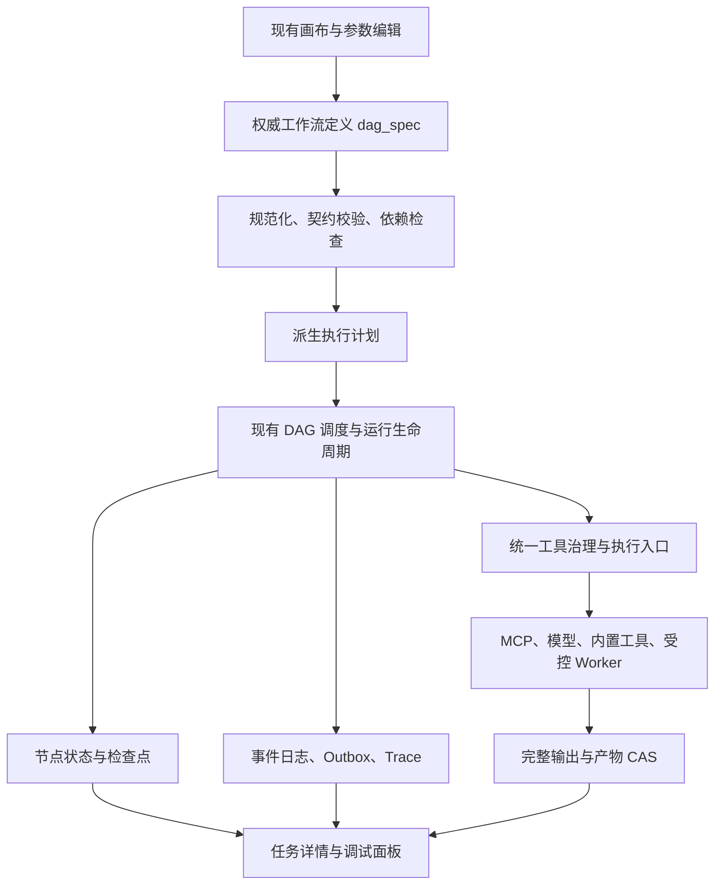

# Pivot 工作流编排能力对标与升级方案

> 文档版本：2.2（现阶段开发收口与真实 PostgreSQL 验证更新）
> 审查基线：Pivot `0.1.153` 当前工作区
> 复核日期：2026-09-20
> 状态：现阶段可在项目内闭环的开发任务已完成；本文保留改造前复核结论作为决策留痕，具体实施状态以“零、实施完成记录”为准
> 适用范围：现有自动化工作区、DAG 运行链路及其依赖；未来版本需重新核对  
> 决策原则：优先修复正确性与权限边界，复用现有底座，以业务场景和测量结果决定扩展

## 零、实施完成记录（2026-09-20）

本轮已按本文的增量架构完成 A～F 中可在当前项目内闭环的开发项，包括此前尚未持久化的逐项恢复、触发器诊断/重放、发布影响与审阅、调试失效和跨层关联。未将“满足特定负载证据后再立项”的外部 Worker、消息代理、S3 和全新执行器提前落地。以下状态覆盖文中“拟新增”“尚未实施”等历史审查表述。

| 阶段 | 已交付内容 | 关键落点 |
|---|---|---|
| A：正确性基线 | 缓存改为显式 `cacheable` 契约准入，并把用户、租户、版本、工具、模型、绑定摘要纳入缓存键；工作流定义的缓存、路由、Schema、失败策略、兜底输出完整往返；发布列表与回滚统一走资源访问控制；保存、发布采用事务/并发校验。 | `agent-dag-cache.js`、`agent-contracts.js`、`agent-workflows.js`、`agent-releases.js` |
| B：路由与恢复 | 增加 `joinMode=any_active`，跳过未命中路由分支；局部重跑保留完整原图与复用来源；大输出以 CAS 引用保存并经生命周期清理；子工作流记录 invocation ID、路径、固定版本和节点隔离；逐项调用的输入摘要、版本、调用身份和终态结果已持久化，可在同一运行恢复时仅复用未变化的成功项。 | `agent-dag-utils.js`、`run-lifecycle.js`、`agent-dag-output.js`、`agent-dag-subworkflow-runtime.js`、`agent_workflow_iteration_items` |
| C：调试与发布 | 节点测试输出可在当前编辑会话覆盖、重置或作为 Mock 使用，Mock 按输出契约校验且不进入生产；草稿定义变化会使测试快照失效；评测批次冻结用例及断言快照；发布前检查与版本固定在服务端完成。 | `dag-core.js`、`dag-inspector-testing.js`、`agent-evaluations.js` |
| D：业务组合 | 新增“逐项调用子工作流”，保留输入顺序、调用身份、单项错误与失败策略及可恢复状态；增加结构化 `errorInfo`、契约化兜底输出，以及参数抽取、内容分类预设。 | `workflow.iteration`、`agent-dag-error-info.js`、`dag-node-presets.js`、`agent_workflow_iteration_items` |
| E：接入与迁移 | 支持受限 OpenAPI 3 JSON 导入为受治理 API 操作，统一复用凭据、网络、审批与工具目录；工作流包导入/导出含依赖清单与敏感值脱敏预检。 | `workflow-api-operations.js`、`mcp-workbench-api-operations.js`、`dag-governance.js` |
| F：运行与观测 | 每用户并发由 PostgreSQL 租约原子控制，运行锁/租约丢失或跨实例取消会停止旧执行器；新增 DAG、缓存、调用、逐项处理 Prometheus 指标和运行详情；触发事件持久化记录接收、派发、失败、水位和重放关系，可由所有者诊断并将成功事件重放为新运行；Trace 关联工作流版本、调用路径和逐项身份；发布前可查看影响清单，组织发布可由同租户管理员审阅。 | `agent-run-concurrency-leases.js`、`agent-queue.js`、`agent-governance-metrics.js`、`agent-triggers.js`、`agent-releases.js` |

### 0.1 数据迁移

- `202609190001_agent_dag_reuse_provenance`：节点重跑复用来源。
- `202609190002_agent_dag_output_refcounts`：DAG 输出 CAS 引用释放。
- `202609190003_agent_evaluation_case_snapshots`：评测用例快照。
- `202609190004_agent_workflow_invocations`：子工作流调用实例。
- `202609190005_workflow_api_operations`：受控 API 操作。
- `202609190006_agent_run_concurrency_leases`：跨实例用户并发租约。
- `202609190007_agent_dag_error_info`：DAG 结构化错误诊断。
- `202609200001_agent_workflow_iteration_items`：逐项子工作流恢复记录。
- `202609200002_agent_workflow_trigger_events`：触发接收、派发、失败与重放诊断。
- `202609200003_agent_workflow_release_review`：发布说明和同租户管理员审阅记录。

所有迁移均提供 PostgreSQL `upPg`；基础 Schema、索引和中文数据字典已同步。部署前仍须在目标 PostgreSQL 执行正常迁移流程，不得向生产库直接执行开发测试脚本。

### 0.2 验证状态与未替代事项

- 已通过纯函数/注入式回归：缓存隔离、路由汇聚、重跑计划、CAS 输出、版本差异、OpenAPI、逐项子工作流与失效、结构化兜底、并发租约、指标、触发器和工作流包导入导出。
- 已通过本机隔离 PostgreSQL 回归：迁移执行、迭代项持久化恢复、触发诊断访问边界、发布影响清单、同租户管理员审阅、凭据/触发器授权矩阵；执行方式为 `node scripts/run_node_tests.js`，未对业务库写入。
- 当前并行工作区的全量静态门禁仍有与本方案无关的个人 Agent 改造项待其所属改动收口；本方案新增文件已完成语法检查、目标前后端回归和 PostgreSQL 回归。不得以并行改动的门禁失败否定上述运行结果，也不得把它们写入本方案的基线。
- 外部 Worker、Redis/RabbitMQ/Kafka、S3、通用 Saga 补偿、实时协同和任意循环仍遵循原文的负载/场景门槛，**未实施且不应因本文完成而自动启用**。

## 一、复核结论与方案取舍

原方案的产品方向基本合理，但不能直接作为实施清单。它低估了已有实现，混合了能力缺失与能力不完善，将多项大型平台建设提前列为 P0，同时缺少执行语义和迁移验收约束。按原方案整体推进，会增加重复建设与兼容风险。

结合当前项目，推荐采用“现有 DAG 增量演进”的路径：

1. **先修复已发现的正确性和权限问题**：缓存隔离、发布访问控制、序列化完整性、分支汇聚和局部重跑。
2. **完成一次编排、调试、发布的体验闭环**：权威输出契约、可编辑测试数据、完整快照、可解释复用和精确版本评测。
3. **增强有明确场景的组合能力**：调用子工作流处理数组、结构化错误与兜底、按需增加 Switch 和数据操作。
4. **围绕现有 MCP 扩展接入**：优先企业内部 API、声明式 HTTP 操作和业务模板。
5. **用实际负载触发基础设施升级**：延续 PostgreSQL 队列及共享文件系统；独立 Worker、S3 和外部消息代理分别立项。

### 1.1 对原方案的关键修正

| 原方案判断或建议 | 复核结果 | 修订决策 |
|---|---|---|
| 新建指定节点重跑、失败节点重跑 | 已有服务、接口和前端事件绑定 | 修复路由和复用完整性，再增强交互 |
| 新建变量目录、测试采样、True/False 双出口 | 已实现主要链路 | 修正目录权威性与语义一致性 |
| 首先引入全新的三类边和持久化 IR | 会与现有 `dag_spec`、`dependsOn`、`edges`、模板多重记账 | 保留一个权威定义，只派生执行计划 |
| 所有节点输出统一改成 Items 包装 | 会破坏 `rows`、`structuredContent`、LLM 文本及现有模板路径 | 保留输出形状，新增可选数组适配与来源元数据 |
| 缺少数据筛选、聚合、字段整理 | 对应 `data.*` 工具已存在 | 完善可发现性、字段契约和边界提示 |
| 先实现 Try/Catch/Finally、补偿、死信节点 | 已有失败条件、继续与停止策略；新增作用域成本较大 | 先明确现有语义、错误对象和兜底；补偿后置 |
| 新建持久化队列、租约和事件 Outbox | 已有 PostgreSQL 路径、事件日志和 Outbox | 补齐跨实例取消、配额和租约丢失行为 |
| 大对象存储从零建设 | 已有 Blob、CAS、产物授权和共享卷 | 补齐 DAG 输出引用接线；S3 适配单独评估 |
| 新建工具契约、预算和评测系统 | 已有工具契约、能力治理、预算与评测门禁 | 改进现有实现及接入覆盖 |
| 自建另一套连接器、凭据、插件市场 | 与 MCP、工具库、凭据库、技能治理重叠 | 以现有治理入口为基础做薄适配 |
| 直接推进多项目、多环境、实时协同 | 当前主要为所有者编辑、接收者只读并映射依赖 | 先并发保存、评审和受控迁移 |
| “很强/领先”等成熟度评分与固定周数 | 没有竞品实测、生产负载与人员投入依据 | 删除评分和承诺工期，改用证据、依赖和验收门槛 |

### 1.2 产品目标与首批场景

遵循项目既有定位：私有化、离线和企业内网中的统一 AI 工作入口。普通用户围绕资料、数据、工具完成任务，管理员治理连接和发布。

首批以三个现有能力可以承接的场景作为验收载体：

- **报表分析**：读取授权报表 → 筛选 → 多字段汇总 → 图表/报告 → 审批 → 通知。
- **条件处理**：查询 → 条件分支 → 两条互斥处理路径 → 统一输出；失败时进入兜底。
- **批量校对**：输入记录数组 → 逐项模型或子流程处理 → 保留成功项、定位失败项 → 受控重试 → 交付产物。

本轮改造的价值以任务成功率、修复时间、输出完整性和生产可恢复性衡量，不以节点数量衡量。

### 1.3 证据与结论边界

本文区分三类结论：

- **代码事实**：已核对实现和调用入口；不等于完成生产负载验证。
- **内存验证**：通过纯函数或注入依赖的小样本确认，不访问真实业务数据。
- **待验证风险**：由实现推导，列明验证方式，不写成已经发生的生产事故。

本次未执行生产写入、真实外部工具调用、完整集成回归或高并发压测。因此不宣称平台已达到某项企业级认证、吞吐或零故障指标。

## 二、当前实现与复用清单

| 能力 | 当前事实 | 边界与下一步 | 主要证据 |
|---|---|---|---|
| 画布和路由 | 节点库、内联配置、撤销、多选、布局、True/False 边已存在 | 重点检查汇聚与跳过传播，不重复开发双出口 | [dag-core.js](E:/pivot/client/chat/dag-core.js)、[dag-interaction.js](E:/pivot/client/chat/dag-interaction.js)、[dag-render.js](E:/pivot/client/chat/dag-render.js) |
| 变量和测试采样 | 支持声明输入、上游 Schema、工具字段提示和测试采样 | 目录仍含硬编码兜底，采样不等于可恢复的完整快照 | [dag-core.js](E:/pivot/client/chat/dag-core.js)、[dag-inspector.js](E:/pivot/client/chat/dag-inspector.js) |
| 局部重跑 | 支持指定节点及其下游重跑，复用外部已完成节点 | 子图重建未完整保留路由语义，需优先修复 | [run-lifecycle.js](E:/pivot/server/services/agent-runtime/run-lifecycle.js)、[agent-run-actions.js](E:/pivot/client/chat/agent-run-actions.js) |
| 版本治理 | 有版本、发布、回滚、Diff、可选 `expectedVersion` 冲突检查 | Diff 覆盖与事务边界需补强 | [agent-workflows.js](E:/pivot/server/services/agent-workflows.js) |
| 发布与评测 | 有评测批次、版本标识、通过率门禁、灰度发布和发布回滚 | 精确锁版、发布原子性、访问边界需要验证 | [agent-evaluations.js](E:/pivot/server/services/agent-evaluations.js)、[agent-releases.js](E:/pivot/server/services/agent-releases.js) |
| 失败处理 | 有 `success/failure/always`、`when`、重试及 `onError` | 已能表达失败处理；错误对象、兜底和可视化仍可增强 | [agent-dag-utils.js](E:/pivot/server/services/agent-dag-utils.js)、[agent-dag-runtime.js](E:/pivot/server/services/agent-dag-runtime.js) |
| 数组处理 | 有筛选、汇总、分组、字段规范化、内容校对和“逐项调用已发布子工作流” | 逐项记录持久化输入摘要、固定版本、调用身份和终态结果；恢复时仅复用同摘要的已完成项 | [builtin-mcp-data.js](E:/pivot/server/services/builtin-mcp-data.js)、[agent-content-review.js](E:/pivot/server/services/agent-content-review.js)、[agent-dag-subworkflow-runtime.js](E:/pivot/server/services/agent-dag-subworkflow-runtime.js) |
| 循环和子流程 | foreach 在独立受控进程执行数组代码；子工作流可调用发布版本，限制递归与三层嵌套 | foreach 并非嵌套图执行器；子流程另有简化执行循环 | [agent-tools-workflow-nodes.js](E:/pivot/server/services/agent-tools-workflow-nodes.js)、[agent-dag-runtime.js](E:/pivot/server/services/agent-dag-runtime.js) |
| 工具与模型契约 | 有归一化工具契约、能力目录、统一执行器、LLM JSON Schema 请求及修复 | 应复用既有字段和入口，补齐输出契约而非重建 | [agent-contracts.js](E:/pivot/server/services/agent-contracts.js)、[agent-tool-orchestrator.js](E:/pivot/server/services/agent-tool-orchestrator.js)、[agent-tools.js](E:/pivot/server/services/agent-tools.js) |
| 审批和等待 | 有审批人、串签、超时、回调、持久化延时 | 人工填写业务字段与编辑结果属于进一步扩展 | [agent-approval-requests.js](E:/pivot/server/services/agent-approval-requests.js) |
| 自动触发 | Webhook、文件、数据库及独立计划任务 | 触发事件已记录接收、派发、失败、水位和重放关系；所有者可诊断并将成功事件重放为新运行，真实业务源的时区与漏触发演练留在生产接入验收 | [agent-triggers.js](E:/pivot/server/services/agent-triggers.js)、[agent-schedules.js](E:/pivot/server/services/agent-schedules.js) |
| 事件与观测 | 事件序号、持久化事件、Outbox、Trace、瀑布图、指标入口 | Trace 已关联工作流版本、调用路径和逐项身份；日志重放仍只会通过受控触发器新建运行，不伪装为原运行续跑 | [agent-event-log.js](E:/pivot/server/services/agent-event-log.js)、[agent-event-outbox.js](E:/pivot/server/services/agent-event-outbox.js)、[metrics.js](E:/pivot/server/metrics.js) |
| 任务队列 | PostgreSQL 持久化运行记录、条件认领、锁续期、优先级和每用户并发限制 | 部分计数与取消控制器驻留进程内，不能据此承诺全局配额 | [agent-queue.js](E:/pivot/server/services/agent-queue.js) |
| 部署与存储 | 已声明 PostgreSQL 队列/锁和 shared_fs 多节点路径；有 Blob、CAS、授权下载与引用生命周期 | 配置预检不替代故障演练；S3 和外部队列仍为待接线适配器 | [deployment-providers.js](E:/pivot/server/services/deployment-providers.js)、[部署预检](E:/pivot/docs/多节点部署预检.md)、[agent-artifact-cas.js](E:/pivot/server/services/agent-artifact-cas.js) |
| 预算与子任务 | 有 Token/资源预算、子任务预留和释放 | 新迭代必须接入，避免并发倍增消耗 | [agent-run-resources.js](E:/pivot/server/services/agent-run-resources.js)、[agent-budget.js](E:/pivot/server/services/agent-budget.js) |
| 从运行生成草稿 | 有 Trace 编译为工作流草稿入口 | 优先完善参数化、校验与样例，再评估自然语言编排 | [agent-trace-compiler.js](E:/pivot/server/services/agent-trace-compiler.js) |

**复用边界**：共享接收者目前只读，并用自己的模型、工具和凭据运行；绑定与发布版本关联。增加协作或环境功能时，不得自动将接收者变成编辑者，也不得继承所有者的凭据使用权。参见 [项目设计规范](E:/pivot/docs/design/DESIGN.md) 与 [依赖映射](E:/pivot/server/services/agent-workflow-dependencies.js)。

## 三、对标结果：学习具体能力，不照搬架构

| 对标能力 | 官方事实 | Pivot 的实际选择 |
|---|---|---|
| Dify 变量调试 | 支持查看、编辑缓存变量后运行下游，原运行记录保持独立。[变量检查器](https://docs.dify.ai/en/cloud/use-dify/debug/variable-inspect) | 在已有采样与局部重跑上补变量覆盖、重置、失效判断 |
| Dify 可视化迭代 | 对数组每项执行内部流程，可顺序或并行，并选择失败项策略。[Iteration](https://docs.dify.ai/en/cloud/use-dify/nodes/iteration) | 先提供“数组 → 已发布子工作流”，再做嵌套画布 |
| Dify 失败兜底 | 部分节点支持默认值、失败分支和错误变量。[错误处理](https://docs.dify.ai/en/cloud/use-dify/build/predefined-error-handling-logic) | 复用现有 failure 条件，先补错误结构和输出契约校验 |
| n8n item 关联 | 输出 item 可关联一个或多个输入，拆分、合并需要维护关联。[Item linking](https://docs.n8n.io/build/work-with-data/reference-data/link-data-items/how-items-link-through-workflows) | 按需增加来源映射，不强制改写所有输出 |
| n8n 历史调试 | 可将历史执行数据带回编辑器调试。[Debug executions](https://docs.n8n.io/build/understand-workflows/understand-executions/debug-executions) | 原始快照与草稿调试分开，保持历史不可变 |
| n8n 扩展生态 | 提供社区节点的开发、安装和管理入口。[社区节点](https://docs.n8n.io/integrations/community-nodes) | 以 MCP 和声明式 HTTP 接入满足企业场景 |
| n8n 横向扩展 | queue 模式由 Redis 分发执行标识，Worker 执行并写数据库。[Queue mode](https://docs.n8n.io/deploy/host-n8n/configure-n8n/scaling/enable-queue-mode) | 借鉴角色隔离和监控；现有 PostgreSQL 路径先测量再决定是否替换 |
| n8n 环境交付 | Git 支持跨实例环境，该功能属于 Business/Enterprise 套餐。[源码控制与环境](https://docs.n8n.io/administer/use-source-control-and-environments) | 先依赖清单、导入检查、精确发布，再考虑 Git 集成 |

竞品资料按复核日期访问，Dify 引用主要来自 Cloud 文档；不能将云端/商业版特性一律认定为自托管社区版能力。本方案不使用主观分数、不承诺兼容 Dify DSL 或 n8n 导出文件。

## 四、首批整改：具体证据、影响与处理方式

### 4.1 P0：缓存权限隔离与契约准入

**已确认事实**：

- `computeDagNodeCacheKey` 当前只包含 workflowId、tool、input、dependsOnOutputs，未包含调用用户、租户、资源授权范围或有效模型配置。
- 缓存准入按工具名称黑名单判断；内存验证中 `mcp.1.db.insert` 返回可缓存。此验证只证明名称规则不足，不代表已在真实数据库执行写入。
- 主运行链在输出 Schema 校验之前写入成功工具返回值。
- `cacheEnabled` 与节点 `cache` 被运行时读取，但当前前后端规范化/序列化链没有完整保留；内存验证中 `false` 均变成未定义。

**影响**：可能复用不属于当前授权上下文的结果，或跳过应执行的动作；关闭缓存的设置还可能无法真正生效。共享缓存会扩大问题，因此不能把迁移 Redis 排在隔离修复之前。

**处理要求**：

1. 修复缓存配置的编辑、保存、加载、导出、导入、发布、运行全链路。
2. 从统一工具契约读取“纯函数/可缓存、无副作用、无人工交互”等明确属性，未知工具默认不跨运行缓存。幂等性不等于可缓存性。
3. 先执行当前用户的能力、资源、模型与绑定检查，命中缓存不能绕过授权。
4. 缓存键纳入用户/租户、规范化节点配置、工具版本、有效模型配置摘要、资源/依赖绑定摘要、完整输入摘要及缓存格式版本；无法证明权限或数据新鲜度的节点禁用跨运行缓存。不得将密钥明文写入键或日志。
5. 输出契约校验通过后才写缓存；补总字节上限、单条上限和命中原因。
6. 先保留进程内缓存。跨实例缓存作为后续优化，在跨账户隔离和撤权测试通过后再评估。

证据：[agent-dag-cache.js](E:/pivot/server/services/agent-dag-cache.js:32)、[缓存运行接线](E:/pivot/server/services/agent-dag-runtime.js:707)、[规范化](E:/pivot/server/services/agent-validators.js:280)。

### 4.2 P0：发布资源访问控制复核

**静态风险**：发布记录列表路由仅使用登录校验后按 workflow_id 查询，未在该路由中调用资源可见性检查；发布回滚服务对管理员身份的判断，也需要验证是否绑定目标租户。当前不能用“已有统一鉴权”推断每个入口都满足资源授权。

**处理要求**：

- 发布历史、Diff、版本恢复、发布回滚逐一复用工作流所有权/共享可见性/租户权限判断。
- 普通共享接收者只能读授权发布信息；编辑、发布、历史草稿不可因知道 ID 而开放。
- 管理员权限必须限定目标组织；更新目标资源不能错误使用当前操作者作为所有者条件。
- 以 HTTP 集成测试验证同租户无权限用户、跨租户管理员、只读接收者及所有者四类访问。
- 在证据闭合前，将其记为待验证并修复的访问控制风险，不宣称发生过数据泄露。

证据：[发布路由](E:/pivot/server/routes/agent-control-plane.js:352)、[发布回滚服务](E:/pivot/server/services/agent-releases.js:676)。

### 4.3 P1：工作流往返保存与 Diff 完整性

**已确认事实**：

- 导出投影没有保留 inputSchema、retryLimit、timeoutMs、onError；内存往返验证确认这些字段丢失。
- 服务端版本 Diff 比较标题、工具、输入、依赖与 condition，未覆盖 edges、when、Schema 和节点策略；前端 Diff 已比较路由，二者不一致。
- 缓存设置存在上述规范化缺口。
- JSON 对象键顺序可能制造无意义差异。

**处理要求**：

建立唯一的“工作流定义字段清单”和规范化比较函数，供保存、导出、导入、发布、Diff 和重跑复用；布局单独比较。Schema 校验器只承诺当前支持的子集，遇到未支持关键字应明确诊断，不能以全量 JSON Schema 支持对外宣传。

验收必须包含：导出再导入后所有执行字段等价；仅更改一条 true/false 边也能被服务端 Diff 识别；排列对象键不产生业务变更。未来语义字段只有在读取、持久化和运行支持全部完成后才进入发布格式。

证据：[导出投影](E:/pivot/client/chat/dag-governance.js:286)、[服务端 Diff](E:/pivot/server/services/agent-workflows.js:552)。

### 4.4 P1：分支汇聚和失败语义

**已确认事实**：

- success 条件要求所有依赖为 completed/continued_error；互斥分支中的另一侧为 skipped 时，默认汇聚节点也会跳过。
- default 边当前直接标为激活，并不单独判断来源是否 skipped。
- continued_error 同时满足成功依赖和失败依赖，可能让两条处理路径都执行。这是现有行为，应保留兼容并明确展示。

**处理要求**：

先用状态真值表定义“等待完成、路由激活、允许失败、是否执行”，再调整 UI。不能把 condition 改成 always 作为统一修复。

对于新的显式“合并已执行分支”模式，目标规则为：

| 上游状态 | 目标行为 |
|---|---|
| 任一相关依赖仍未结束 | 继续等待 |
| 存在激活的成功路径，其余仅为路由未选中 | 执行一次 |
| 全部路径未选中 | 跳过并传播原因 |
| 存在未处理失败 | 按显式失败策略处理，不伪装成功 |
| continued_error | 按当前兼容规则，或显式新模式处理，并保留失败标识 |
| 审批、延时尚未结束 | 挂起等待，不当作失败或跳过 |

新语义使用显式字段/版本能力标识（名称在实现设计时冻结），旧 DAG 保持原行为。跨分支取值使用“选择已激活结果”的聚合策略；普通 `agent.merge` 字段映射不自动忽略所有空值或失败。

证据：[依赖与路由判断](E:/pivot/server/services/agent-dag-utils.js:240)、[运行门禁顺序](E:/pivot/server/services/agent-dag-runtime.js:479)。

### 4.5 P1：修复已有局部重跑，再扩展调试器

**已确认事实**：`buildDagResumeSpec` 会计算起点下游闭包并复用其他 completed 节点，但返回定义仅包含 nodes、layout，丢失 edges 和 schemaVersion；也会裁掉跨子图的依赖。因此“已有从节点重跑”不代表条件路由重放已经完整。

**目标**：

- 保存完整原始定义及输出契约，以执行选择集控制需要重算的节点，避免删图导致语义损失。
- 复用快照保留来源运行、完整性、状态与路由信息；边界依赖用于路由判断，不能直接删除。
- 分别标识“继续同一次运行”“基于旧快照新建调试运行”“以当前草稿重跑”，三者的审批、幂等和版本规则不同。
- 节点变化、输入覆盖、路由变化、依赖绑定/权限变化使相应下游失效；不复用已经过期或不可授权的资源。
- 完整快照不可用时给出明确原因；不能把截断预览当完整输入。
- 复用结果跳过外部操作，新执行部分重新经过工具治理；新建运行不能继承旧审批或冒用旧操作幂等键。

证据：[重跑闭包与快照复用](E:/pivot/server/services/agent-runtime/run-lifecycle.js:123)、[前端重跑入口](E:/pivot/client/chat/agent-run-actions.js:261)。

### 4.6 P1：权威变量目录及可恢复输出

**已确认事实**：

- `getAvailableVariableOptions` 已存在，但工具参数名为 `_tools`，尚未形成完整的动态工具输出 Schema 查询路径。
- 无显式 Schema 的 rag 分支仍推荐 documents/text，而当前内置 `rag.search` 返回 query/matches/metrics；应修正该兜底并检查预设覆盖情况。
- 单节点测试会保存经过脱敏、截断的采样；这是字段发现数据，不应直接作为真实执行输入。
- DAG 输出超过持久化上限时会产生 `__partial` 预览；内存执行使用原输出，恢复读取持久化值，二者可能不同。

**处理要求**：

1. 变量候选优先使用节点声明契约、工具目录契约和显式动态输出规则，采样只作补充并标记来源。
2. 保持 MCP 包装路径和 LLM 结构化字段的真实可解析路径；字段名不能由标题或示例猜测。
3. `outputRef + preview + complete + digest` 为拟新增的持久化描述，复用现有 CAS 授权与生命周期。短结果可内联，长结果先可靠落盘再提交节点完成状态。
4. 引用恢复时校验存在性、摘要、权限和生命周期；清理任务需保护仍被运行、检查点或调试会话引用的对象。
5. 历史截断结果保持可查看，但不具备完整重放资格；用户可重新执行上游或提供明确的测试夹具。

证据：[变量目录](E:/pivot/client/chat/dag-core.js:411)、[真实 RAG 输出](E:/pivot/server/services/agent-tools.js:964)、[持久化截断](E:/pivot/server/services/agent-dag-output.js:9)。

### 4.7 P1：子流程执行身份与主流程一致性

子工作流有独立的简化执行循环、内存 states 和逐节点执行路径，不能直接把它套进并行迭代后假定获得主流程全部能力。

重点问题与前置要求：

- 当前 childRun 沿用父 run.id；默认操作键为 runId + nodeId + 输入摘要，未包含子流程调用实例路径。不同调用点内部同名节点、相同输入存在键碰撞风险。
- 审批键中的工作流 ID 栈不能唯一表示同一子工作流在不同调用点或不同数组项的执行实例。
- 需要核对与主流程的 Schema、预览拦截、sandboxExecution、取消信号、节点持久化、错误和 Trace 行为。
- `published` 是动态引用；一次运行中的子工作流应固定解析结果，恢复和逐项执行不得悄悄切换版本。

建议先抽取共同的节点执行步骤，保留现有调度器。拟增加 invocationId/executionPath，唯一标识调用节点、子流程实例和 item；同一次节点重试保持相同操作键，attempt 只记录尝试次数。新运行与新数组项使用独立操作身份。

在这一门槛通过前，Iteration 只做设计和原型，不对外承诺嵌套审批、等待与断点续跑。

证据：[子工作流执行](E:/pivot/server/services/agent-dag-runtime.js:290)、[操作键](E:/pivot/server/services/agent-dag-approval.js:15)。

### 4.8 P1：保存、发布和评测必须锁定同一份内容

当前 `expectedVersion` 为可选的读后检查，随后 MAX(version)+1、插入版本、更新指针是分开的操作；发布指针和 release 记录也有多步写入。它们需要事务与并发验证，不能等到多人实时协同才处理。

评测虽记录 workflowVersionId，但创建每个案例运行时仍传 current/published 等可变别名；若批次创建期间发生保存/发布，应验证实际执行版本是否和批次快照一致。评分路径还应核查案例断言是否随批次冻结。

处理要求：

- 保存使用资源行锁或等价事务内 CAS，分配唯一版本并更新指针；冲突返回 409。
- 评测批次冻结定义版本、案例及断言摘要、模型配置/工具依赖摘要；每个案例显式传递解析后的目标，批次内不得再次解析动态别名。
- 发布门禁采用服务端策略，校验完成状态、对应内容、最小样本和关键用例；调用者不能任意降低通过率。现有多层门禁应使用统一规则。
- 发布指针、release 与必要审计记录事务化；通知通过 Outbox 提交后投递。
- 回滚只影响后续的动态发布引用；已开始运行继续使用快照，显式固定版本的计划/子流程不被强行改写。
- 共享依赖映射过期时重新确认；不承诺回滚后所有任务无需检查就能自动切换。
- 发布失败与业务副作用补偿是两件事，回滚定义不会撤销已发送通知或已写入数据。

证据：[保存逻辑](E:/pivot/server/services/agent-workflows.js:349)、[评测创建](E:/pivot/server/services/agent-evaluations.js:490)、[发布写入](E:/pivot/server/services/agent-releases.js:629)。

## 五、目标架构：保留权威定义，派生执行计划

### 5.1 架构决策记录

| 决策 | 本阶段选用方案 | 暂缓方案及启动条件 |
|---|---|---|
| 工作流定义 | 现有 dag_spec 为权威来源，补齐字段完整性 | 独立持久化 Workflow IR：仅在多种编排入口或执行器确需共享编译产物时评估 |
| 控制关系 | 保留 dependsOn、edges、when、condition 的兼容含义 | 三套并列 control/data/error 边：先证明增量模型不足，再做版本化设计 |
| 数据输出 | 保留原有文本、JSON、rows、structuredContent、产物引用 | 全平台 Items 强制包装：迁移收益不足，暂不采用 |
| 工具接入 | 现有工具目录、MCP、凭据和统一执行器 | 第二套插件执行器：无独立必要性时不建设 |
| 子流程 | 先复用共同执行步骤，再增加调用实例身份 | 新建通用递归引擎：避免同时维护两套执行语义 |
| 队列与状态 | PostgreSQL 持久化队列和租约，按负载优化 | Redis/RabbitMQ/Kafka：有测得的瓶颈或事件总线需求才选型，三者并非可直接互换 |
| 文件和快照 | 复用 CAS、产物授权及现有共享卷 | S3：跨机存储需求成立后，实现完整读写、清理及授权适配 |
| 团队交付 | 版本冲突、发布评审、依赖清单和迁移检查 | 实时协作与 Git 双向合并：由实际协同规模决定 |
| 观测 | 扩展现有事件、Trace、指标和任务中心 | 另建独立运行管理台：优先避免用户入口重复 |

### 5.2 增量架构



“派生执行计划”是拟新增的内部对象，可包含依赖索引、引用索引、路由规则、执行选择集和版本摘要。它从权威定义生成，不能成为另一份可独立编辑的资产；UI 数据映射最终仍落入现有节点参数，避免模板与 dataBindings 双重记账。

实施时先让旧执行器继续运行，由派生计划进行影子校验和诊断。确需切换调度判断时采用单次运行锁定的执行语义版本，不能在同一运行恢复途中切换规则。

### 5.3 契约统一与依赖诊断

延续现有 input_schema、output_schema、risk_level、side_effect、idempotent、concurrency、cancellable、approval_required、timeout 等契约字段。前端可适配展示命名，但持久化与执行只保留一套规范。

拟新增诊断结构示意：

```json
{
  "code": "WORKFLOW_REFERENCE_UNRESOLVED",
  "severity": "error",
  "nodeId": "summary",
  "fieldPath": "input.prompt",
  "message": "引用字段不存在，请重新选择上游结果。",
  "actions": [
    { "type": "open_field", "fieldPath": "input.prompt" }
  ]
}
```

要求：

- 类型规则从已有 Schema 子集扩展，明确未知类型、nullable、数组项和动态字段，不把采样结果升级成确定契约。
- 引用传递上游合法，不因缺少直接连线误报；引用非上游提供添加依赖动作，并检查循环。
- 参数声明与工作流输入、默认值、必填验证共用来源；不强制给现有工作流补起点节点。
- 不支持的格式版本或执行能力在服务端拒绝；不能静默忽略新字段并继续发布。
- 执行语义摘要排除布局与界面状态；工具、模型及资源绑定摘要与定义摘要分别记录。

## 六、调试工作台：扩展已有重跑链路

### 6.1 区分四种行为

| 行为 | 是否产生新执行 | 使用的数据与授权 |
|---|---|---|
| 查看历史事件 | 否 | 原事件、Trace、节点预览；只读 |
| 恢复原运行 | 继续原运行 | 原定义、检查点、操作身份；重新核验失效权限 |
| 基于历史运行调试 | 是 | 原定义与可授权完整快照，新增调试覆盖 |
| 当前草稿调试 | 是 | 草稿快照；只复用经验证仍兼容的上游数据 |

界面要显示“复用历史结果”“使用测试值”“重新执行”三种节点状态，不把事件重放标成任务重新执行。模型重算和外部数据读取可能变化，历史回放不能承诺确定性复现。

### 6.2 调试输入覆盖

在已有变量目录和采样树上增加查看、固定测试值、编辑、重置入口。固定值按工作流/草稿摘要、节点及字段隔离；切换工作流或节点配置变化时标记过期。

覆盖数据进入独立调试配置，不修改原始运行输出。服务端验证覆盖路径、类型、大小和权限；不接受客户端直接提交“已完成节点”“已审批”“已支付”等可信运行状态。原始敏感值仍应保存在受控引用中，UI 遮蔽字符串不能作为原值回填。

首期提供“选中节点及其下游”的确定范围。跨版本缓存自动命中、任意节点集合重算等优化，只有依赖失效规则稳定后才开放。

### 6.3 副作用测试与 Mock

当前预览会拦截被标记为副作用/需审批的工具；这不等同于所有工具已有 Dry Run。

建议支持三种明确方式：

1. **只校验**：展示解析后的非敏感参数、依赖和预检结果，不调用外部系统。
2. **模拟结果**：使用用户明确设置的夹具，并按输出契约校验，标记为模拟。
3. **真实测试**：仅在工具支持、当前用户有权限、目标环境明确且既有审批规则满足时执行。

模拟外部写入不能显示“业务已完成”。正式运行、计划任务和发布产物不得自动携带临时 Pin 或 Mock 数据；测试夹具仅作为独立评测资源引用。

### 6.4 调试体验落点

- 画布节点：最近状态、耗时、是否复用及问题入口。
- Inspector：实际输入、输出字段、局部重跑与参数修复。
- 运行详情：失败节点跳转、执行范围预览、来源运行与结果对比。
- 评测中心：将经过脱敏确认的输入与断言保存为用例，避免自动收录敏感生产输出。
- 沿用自动化与任务两个工作区，复用全局样式和模块 API；不因功能增加重新组织导航或引入新的前端框架。

## 七、数组、子工作流与错误能力

### 7.1 数组能力采用适配策略

继续接受数组、rows、structuredContent.rows 以及工具明确声明的集合字段。引用来源和映射路径必须显式；同一结果出现多个数组时，不能自动选第一项。

新增能力与已有能力划分：

| 业务操作 | 实施方式 |
|---|---|
| 筛选、汇总、分组、字段规范化 | 复用 data.filter_rows、data.aggregate、data.group_summary、data.normalize_fields |
| 文档分块、报表查询 | 复用 doc.*、reports.* 与现有数据处理底座 |
| 排序、去重、分页 | 核对现有工具后补缺口，先明确空值、排序规则和分页边界 |
| 多路字段合并 | 复用 agent.merge；按键连接、重复键展开属于独立增强 |
| 每条记录调用多个节点 | 新增数组调用子流程能力，依赖子流程一致性整改 |
| 大数据统计 | 优先数据库/DuckDB 下推过滤聚合；不要默认逐行调用模型 |

当前部分 data 工具有输入行数上限与 limitApplied/warnings，foreach 也有最多 1000 项等受控边界。接口返回的“截断”“总数”必须展示给用户，不能把前 N 行处理结果当成全量完成，也不以提高上限代替分页和背压。

### 7.2 首期批处理形态

首期建议新增一个“逐项执行子工作流”节点（工具名实施时确定），输入包括：

- 数组来源。
- 已发布子工作流及版本选择。
- 每项到子工作流 inputs 的映射。
- 并发上限、总项数/输出字节/总预算限制。
- 失败处理与输出映射。

示例映射仍使用现有输入语法：把当前项传给子流程 `inputs.item`，索引传给 `inputs.itemIndex`，子流程内部使用 `{{inputs.item.xxx}}`。首期无需引入全局 `item` 魔法变量或修改全部工具输出。

每项结果至少包括 itemId、inputIndex、status、value 或 error，以及对应执行实例引用。索引仅用于显示顺序；输入集合须固定摘要，恢复后不能按重新排序的数组误认同一条数据。

### 7.3 持久化和调度前置条件

- 父节点在派发前固化输入集合引用、子流程解析版本、权限映射和 item 清单。
- 使用第 4.7 节的调用身份；可选择持久化调用记录或子运行表，但同一迭代的执行方式应统一，不同时维护互不一致的内存状态与子任务状态。
- 并发需同时受父运行预算、每用户/组织配额、模型/工具限额限制；不能简单相乘“节点并发 × item 并发 × 子节点并发”。
- 等待子任务时释放执行槽或使用持久化等待机制，避免父任务占满队列后子任务无法启动。
- 取消停止后续派发，并传播到活动调用；已完成副作用保留审计，不伪称被撤销。
- 重试失败项需重新核验是否存在结果未知的副作用；原项的重试保持原操作身份，新业务请求创建新身份。
- 空数组成功返回空结果；默认按输入顺序聚合，并保留失败项位置和错误。过滤失败项时仍返回来源索引。
- 首期可限定只读子流程；确有副作用需求时逐类增加幂等与审批支持。嵌套迭代、循环内持久等待、循环内人工审批另设验收门槛。

嵌套画布是后续编辑体验，不能成为首期批处理的前置条件。已有 foreach 继续作为受控代码转换工具，保留名称与行为。

### 7.4 错误处理增量演进

第一步复用 condition=failure/always 与 onError 策略，补全错误信息；第二步增加输出兜底和便于配置的失败连线；只有多节点异常作用域成为真实需求时再引入 Try/Catch/Finally。

拟新增结构化错误字段可与现有字符串 error 并存，避免破坏旧模板：

```json
{
  "errorInfo": {
    "category": "rate_limit",
    "code": "UPSTREAM_RATE_LIMIT",
    "message": "上游服务请求过于频繁。",
    "nodeId": "query",
    "retryable": true,
    "attempt": 1
  }
}
```

规则：

- 类别优先复用现有诊断与 retry-policy 的分类，建立映射表，不再维护另一组相互冲突的错误码。
- 重试必须结合工具契约、状态码和副作用结果；429 可以考虑 Retry-After，但必须有总期限和预算。
- 当前 AGENT_NODE_TIMEOUT 不自动重试，任何改变要显式设计和回归。
- 兜底值需要通过原输出 Schema，并展示降级标识。错误被处理后是否算成功，须同时满足交付节点完成条件，不由“出现输出文本”推断。
- always 表示普通依赖终结后的执行条件，不应被宣传为取消、进程崩溃后必定执行的 finally。
- 审批挂起、延时等待、用户取消与普通失败分开；不能由 catch 吞掉取消继续运行。

**补偿后置**：外部操作无法靠修改数据库状态撤销。后续补偿必须有显式操作、原副作用标识、补偿幂等性、逆序/依赖规则和人工介入状态。通知投递已有死信能力，不据此直接宣称整个 DAG 已支持通用事务补偿。

## 八、接入生态与 AI 节点

### 8.1 MCP 优先的接入路线

现有工具库已经处理模型、数据库连接、外部 MCP、本机能力与治理。下一步接入应形成：

```text
外部 MCP / 声明式 HTTP 操作 / 既有内置工具
                    ↓
        工具目录 + 输入输出 Schema
                    ↓
     凭据引用 + 能力/网络/审批/预算校验
                    ↓
            统一执行入口
```

连接器能力包可以提供节点描述、中文表单、输出契约、认证引用、分页规则和测试样例；执行仍经过现有运行入口。先做内部可安装模板和开发说明，再根据维护需求决定是否形成公开 SDK。

工具认证、触发器生命周期和持久化状态不同。普通 MCP 工具并不会自动成为可靠触发器；Webhook/轮询适配须另外处理签名、去重、水位和租约。

### 8.2 OpenAPI 适配最小范围

首期只支持经过验证的 JSON 请求/响应操作、有限认证方式、明确的参数映射和返回契约：

- 导入时不自动发送请求，展示将生成的操作和所需凭据。
- 限制文档体积、引用深度；外部引用不自动抓取，确需解析时经过现有网络策略。
- OpenAPI Schema 到项目 JSON Schema 子集做显式转换；不支持的组合、文件流或复杂认证标记为不可用。
- 分页、重试、幂等和副作用由操作声明与审核确定，不能仅根据 HTTP 方法保证安全。
- 私网地址可按企业授权网络策略访问，不放宽 SSRF 规则。
- 目标系统支持的 OAuth 需求确认后再扩展凭据类型、刷新锁与撤权处理，避免第一期搭完整 OAuth 平台。

验收目标是完成真实内部业务 API 接入及故障处理，不是支持所有 OpenAPI 规范形式。

### 8.3 触发器可靠性

先补现有触发链路的运行诊断、重放和幂等，再增加高频来源。新增邮件、消息队列或企业消息事件必须有具体使用方。

统一规定：

- 入站事件经验证后持久化，再确认接收；触发记录与运行创建需通过事务或 Outbox 保证可恢复。
- 去重作用域包含触发器与调用来源，记录去重窗口和再次处理规则。
- 数据库轮询水位只能在对应事件可靠接收后推进；文件事件需考虑文件尚未写完、覆盖和同名文件。
- 重放历史事件属于新运行，并明确原事件与新业务幂等键关系。
- 调度需定义时区、停机后补跑策略及重叠运行策略，不简单新增第二套 Cron。
- Webhook 触发返回运行标识和最终业务响应是两种契约；需要同步结果或流式接口时另行设计超时、授权与响应大小。

### 8.4 AI 专用节点以既有能力封装为主

| 需求 | 优先方案 |
|---|---|
| 参数抽取 | LLM 节点 + outputSchema + 字段描述表单，复用原生结构化输出和修复 |
| 问题分类 | 结构化分类结果 + 条件节点/后续 Switch，增加中文业务预设 |
| 质量检查 | 扩展既有规则评测和内容校对，按需增加模型评分并记录评分器版本 |
| 检索与重排 | 核对并复用知识库检索配置，按场景暴露节点参数 |
| 模型选择与故障回退 | 复用现有模型运行/路由能力，核对 DAG 接入、权限和预算 |
| 人工补充 | 扩展现有审批/交互数据结构，增补字段 Schema、超时和审计 |
| 自然语言搭建 | 先完善 Trace 转工作流草稿、参数化和静态校验，再做受约束草稿编辑 |

评测门禁应保留为发布控制面规则，不能仅做成一个可以从画布删除的 Evaluation Gate 节点。AI 生成的流程只能进入草稿，通过工具可用性、字段引用和权限校验后按既有规则发布。

## 九、团队发布、部署与运行优化

### 9.1 先强化资产交付，再扩大协作权限

按以下顺序推进：

1. 修复保存冲突、发布访问检查及精确版本绑定。
2. 增加发布前影响清单：变更字段、工具、模型、网络目标、凭据引用和子流程版本。
3. 在现有发布记录上增加评审与说明；如需增加 reviewer/publisher 权限，接入已有企业权限体系，不创建另一套组织树。
4. 完善工作流导出清单、依赖映射、目标环境预检与导入试运行。
5. 只有多人共同维护同一工作流成为常态时，增加协同编辑；首先可采用编辑锁/乐观并发，不立即投入实时合并。

跨实例迁移不能直接复制数字资源 ID，应以逻辑依赖标识建立映射。导入包含脱敏工作流定义、依赖类型、版本/摘要、所需能力和测试样例；凭据值、生产运行数据、所有者私有资源不随包迁移。

开发/测试/生产可以先采用独立实例与受控推广。Git 作为可选交付通道，不将客户端提交等同于生产发布。凭据、环境策略与知识库授权由目标环境管理。

### 9.2 运行优化顺序

当前主调度器按一批 runnable 节点 Promise.allSettled 后再进入下一轮；短分支可能等待同批长节点。应先用长短分支样例测量，再评估有界任务池：任一节点完成即可调度新就绪节点，同时保证取消、失败停止、状态写入和预算一致。

多实例必须重点验证：

- 每用户并发计数目前主要在进程 Map 中，跨实例配额应使用数据库原子预留/释放，并由超时回收兜底。
- 运行锁丢失后旧执行者不得继续提交状态；对执行与结果提交加入持锁校验，必要时增加租约世代标识。
- 跨实例取消不能仅依赖本进程 AbortController，需要持久化取消状态和执行端检查。
- 审批/延时释放执行槽，恢复时重新认领；不能把长时间等待的墙钟时间简单计入工具超时。
- 停机、数据库短暂故障、共享卷不可用和权限撤销需要故障演练。

这些是现有运行平面的强化。独立 DAG/AI/Connector 多种 Worker 不作为首期强制拆分；先按实测资源类型隔离 CPU/代码执行与 Web 请求，复用已有受控 Worker。

### 9.3 扩容立项条件

| 候选升级 | 启动证据 | 应先做的低成本优化 |
|---|---|---|
| 独立工作流 Worker | 执行负载持续影响 Web 响应或需独立扩缩容 | 有界并发、慢任务隔离、连接池与队列测量 |
| 外部消息代理 | PostgreSQL 队列在目标负载下锁等待/延迟仍不达标，或确需跨系统事件消费 | 索引、认领批次、配额与队列扫描策略 |
| S3 存储 | 多机共享卷无法满足容量、可用性或运维要求 | 先将 DAG 完整输出接入已有 CAS |
| 分布式缓存 | 相同授权上下文的重复计算足够多且收益明确 | 缓存准入、隔离、完整键和大小限制 |
| 流式大数据图 | 多个真实业务受分页限制，无法通过 SQL/DuckDB 下推解决 | 数据源分页、下推和文件引用 |
| 完整 IR/新执行器 | 当前定义不能表达已经确认的多种语义，或出现多后端编译需求 | 派生计划、公共执行步骤和版本化字段 |

在目标硬件上采集基线并由项目确定 SLO 后才能选型。本方案不据文档中的 provider 标签承诺端到端分布式一致性。

### 9.4 运行观测

复用已有 Trace、事件序号、Outbox、瀑布图、usage 与指标，补齐：

- workflowVersion、runId、invocationId、nodeId、itemId 关联。
- 排队、工具执行、模型调用、审批等待与持久化写入的独立耗时。
- 缓存命中/拒绝原因、完整结果引用、重跑来源、失败类别。
- 版本成功率、交付完整率、Token/成本、降级率、人工介入率。
- 外部观测系统通过适配导出；不要求所有私有化部署安装额外平台。

标签禁止直接使用高基数字段或敏感输入造成指标膨胀；成本区分实际 Provider 用量、估算值和未知值。

## 十、数据、接口与迁移范围

### 10.1 已有字段和存储优先复用

| 内容 | 优先落点 | 本轮设计约束 |
|---|---|---|
| 定义与版本 | agent_workflow_versions.dag_spec | 先补投影字段，不另建可编辑 IR 副本 |
| 运行定义与来源 | 现有运行 metadata、parent_run_id | 沿用 dagSpec、dagInputs、重跑来源等；限制体积 |
| 节点状态 | agent_dag_nodes 与检查点 | 保留历史状态；新增调用身份需验证唯一键及索引 |
| 完整大输出 | 现有 CAS、产物引用与授权 | 增加引用描述和生命周期接线，避免裸路径 |
| 事件与 Trace | 现有事件表、Outbox、Trace | 补关联字段及必要事件，不复制完整敏感负载 |
| 发布与评测 | 现有 release、suite、case、run、result | 冻结内容摘要与断言，完善事务边界 |
| 预算 | budget_config、usage_stats、资源账本 | 不新增重复 cost_budget/token_budget 体系 |
| 调试覆盖 | 会话级状态；需要分享/保存时再持久化 | 与生产定义、原运行状态分离 |

新增 invocation、snapshot 或 package 表必须在实现设计中确认现有表是否能够表达，不能仅凭概念清单建表。新增字段应包含单位、空值含义、默认值和格式版本；例如预算“0/未设置”必须沿用现有定义，不另造含义。

### 10.2 接口复用与建议增量

| 功能 | 既有入口/位置 | 建议 |
|---|---|---|
| 工具目录与单节点测试 | GET /api/agents/tools、POST /api/agents/tools/test | 补输出契约、诊断和安全模拟能力 |
| 指定节点重跑 | POST /api/agents/runs/:id/dag/rerun | 修复语义后向后兼容扩展，不重复增加另一条 rerun API |
| 恢复运行 | POST /api/agents/runs/:id/resume | 保持恢复与新建调试运行的差异 |
| Trace / 事件 | /api/agents/runs/:id/trace、/events/replay | 查询与事件重放保持只读 |
| 草稿生成 | /api/agents/runs/:id/trace/compile、/workflow-draft | 增强现有 Trace 转草稿入口 |
| 保存工作流 | PUT /api/agents/workflows/:id | expectedVersion 与事务化版本更新 |
| 版本、Diff、发布 | 现有 versions、diff、publish、releases 路径 | 补一致性和权限，统一门禁策略 |
| 完整快照读取、调试计划 | 拟新增，小范围独立服务 | 实现时确定接口；必须鉴权、分页、脱敏 |
| OpenAPI/模板导入 | 拟在工具库与自动化导入入口扩展 | 先预检，再创建草稿；不自动启用触发器 |

重跑请求中的原始版本、目标节点、覆盖数据和执行模式必须由服务端解析并生成计划；请求体不能直接指定“跳过权限”或“复用审批”。

### 10.3 迁移与回滚

- 先补读写兼容和缺失字段默认值，再写新格式；完整往返测试必须先于批量迁移。
- 旧版本定义不可原地重写。需修复时创建新版本并保留父版本、迁移说明。
- 新语义使用显式版本/能力要求；旧执行器遇到不支持的流程应拒绝运行并给出说明。
- 新旧计划可对同一快照做只读比较，不双执行真实副作用。
- CAS 输出先写完整对象，再提交引用；异常产生的孤立对象由既有清理机制按安全窗口回收。
- 回滚应用前检查是否仍有依赖新语义的活动运行；保留兼容执行路径或完成排空，不能直接降级后丢弃状态。
- 定义回滚、数据迁移回退和业务补偿分别记录，不承诺数据库回滚能恢复所有外部系统状态。

## 十一、实施优先级与可独立交付阶段

优先级约定：P0 为权限、错误复用等风险；P1 为核心正确性与主要使用闭环；P2 为有场景支持的能力扩展；P3 为条件成熟后再立项的平台能力。不能把所有新能力同时标成 P0。

不沿用原方案的固定“4～16 周”估计。人员投入、可用测试环境与业务流量尚未确认，当前采用带依赖的交付包；每包完成设计和基线测量后再估算工期。

| 阶段 | 主要交付 | 当前状态 | 完成/后续边界 |
|---|---|---|---|
| A：正确性基线（P0/P1） | 缓存隔离与准入、发布资源授权、定义字段往返、服务端 Diff | 已完成 | 已有跨用户/跨租户隔离及执行字段等价测试 |
| B：路由与恢复（P1） | 分支汇聚语义、局部重跑完整图、输出完整性标记、子流程调用身份 | 已完成 | 已覆盖分支、重跑、同名子节点、截断输出和逐项持久化恢复 |
| C：调试与发布闭环（P1） | 变量覆盖/重置、Mock、快照引用、精确评测、保存发布事务 | 已完成 | 草稿变更会使测试快照失效；发布增加影响清单、说明与管理员审阅 |
| D：业务组合扩展（P2） | 数组调用子流程、失败项处理、结构化错误、分类/抽取预设 | 已完成 | 逐项恢复不重做同摘要的成功项，结果顺序与来源可解释 |
| E：接入与迁移（P2） | MCP 接入模板、有限 OpenAPI、依赖清单、模板迁移 | 开发能力已完成 | 真实内部系统接入、停用和排错演练由生产接入验收执行，不是待开发项 |
| F：按负载扩容（P2/P3） | 全局配额、跨实例取消/租约强化；必要时独立 Worker/S3 | 当前风险项已完成 | 外部 Worker/S3 仅在目标负载和故障演练证明需要时另行立项 |

阶段并非全串行：A 中权限与字段修复可并行；精确评测可与 B 并行；D 不必等待完整 Connector SDK；F 中已暴露的运行风险优先修复，不因“扩容后置”而延后。

### 11.1 第一批建议拆分的工作项

| 编号 | 内容 | 主要改动范围（后续实施时） | 验收证据 |
|---|---|---|---|
| A1 | 缓存安全和开关完整性 | dag-cache、dag-runtime、contracts、validators、dag-core | 用户/资源隔离、撤权、未知副作用、契约失败不入缓存 |
| A2 | 发布记录及回滚权限 | agent-control-plane、agent-releases、资源可见性服务 | HTTP 访问矩阵与同/跨租户用例 |
| A3 | 定义字段清单与 Diff | dag-core、dag-governance、validators、agent-workflows | 多字段往返与仅路由变更 Diff |
| B1 | 汇聚状态真值表 | dag-utils、dag-runtime、前端路由与运行展示 | 互斥分支、全部跳过、失败混合测试 |
| B2 | 原图重跑计划 | run-lifecycle、dag-runtime、运行详情 | 起点内外路由、快照复用与失效验证 |
| B3 | 子流程身份与共同行为 | dag-runtime、dag-approval、检查点/审批/资源服务 | 同流程两次调用、同名节点、审批恢复、版本固定 |
| C1 | 完整输出恢复 | dag-output、CAS、运行记录/详情 | 大结果恢复与原始输出摘要一致 |
| C2 | 变量目录与调试面板 | dag-core、inspector、wizard、运行操作 | 真实路径、覆盖重置、Mock 标识、只读共享 |
| C3 | 保存发布与评测锁版 | workflows、releases、evaluations、repositories | 并发 409、批次版本稳定、失败发布无半状态 |

该拆分表已作为本轮实施依据；实际完成情况、迁移和验证限制见“零、实施完成记录”。

### 11.2 扩展门槛

以下项目保留为候选，不进入首期默认范围：

- 全新持久化 IR 和多种执行后端。
- 全节点 Items 改造及通用流式 ETL 引擎。
- 任意嵌套 Loop/While 和循环内长期人工等待。
- 通用 Try/Catch 作用域、Saga 补偿引擎。
- 开放插件市场、任意第三方代码加载。
- 实时多人协同、跨环境 Git 双向合并。
- 自动修复后直接发布、未经评测的自动模型切换。
- 没有负载证据的外部消息中间件迁移。

## 十二、验收矩阵与验证方法

### 12.1 正确性和安全

| 场景 | 必须达到的结果 |
|---|---|
| 同工作流同输入、不同调用用户 | 无跨用户缓存/快照泄露，授权分别校验 |
| 权限或凭据绑定撤销 | 缓存命中、重跑、子流程均不能继续沿用失效权限 |
| 副作用工具名称未命中旧黑名单 | 仍由契约拒绝普通缓存和不安全重试 |
| 缓存关闭 | 保存、发布、导出、导入与运行均保持关闭 |
| 输出 Schema 校验失败 | 不写入可复用成功缓存，不算成功交付 |
| 非所有者访问发布历史/回滚 | 遵守工作流及租户授权，不能仅凭登录访问 |
| 导入后再次导出 | 执行字段语义等价；敏感值不混入共享导出 |
| 仅更改 when、edges 或 retryLimit | Diff 能识别实际变化 |
| 新格式交给旧执行器 | 明确拒绝，不静默丢弃语义 |

### 12.2 路由、循环和恢复

| 场景 | 必须达到的结果 |
|---|---|
| True/False 互斥后汇聚 | 新显式汇聚模式执行一次；旧语义保持兼容 |
| 两侧都未激活 | 汇聚跳过并保留原因 |
| completed、continued_error、error、skipped 混合 | 与状态真值表一致 |
| 从条件节点及条件下游分别重跑 | 路由不丢失，边界快照与执行范围明确 |
| 上游输出是 __partial | 不能按完整数据自动复用 |
| 同一子工作流被两个节点调用 | 执行、检查点、审批身份互不混用 |
| 发布版本在运行途中改变 | 原运行与迭代项仍使用固定版本 |
| 空数组、重复数据、失败项、乱序完成 | 输出次序、来源、计数及错误清晰 |
| 父任务占满并发槽 | 子任务仍能推进，不发生槽位死锁 |
| Worker 在外部操作成功后、落库前崩溃 | 识别结果未知状态；不盲目重新产生副作用 |
| 取消后进程恢复 | 不继续派发新项；活动调用按能力终止并记录结果 |

“无重复副作用”是验收目标，需要外部系统幂等键、操作账本或人工核对支撑。不得承诺对任意外部系统提供 exactly-once。

### 12.3 发布、共享与用户体验

- 并发保存一个版本：一个成功，另一个得到明确冲突，不能静默覆盖。
- 评测批次创建期间保存新版本：所有用例仍绑定同一份定义和案例断言。
- 发布写入失败：指针、release 与门禁状态不残留半发布结果。
- 回滚：新运行使用解析到的稳定版本，活动运行仍按原快照；固定版本依赖与映射过期均可见。
- 只读接收者：可按权限运行发布版，不能编辑草稿或看到所有者凭据。
- 调试覆盖：不会改变原运行或自动进入生产运行。
- 首批报表/条件/批量校对场景：业务用户能从节点错误找到字段，并通过局部调试完成修复。
- UI 复用全局按钮、表单、弹窗和表格；状态不能仅靠颜色区分。

### 12.4 测试组织

复用并扩展已有测试，不另建一套回归体系：

- 定义/路由：`dag-authoring-*`、`dag-governance-contract`、`dag-route-runtime`。
- 缓存与幂等：`dag-runtime-cache-contract`、`agent-dag-operation-key`、`agent-non-idempotent-fault-matrix`。
- 生命周期与资源：`agent-runtime-lifecycle`、`agent-event-resource-plan`。
- 权限/共享：`automation-triggers`、`recipient-permissions-http` 及发布入口补测。
- 版本/评测：`agent-postgres-integration`、`agent-trace-contracts`、`e2e/workflow-version.spec.js`。
- Worker：`workflow-foreach-worker`；新增迭代场景覆盖实际调度和恢复。
- 纯函数测试可独立运行；需要数据库的测试通过项目隔离测试装置运行，不对业务库执行无隔离用例。
- 核心行为必须用执行断言验证，不能仅靠源文件正则或函数名存在性证明。
- 实施交付遵循项目 check、lint、相关回归和发布门禁；文档修订与代码交付的校验范围应分别报告。

## 十三、指标、风险与决策复盘

### 13.1 指标需要有分母和样本

| 指标 | 计算口径 | 用途 |
|---|---|---|
| 首次编排成功率 | 首次接触样例并完成正确交付的人数 / 参与人数 | 检验易用性 |
| 故障修复时间 | 展示错误至验证修复成功的用时，记录中位数/P95 | 衡量调试收益 |
| 完整交付率 | 交付节点完成且输出完整的运行 / 合法启动运行 | 避免仅看任务 completed |
| 重跑一致性 | 固定纯函数样例中，完整重跑与局部重跑相同结果数 / 样例数 | 验证语义；不用于承诺 LLM 结果一致 |
| 排队延迟 | 入队至成功认领的时长，按实例/业务类型聚合 | 决定是否扩容 |
| 活动执行耗时 | 排除审批和持久等待的执行时间 | 分离业务等待与性能瓶颈 |
| 完整快照可恢复率 | 具备所需权限且引用未过期时恢复成功数 / 恢复尝试数 | 评估恢复底座 |
| 模型用量 | 原调用、修复、重试、调试分别记录 | 防止成本被缓存或重跑统计掩盖 |
| 重复业务动作 | 同业务幂等标识被执行多次的已确认事件数 | 驱动副作用可靠性整改 |

先在固定样例、目标硬件和代表性数据规模建立基线，再定目标；不能用“显著下降”“分钟级回滚”替代测量方案。权限绕过、静默字段丢失、截断被当全量、未处理失败被计为成功等属于阻止发布的正确性问题。

### 13.2 主要风险与控制

| 风险 | 控制方式 |
|---|---|
| 新语义改变旧工作流 | 显式版本/模式、冻结历史快照、兼容测试 |
| 重新执行产生重复动作 | 区分恢复/重跑身份，操作账本、外部幂等与结果未知处理 |
| 快照数据暴露 | 服务端授权、展示脱敏、完整内容受控引用、到期清理 |
| 迭代并发和预算失控 | 原子预留、父子预算、最大项数及持久化等待 |
| 存储清理破坏恢复 | 引用计数/保留策略、活动运行保护、摘要校验 |
| 平台拆分加重运维 | 先使用现有部署路径，每新增组件附退出方案与故障演练 |
| 开放接入绕过治理 | MCP/HTTP 操作统一执行、凭据引用、已声明能力和网络策略 |
| 方案不断扩大 | 阶段验收后复盘收益，未满足立项证据的候选能力继续后置 |

### 13.3 对“是否最优”的结论

在当前代码、私有化定位和已知业务场景下，**修复正确性 → 完善调试发布 → 有限增强组合与接入 → 按测量扩容**，比全面重建 IR、数据流、连接器和运行平台更有依据，兼容成本也更可控。

这是一项基于当前约束的推荐，不是脱离资源和业务负载的全局最优保证。后续只有出现明确的多团队协作、大规模数据、跨系统事件或独立执行集群需求时，才重新评估被后置的架构方案。

## 附录 A：本次复核证据

### A.1 已执行的检查

本次已完成对应代码、迁移、前端入口与回归测试；验证范围及未配置 PostgreSQL 测试库的限制见“0.2”。改造前的复核过程保留如下：

1. 阅读工作流前端、运行生命周期、缓存、路由、子流程、发布、评测、部署、产物及项目规范。
2. 执行现有纯函数相关测试：
   `node --test tests/dag-runtime-cache-contract.test.js tests/dag-governance-contract.test.js`。
   结果：13 项测试通过，0 失败。
3. 通过不落盘、不访问数据库的内存脚本验证：
   - 重跑定义只返回 nodes/layout，缺少 edges/schemaVersion。
   - 导出往返丢失 inputSchema/retryLimit/timeoutMs/onError。
   - 前后端规范化链丢失 cacheEnabled/cache。
   - 缓存键未区分传入的不同 userId；名称规则将 mcp.1.db.insert 视为可缓存。
   - success 汇聚遇到 skipped 依赖返回 false。
   - default 边来源为 skipped 时，边判定本身仍为 active。
   - 无显式 Schema 的 RAG 提示仍包含 documents/text。
4. 核对官方文档的变量调试、迭代、错误处理、item 关联、队列和环境能力，并更新已迁移的 n8n 链接。

现有测试通过只能证明其覆盖的断言通过，不覆盖上述新增缺口。发布权限、并发事务、真实外部副作用、跨实例恢复等在本次为代码风险审查，尚未执行端到端复现或生产压测。

### A.2 与已有方案的关系

- [开发规范](E:/pivot/开发规范.md) 和 [项目设计规范](E:/pivot/docs/design/DESIGN.md) 继续作为实现与产品约束。
- [既有易用性与节点扩展方案](E:/pivot/Pivot工作流编排易用性优化与节点扩展方案.md) 中已经落地的变量目录、内联编辑、模板、通知、Worker foreach、True/False 双出口，作为现有基础。
- 旧文档中“拟实施”与“已完成”混写之处，以本次代码复核和后续实际验收为准，不据其文字重复立项。
- [多节点部署预检](E:/pivot/docs/多节点部署预检.md) 描述当前可配置路径；外部 Redis/S3 URL 被识别不代表适配器已完成。
- 本文取代该文件原有的泛化实施路线，保留对标方向，采用具体整改包及按需扩展的顺序。
