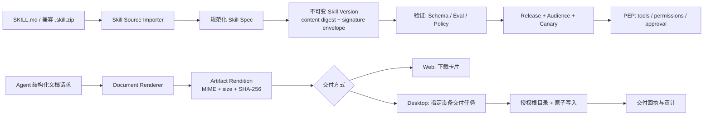
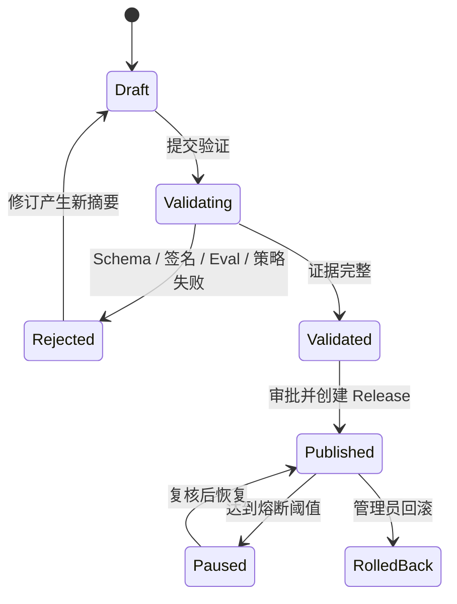
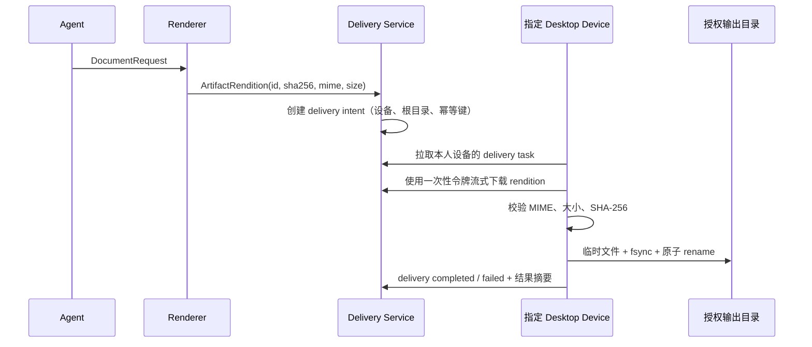

# Pivot Agent 技能体系与文档自动化生成落地优化方案

## 文档元数据

- **版本**：v1.1.0
- **日期**：2026-08-31
- **定位**：在现有 Skill、发布控制面、Artifact 与桌面端本机桥接能力基础上，形成可审计、可迁移、可分阶段交付的落地方案。
- **适用范围**：纯内网 / Air-Gapped 部署；Web 与 Electron 桌面端；多租户企业环境。
- **决策状态**：建议作为后续实施基线；v1.0 中未落地或存在安全缺口的内容不应直接上线。

---

## 一、执行摘要

本方案保留“低门槛 Markdown 技能 + 企业级策略执行点（PEP）+ 版本化发布 + 文档本机交付”的业务目标，但将其拆分为三个独立控制面：

1. **技能配方（Skill Recipe）**：面向模型的操作说明、输入输出契约和已批准工具引用；默认不携带可执行代码。
2. **能力制品（Capability Package）**：可执行脚本、运行时与依赖的受控制品；只允许在真正隔离的执行环境中运行。
3. **文档交付（Artifact Delivery）**：模型产出结构化文档请求，服务端统一渲染为不可变二进制 Artifact，再由 Web 下载或指定桌面设备写入授权目录。

这三个概念不能再由一个 `.skill.zip` 同时承担。分离后，Markdown 仍足够轻量，企业控制面也能准确地对签名、租户、权限、发布和文件写入进行治理。

### 1.1 上线结论

| 能力 | 建议 | 原因 |
|---|---|---|
| 单文件 `SKILL.md` 导入 | **可优先实施** | 仅限配方型技能，且默认零权限、仅个人草稿可用。 |
| 团队 / 组织共享 | **修正数据模型后实施** | 必须统一作用域、强制 `tenant_id` 和团队成员校验。 |
| `.skill.zip` 内运行脚本 | **暂不开放** | 当前 Jail 与 Windows Job Object 不构成文件系统隔离，不能执行不受信任脚本。 |
| Web 文档下载 | **可优先实施** | 以二进制 Artifact 和显式下载卡片为标准体验。 |
| 桌面端自动落盘 | **在交付协议完成后实施** | 需要设备绑定、授权根目录、哈希校验、原子写入和可追溯回执。 |

---

## 二、现状基线与差距

### 2.1 已有可复用能力

| 领域 | 现有实现 | 在本方案中的定位 |
|---|---|---|
| Skill Manifest | `agent-skills.js` 已支持 YAML/JSON 解析、基础字段校验和权限 / 工具白名单 | 保留为兼容层；新增严格的 Schema 校验。 |
| Skill 包 | `agent-skill-packages.js` 已限制包体大小、条目数、解压大小并阻止基础路径穿越 | 保留解包能力；改为内容寻址的不可变制品库。 |
| 发布 | `agent-releases.js` 已具备草稿、验证、发布、灰度、回滚与 PEP 上下文注入 | 改造作用域和签名数据模型，并补充熔断指标。 |
| 工具策略 | `agent-policy.js` 对 Skill 权限和工具清单执行 PEP 拦截 | 作为唯一运行时策略执行点，继续增强。 |
| 本机桥接 | Electron 具备目录选择、授权状态和远端任务轮询机制 | 新增仅用于交付的输出目录授权与 Artifact 下载器。 |
| 文档 | 已有公文工作台导出和通用 DOCX 导出能力 | 收敛为服务端 Document Renderer，消除前后端版式分叉。 |

### 2.2 必须先修复的事实偏差

1. **分离式包签名未贯穿验证流程**：导入时可验证 `SKILL.sig`，但版本验证阶段只验证 Manifest 内嵌签名。v1.1 统一存储签名信封，导入、验证和发布使用同一份摘要和签名记录。
2. **现有脚本测试不等于安全沙箱**：测试脚本由 Node 进程直接执行；在 Windows 上资源限制并不能阻止宿主机文件访问。v1.1 的第一阶段不执行 Skill 包内脚本。
3. **作用域词汇和数据边界不统一**：旧模型的 `user/shared/global` 与发布模型的 `personal/team/organization` 不能并存为业务语义。v1.1 只保留后一套。
4. **包安装目录不是不可变存储**：以 `skillId/version` 覆盖安装会破坏“验证的版本即运行版本”的不变量。v1.1 以内容摘要作为物理存储键。
5. **当前本机 MCP 为只读数据能力**：现有 `local_database` 与 `local_report_dir` 仅用于查询/扫描，不应被描述为已经具备的文件写入能力。
6. **当前 Agent Artifact 是文本沉淀，不是二进制交付物**：v1.1 新增 rendition（渲染版本）、MIME、大小和 SHA-256，文档下载及本机写入均以 rendition 为唯一输入。

---

## 三、目标、非目标与核心原则

### 3.1 目标

1. 让业务人员能以一个 `SKILL.md` 快速创建个人技能配方。
2. 让组织可安全地将经过验证的技能发布给团队或全租户用户。
3. 确保 Skill 声明的工具与权限在 PEP 中被强制执行，而非依赖 Prompt 自律。
4. 让 Agent 生成 DOCX、XLSX、PDF、Markdown 等可下载、可校验、可追溯的交付物。
5. 在桌面端中，允许用户授权一个输出根目录，并将明确请求的交付物自动保存为新文件。

### 3.2 非目标

1. 不把任意 JavaScript、Python 或 npm 依赖直接交给应用服务器执行。
2. 不让模型指定任意绝对路径、覆盖任意现有文件或决定目标桌面设备。
3. 不承诺 Web 浏览器一定无提示地保存到某一系统目录；浏览器下载策略由用户和浏览器控制。
4. 不要求个人草稿具备组织级签名或审批，但个人草稿不得获得组织共享资格。

### 3.3 设计原则

- **默认拒绝**：缺失权限即没有权限；默认权限是空集合，而非“最小只读”。
- **单一事实来源**：版本、摘要、签名、发布受众和 Artifact rendition 都有唯一权威记录。
- **租户先行**：所有可共享资产都绑定 `tenant_id`，团队资产额外绑定 `team_id`。
- **不可变制品**：已验证的 Skill 版本和已交付的文档 rendition 不可原地修改。
- **交付与生成分离**：模型不传递二进制内容给本机写入工具；本机端只交付经过验证的 Artifact。
- **可恢复与可审计**：副作用操作使用幂等键、状态机和附加式审计事件。

---

## 四、目标架构



### 4.1 三层对象模型

| 对象 | 责任 | 是否可执行 | 发布要求 |
|---|---|---:|---|
| **Skill Recipe** | Prompt、输入输出 Schema、工具引用、质量规则 | 否 | 个人可草稿；共享需验证和审批。 |
| **Capability Package** | 已编译/容器化的代码、数据包、SBOM、运行时约束 | 是 | 可信签名、隔离 Worker、管理员发布。 |
| **Artifact Rendition** | 某 Artifact 版本的二进制文档及其元数据 | 否 | 生成后校验；交付需要用户或策略授权。 |

---

## 五、技能体系设计

### 5.1 `SKILL.md`：配方型技能的唯一创作入口

开发者只维护一个 Markdown 文件。导入服务提取 Frontmatter，按服务端 JSON Schema 规范化后存为 `manifest_json`；Markdown 正文保存为 `instructions_md`。数据库中的规范化 Manifest 是运行时事实来源，原始文件仅用于溯源和再编辑。

```markdown
---
schemaVersion: 1
id: corp.finance.review
name: financial-review
version: 1.0.0
title: 财务分析助手
description: 对用户明确提供的财务数据进行分析并生成风险摘要。
tools:
  - tool.duckdb.query
permissions:
  - code.duckdb_query
inputs:
  financial_excel:
    type: file
    extensions: [".xlsx", ".csv"]
    required: true
outputs:
  risk_summary:
    type: document_request
    formats: ["docx", "md"]
qualityGates:
  - no_fabricated_facts
  - cite_input_sources
---

# 工作指引

仅基于用户提供或工具已返回的数据进行分析；缺失数值必须标记为“待补充”。
```

导入规则：

1. Frontmatter 仅允许白名单字段；未知字段、重复键、锚点/别名展开、超长文本均拒绝。
2. `id`、`name`、`version`、工具引用、权限、输入输出 Schema 必须校验；`inputs`/`outputs` 不再只是展示元数据。
3. `permissions` 和 `tools` 为空时即没有工具调用权；任何权限提升均需明确声明，并与服务器允许清单求交集。
4. 个人开发模式可免签，但仅可创建 `personal` 草稿、不得含脚本、不得发布或共享；其有效期和来源需审计。
5. 个人草稿升为共享版本时，必须重新计算摘要、通过验证并使用组织信任密钥签名。

### 5.2 `.skill.zip` 的兼容与收敛

v1.1 继续接受既有 `.skill.zip`，但作为**导入兼容格式**，而非独立的运行模型：

1. 导入器读取现有 `SKILL.yaml|yml|json` 与 `INSTRUCTIONS.md`，转换成统一的 `Skill Spec`。
2. 新包优先要求 `SKILL.md`；Manifest 与正文不允许出现两份互相矛盾的业务定义。
3. ZIP 实际条目必须做路径、空字节、隐藏敏感文件、重复文件、压缩炸弹和符号链接属性检查；不能仅相信 Manifest 自报的文件清单。
4. 包存放到 `sha256/<contentDigest>/` 内容寻址目录。若同一逻辑版本摘要不同，创建新的版本记录，绝不覆盖旧目录。
5. 声明依赖时要求锁文件、SBOM 和许可证结果；仅“存在 `package-lock.json`”不构成依赖可信。

### 5.3 可执行能力包：独立后续阶段

若确有 Python / JavaScript 扩展需求，必须按 Capability Package 交付，并同时满足：

- 签名信封包含 `digest`、`keyId`、算法、签名、签发时间、过期时间和吊销状态；支持密钥轮换。
- 由无业务凭据、无宿主文件系统写权限、默认断网的独立 Worker 执行。推荐受控容器或 VM；Windows 生产环境不能把 Job Object 视为安全边界。
- 启动镜像、依赖锁、SBOM、允许的系统调用/网络目的地、资源配额均由平台配置，不能由包自行指定。
- 验证用例改为声明式输入、工具 Stub、期望断言和 Golden 输出；禁止执行包内任意 `script` 字段。

在该 Worker 未落地前，Skill 包中的 `scripts/`、npm 生命周期钩子和动态依赖一律拒绝。

---

## 六、租户、作用域与发布治理

### 6.1 统一术语

| 发布范围 | 数据边界 | 典型权限 |
|---|---|---|
| `personal` | `tenant_id + owner_user_id` | 创建者使用和调试。 |
| `team` | `tenant_id + team_id` | 团队成员使用；管理员或被授权发布者发布。 |
| `organization` | `tenant_id` | 租户内用户使用；组织管理员发布。 |

不再使用 `user/shared/global` 作为另一套业务语义。全局平台内置能力应使用显式的 `platform_managed=true`，并经过租户启用策略后才可见。

### 6.2 最小数据模型

```text
skills(id, tenant_id, owner_user_id, logical_name, created_at)
skill_versions(id, skill_id, semver, content_digest, manifest_json,
               instructions_md, source_ref, signing_envelope_id, status)
skill_validations(id, skill_version_id, policy_result, evaluation_result,
                  supply_chain_result, status, evidence_ref)
skill_releases(id, skill_version_id, tenant_id, scope, team_id,
               rollout_percent, status, previous_release_id, published_by)
skill_release_audiences(release_id, subject_type, subject_id)
```

数据库约束要求：

- `tenant_id` 不可为空；所有查询都必须以它作为首个访问条件。
- `team` 发布必须有 `team_id`；发布者与使用者均需实时校验团队成员关系。
- `skill_versions` 使用 `(skill_id, semver, content_digest)` 唯一约束；已验证版本禁止更新正文、Manifest 和包路径。
- `skill_releases` 是附加式记录；回滚是创建/恢复一个明确的 release 状态，而不是修改历史版本内容。

### 6.3 验证、发布、灰度与熔断



灰度命中必须对**当前候选 Release**独立计算：

```text
bucket = HMAC-SHA256(tenantRolloutSecret, userId + ":" + releaseId) mod 100
```

这样每个 Release 的用户桶稳定、不可被外部预测，且不会误用其他候选版本的 Release ID。目标用户和目标团队为显式 allow-list；百分比仅在已命中受众后生效。

发布门禁至少包括：

1. 规范化 Manifest、签名信封与内容摘要一致。
2. 权限/工具引用均是组织允许的已注册能力。
3. 固定评测集、工具 Stub 断言、输出 Schema 和敏感信息检查通过。
4. 依赖、SBOM、恶意文件扫描和许可证策略通过（Capability Package 必选）。
5. 生产版本设置自动暂停阈值：策略拒绝率、工具错误率、超时率、用户负反馈率；阈值和最小样本量由发布时冻结。

---

## 七、文档生成与交付体系

### 7.1 统一文档中间表示（Document IR）

模型不生成 DOCX/PDF 二进制内容，也不向文件工具传递任意长字符串。模型输出受 Schema 约束的 `DocumentRequest`，例如：

```json
{
  "template": "official-writing.v1",
  "title": "2026 年第三季度财务分析报告",
  "sections": [
    { "kind": "heading", "level": 1, "text": "一、经营概况" },
    { "kind": "paragraph", "text": "……" },
    { "kind": "table", "columns": ["指标", "数值"], "rows": [["毛利率", "25.1%"]] }
  ],
  "requestedFormats": ["docx", "pdf"],
  "sourceRefs": ["run:agt_xxx:step:4"]
}
```

`Document Renderer` 在服务端完成以下工作：

1. 校验 Document IR、模板版本、字段类型、页眉页脚和格式白名单。
2. 使用同一模板引擎生成 DOCX、XLSX、PDF、Markdown；公文排版不再由前端和后端各实现一份。
3. 对每个二进制输出创建不可变 `Artifact Rendition`，记录 `artifactId`、`version`、格式、MIME、字节数、SHA-256、模板版本、来源 Run 与保留策略。
4. 通过格式打开校验、XML/ZIP 校验、可选 PDF/DOCX 渲染截图 Golden Test 完成出厂检查。

### 7.2 Artifact Delivery 协议



交付请求示例：

```json
{
  "artifactRenditionId": "ar_01J...",
  "deviceId": "desktop_01J...",
  "outputGrantId": "out_01J...",
  "requestedFileName": "2026Q3财务分析报告.docx",
  "conflictPolicy": "create_new",
  "idempotencyKey": "run:agt_...:rendition:ar_..."
}
```

服务端拒绝 `content`、绝对路径、任意 URL、任意设备 ID 和未经批准的格式。桌面端不信任任务内的路径，只接受自身已登记的 `outputGrantId`。

### 7.3 Web 端交付

1. 任务完成后显示“下载 DOCX / PDF / XLSX”Artifact 卡片，下载接口以短期授权和 `Content-Disposition` 返回二进制流。
2. 用户在同一交互上下文中明确选择“生成并下载”时，可以尝试自动触发下载；失败时必须保留下载按钮和可理解的提示。
3. 不承诺固定保存到 `Downloads`。浏览器可能提示、自动保存、内嵌打开或受组织策略阻止，实际行为由浏览器与用户设置决定。
4. 下载卡片显示版本、大小、SHA-256、来源任务和保留期限，支持重新下载及权限失效提示。

### 7.4 桌面端本机写入

新增授权类型 `local_output_dir`，与既有只读 `local_report_dir` 分离：

1. 用户在 Electron 原生目录选择器中选择输出根目录；持久化 `outputGrantId`、真实路径、设备 ID、授权时间、策略版本和可用格式，界面只展示路径提示而不回传完整路径。
2. 写入只在用户明确提出“生成并保存”或已启用该任务模板的自动交付策略时发生。默认目录建议为 `Pivot Outputs`，避免误写桌面、系统目录或业务源目录。
3. 文件名由 Renderer 建议、桌面端再次规范化；格式根据 rendition 的 MIME 和扩展名交叉校验。
4. 默认 `create_new`：使用独占创建与递增命名；覆盖仅接受显式用户批准，且覆写前显示目标文件摘要。
5. 写入流程采用同目录临时文件、流式写入、大小/哈希校验、`fsync`、原子重命名。失败不覆盖原文件，遗留临时文件由恢复任务清理。
6. 每次请求、领取、下载、校验、写入成功/失败都产生 `artifact_delivery_events`。服务端记录目标目录的最小化提示和文件 SHA-256，不记录不必要的完整本机路径。
7. 完成后由 Electron 主进程调用 `shell.openPath` 或 `shell.showItemInFolder`；只对本次成功写入并已在本地重新校验的路径开放。

### 7.5 本机写入安全边界

| 防线 | 实施要求 |
|---|---|
| 根目录边界 | 真实路径解析后必须位于授权根目录内；逐段拒绝 Junction / Symbolic Link 越界。 |
| 权限边界 | `local_output_dir` 只允许写，`local_report_dir` 保持只读，不能复用。 |
| 设备边界 | 交付任务绑定具体 `deviceId`，不得“选择该用户最近在线设备”。 |
| 内容边界 | 只下载服务端签发的 rendition；校验大小、MIME、扩展名和 SHA-256。 |
| 覆盖边界 | 默认永不覆盖；覆盖必须单次审批且幂等键不可重放。 |
| 审计边界 | 请求、执行和回执均带 run、artifact、release、device、policy 和哈希关联。 |

---

## 八、PEP 与审计要求

### 8.1 运行时策略

PEP 必须同时检查以下约束，任何一个不满足均拒绝调用：

```text
用户身份与租户
∩ Release 受众与灰度命中
∩ Skill 声明的权限
∩ Skill 声明的工具清单
∩ 组织允许的能力与数据策略
∩ 当前任务工具策略、网络策略与审批策略
```

文件写入是显式的副作用工具，风险级别不低于高风险 MCP：即使调用者具备权限，也需满足用户交付意图、设备在线、输出授权有效和交付令牌有效四个条件。

### 8.2 附加式审计事件

新增统一事件模型而不是依赖不存在或语义不匹配的表：

```text
artifact_delivery_events(
  id, delivery_id, event_type, occurred_at,
  tenant_id, user_id, run_id, artifact_rendition_id,
  device_id, output_grant_id, file_name, path_hint,
  sha256, size_bytes, policy_decision, error_code, metadata
)
```

事件至少包含：`requested`、`approved`、`queued`、`claimed`、`downloaded`、`verified`、`written`、`failed`、`expired`、`canceled`。审计读模型可关联现有 `agent_tool_calls`，但交付事件不应被简化为一次普通工具调用。

---

## 九、迁移与实施路线图

### 阶段 0：安全不变量与兼容修复

**完成条件**：

- 统一签名信封，分离式和内嵌式历史签名均能导入、复验和发布。
- 所有共享查询和 Catalog 强制租户过滤；旧 Scope 映射到新 Scope 并写入迁移审计。
- 技能包改为内容寻址存储，实际 ZIP 条目扫描生效。
- 禁止 Skill 包内任意脚本执行；验证改为声明式测试与工具 Stub。
- 为分离签名、跨租户不可见、同版本不同摘要、路径/符号链接、回滚一致性补齐自动化测试。

### 阶段 1：Artifact Rendition 与可靠 Web 下载

**完成条件**：

- 引入 Document IR、统一 Renderer 和 `artifact_renditions`。
- DOCX/XLSX/PDF/Markdown 统一以 rendition 输出；关键模板具备视觉 Golden Test。
- Web Artifact 卡片、短期下载授权、下载审计和失败重试可用。
- 浏览器自动下载仅为尽力优化，下载按钮始终可用。

### 阶段 2：桌面端受控交付 MVP

**完成条件**：

- 新增 `local_output_dir` 与 `artifact.delivery.write`，同现有只读 MCP 权限彻底分离。
- 任务绑定设备和输出授权；支持断线、重复领取、重复回执、写入中崩溃恢复。
- 实现临时文件、哈希校验、原子重命名、自动新文件名和显式覆盖确认。
- `artifact_delivery_events` 可从 Run、Artifact、设备和用户四个维度查询。

### 阶段 3：`SKILL.md` 配方型技能

**完成条件**：

- 前端支持粘贴/上传 Markdown、Schema 错误定位、草稿调试和“申请共享”。
- 默认零权限；个人开发模式有来源、水印、有效期与不可共享限制。
- Shared Catalog 按租户、团队、可用工具、版本、发布状态检索。

### 阶段 4：受控 Capability Package 与高级治理

**前置条件**：隔离 Worker、SBOM、密钥轮换、恶意文件扫描、熔断和运维响应流程均已验证。

**完成条件**：

- 能力包在独立执行环境中运行，宿主服务无业务凭据暴露。
- 发布可按团队、用户、百分比灰度，自动根据冻结阈值暂停。
- 管理端展示质量、错误、策略拒绝、审批、回滚和交付成功率。

---

## 十、验收指标

### 10.1 安全与治理

- 未命中租户、团队或灰度的用户，无法列出、解析或执行对应 Skill。
- Skill 的任何权限提升、工具新增、正文或包内容变更均产生新摘要和新验证。
- 未签名个人草稿无法进入共享发布流程；Capability Package 无隔离 Worker 时无法导入。
- 任意 `../`、绝对路径、空字节、Windows Junction 或符号链接越界都不能让本机写入逃离授权根目录。

### 10.2 交付可靠性

- 同一 `idempotencyKey` 重试不产生第二个文件，也不重复覆盖。
- 写入成功事件中的 SHA-256 与 rendition SHA-256 一致；失败不破坏同名原文件。
- 桌面端掉线、重启、下载失败、哈希不匹配、写入崩溃均可得到可恢复或可诊断终态。
- 关键文档模板在 DOCX/PDF 渲染比较中无页面截断、乱码、页眉页脚错位或表格溢出。

### 10.3 业务体验

- 新建个人配方型技能不超过一个 Markdown 文件和一次受控权限选择。
- 用户可在 Artifact 卡片上看到格式、大小、来源、版本、下载/交付状态。
- 用户在桌面端一次选择输出目录后，可对明确发起的“生成并保存”任务自动创建新文件；所有覆盖动作仍需确认。

---

## 十一、最终决策

推荐采用本 v1.1 方案，并以“**先修控制面不变量，再交付用户价值，最后开放可执行扩展**”作为实施原则。

最小可用闭环应是：个人 `SKILL.md` 配方 + PEP + 服务端生成不可变 DOCX/PDF Artifact + Web 下载卡片。桌面端受控写入可在此基础上增加，不应绕过 Artifact 与交付协议直接让模型调用 `fs.writeFile`。可执行 Skill 包则必须等待真正的隔离执行环境成熟后再开放。
