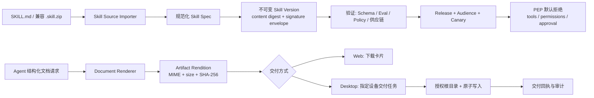
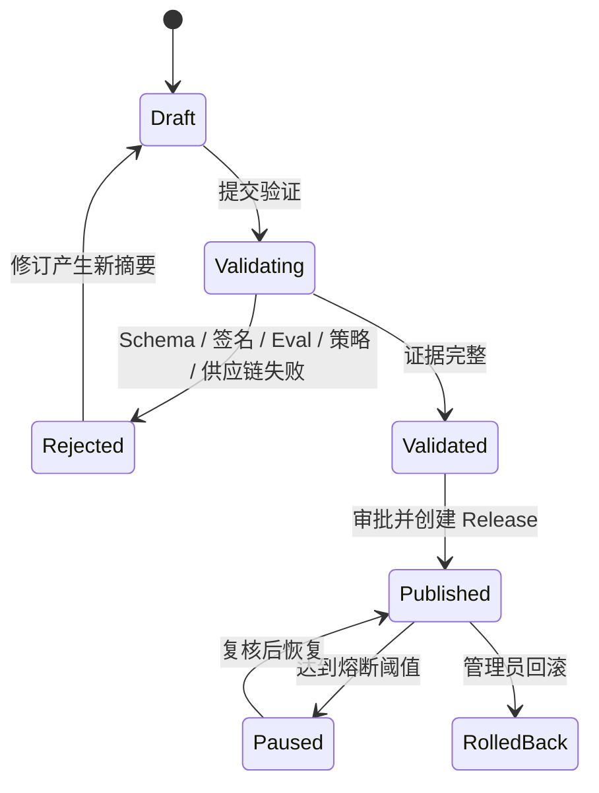

# Pivot Agent 技能体系与文档自动化生成落地方案

## 文档元数据

- **版本**：v1.2.1
- **日期**：2026-08-31
- **前序版本**：v1.0（`Agent技能体系与文档自动化生成落地综合技术方案.md`）、v1.1（`Agent技能体系与文档自动化生成落地优化方案v1.1.md`）
- **定位**：在 v1.1 的控制面拆分结论基础上，完成代码级现状核实、补齐 v1.1 遗漏的安全缺口与落地前提、明确与既有实现的复用边界，形成可直接排期的实施基线。
- **适用范围**：纯内网 / Air-Gapped 部署；多租户企业环境；Web 端为控制面与交付主通道，Electron 桌面端定位见 §4.2。
- **决策状态**：经 v1.2.1 安全与数据模型修订后建议作为实施基线，替代 v1.1。v1.1 的架构方向全部保留；§2.2、§2.3 中的 P0 项是对应能力进入开发与上线的前置条件。
- **核实基线**：`main` 分支 `0330fa8`（v0.1.59）。本文所有现状论断均标注代码位置，可复核。
- **实施状态（2026-09-01，v0.1.69）**：阶段 0–4 的安全底座、个人 Skill 配方、Artifact Rendition、Web 下载、桌面受控交付、持久化桌面连接器和本机多浏览器自动化均已完成；个人创作无需组织签名，管理员发布到团队/组织时由服务端自动完成批准、签名和复验。组织签名支持最高管理员在全局参数中生成/导入加密托管密钥、轮换和停用，或由环境变量接管。日常 Agent 控制台以“技能与助手”为首屏，依次提供待办中心、自动目标、通知设置和运行质量；运行资源包和运维/实验能力默认收起。PEP 已直接启用 `enforce`，Windows 正式安装包已构建成功。阶段 5 的 Docker 隔离执行框架已实现但默认关闭，唯一待办是登记已审计内网镜像、固定入口与资源上限后启用。详细状态见 `docs/releases/v0.1.69-Agent控制台导航重排与命名收敛.md`。

---

## 一、执行摘要

本方案保留 v1.1 的核心结论：把"低门槛 Markdown 技能 + 企业级策略执行点 + 版本化发布 + 文档本机交付"拆分为三个互不混淆的控制面。

1. **技能配方（Skill Recipe）**：面向模型的操作说明、输入输出契约与已批准工具引用；默认不携带可执行代码。
2. **能力制品（Capability Package）**：可执行脚本、运行时与依赖的受控制品；只允许在真正隔离的执行环境中运行。
3. **文档交付（Artifact Delivery）**：模型产出结构化文档请求，服务端统一渲染为不可变二进制 Artifact，再由 Web 下载或指定桌面设备写入授权目录。

v1.2.1 的增量不在架构，而在**可落地性**：v1.1 列出的 6 条事实偏差经核实全部成立。v1.2 补出了 PEP、发布权限与能力别名三项 P0；本次再补齐租户降级、设备身份、二进制 CAS 三项阻断性前提，并修正交付 DDL、部署矩阵、能力模型和测试基线中的不一致。

### 1.1 v1.2 相对 v1.1 的修订要点

| 类别 | 修订内容 | 影响 |
|---|---|---|
| P0 安全 | 新增：PEP 当前为 fail-open，空权限等于全权限 | 推翻 v1.1「`SKILL.md` 可优先实施」结论，改为有前置条件 |
| P0 安全 | 新增：`createSkillVersion` 的 ownerKey 无角色校验，构成跨用户可见性越权 | 由 v1.1 的「术语不统一」升级为独立越权缺口 |
| P0 安全 | 新增：技能权限别名表为放大方向，`code.duckdb_query` 可匹配 `code.execute` | v1.1 §5.1 示例需更换 |
| P0 租户 | 新增：企业访问已启用但用户无团队时，不能回落默认租户 | 否则可能将未归属用户接入租户 1 的共享资产 |
| P0 设备 | 新增：设备 ID 由客户端自报，不构成可信设备身份 | 桌面端写入前必须有设备注册、密钥证明与吊销机制 |
| P0 存储 | 新增：现有 `agent-blob-store` 只能保存 JSON/文本，不能承载二进制产物 | IR、图片、DOCX/PDF 与 Skill 包需要二进制 CAS 扩展 |
| 复用 | 新增 §2.1 复用映射表，纳入 `enterprise-access`、`agent-blob-store`、`agent-event-outbox`、`agent-approval-requests`、既有 `tenant_id` 列 | 避免与开发规范第 8 条冲突 |
| 数据模型 | §6.2 改为增量 DDL 与现有 `agent_skill_*` 表映射，不再给出并行新表名 | 消除重建表的误读风险 |
| 部署 | 新增 §4.2 部署矩阵决策：控制面表当前仅 PostgreSQL | 决定桌面端是否共用控制面，直接影响阶段 2/3 工作量 |
| 渲染 | §7.2 明确服务端当前无公文版式与 DOCX/PDF 生成能力，为新建而非收敛 | 修正 §9 阶段 2 工作量与依赖决策 |
| 交付 | §7.4 明确本机桥接为进程内存态，需先持久化 | 补齐 §9 阶段 3 前置 |
| 路线图 | 「默认拒绝」由 v1.1 阶段 3 前移至阶段 0 | 修正阶段间的安全窗口 |

### 1.2 上线结论（修正版）

| 能力 | 建议 | 前置条件 | 说明 |
|---|---|---|---|
| PEP 默认拒绝改造 | **必须最先实施** | 无 | 一切"默认零权限"承诺的成立基础。当前空权限等于不校验。 |
| ownerKey 与作用域收敛 | **必须最先实施** | 无 | 当前存在普通用户使技能全平台可见的越权路径。 |
| 租户 fail-closed 语义 | **必须最先实施共享能力** | 区分企业访问关闭与企业访问开启但租户不可解析 | 仅前者可使用单租户默认组织；后者必须拒绝共享访问。 |
| 单文件 `SKILL.md` 导入 | **安全前置在 P0 完成后满足，排期置于 §9 阶段 4** | PEP 默认拒绝 + ownerKey 收敛 | 仅限配方型技能，零权限，仅个人草稿。排期后置的理由见 §9 阶段 4 说明与 §12.1。 |
| 团队 / 组织共享 | **修正数据模型与租户语义后实施** | 默认租户语义、团队成员实时校验、管理员治理入口 | 见 §6.1、§6.2、§2.3-C5。 |
| Web 文档下载 | **可在渲染器落地后实施** | 服务端渲染器与 rendition 模型 | 服务端当前无二进制交付能力，见 §7.2。 |
| `.skill.zip` 内运行脚本 | **暂不开放** | 隔离 Worker | 当前 jail 仅为 cwd，Windows Job Object 不构成文件系统边界。 |
| 桌面端自动落盘 | **在交付协议与桥接持久化完成后实施** | 桥接状态持久化、设备密钥注册、显式设备绑定、授权根目录、哈希校验、原子写入 | 见 §2.3-C1、§2.3-C2、§2.3-C7。 |

---

## 二、现状基线（代码级核实）

### 2.1 已核实可复用能力

前六项为 v1.1 已列出并核实无误的部分；后五项为 v1.1 遗漏、但与本方案直接重叠的既有实现，按开发规范第 8 条「不引入重复体系」必须复用。

| 领域 | 现有实现与位置 | 在本方案中的定位 |
|---|---|---|
| Skill Manifest | `server/services/agent-skills.js` YAML/JSON 解析、SemVer 与 id 正则校验、权限/工具白名单求交 | 保留为兼容层，外挂严格 JSON Schema。 |
| Skill 包读取 | `agent-skill-packages.js` 包体 100MB / 条目 128 / 解压 256MB 上限，`safeEntryPath` 阻止绝对路径、空字节、`../` | 保留解包能力；补齐实际条目扫描与内容寻址存储。 |
| 发布控制面 | `agent-releases.js` 草稿→验证→发布→灰度→回滚，及 PEP 上下文注入 | 改造签名信封、作用域推导、灰度算法，并补熔断。 |
| 工具策略 | `agent-policy.js` 对 Skill 权限与工具清单执行拦截 | 作为唯一运行时策略执行点；语义须由 fail-open 翻转，见 §6.4。 |
| 本机桥接 | `local-device-bridge.js` + `local-device-mcp.js` 目录授权状态与远端任务轮询 | 新增仅用于交付的输出目录授权；须先持久化状态，见 §2.3-C1。 |
| 文档导出 | `document-processing/exporters/index.js` 的 `buildDocx`、`buildMarkdown`、`buildJson`、自实现 `createZip` | ZIP 与 Markdown/JSON 可复用；DOCX 版式须重建，见 §7.2。 |
| **企业访问模型** | `enterprise-access.js`：`teams` / `team_members` / `organizations` 表齐备；`getUserEnterpriseContext` 返回用户团队与组织；`listResourcePermissions` 的 `subject_type` 已支持 `user`/`team`/`organization`/`role` | 复用团队成员关系；`resource_permissions` 须先扩展 `skill_release` 资源类型、`use/publish/manage` 动作和运行时判定器后，才能承载发布受众，不可直接接入。 |
| **既有租户列** | `agent_skill_versions`、`agent_skill_releases` 已有 `tenant_id` 列，并已有 `team_members → organizations` 回填迁移（`migrations/agent-production-control-plane.js:146,165`） | **在既有列上补 NOT NULL 与默认租户语义，不新建表。** |
| **既有唯一约束** | `agent_skill_versions` 已有 `UNIQUE(owner_key, name, version)` 与 `UNIQUE(owner_key, name, digest)`（`:33-34`） | **等价于 v1.1 要求的版本+摘要唯一约束，仅需补不可变触发器。** |
| **内容寻址存储** | `agent-blob-store.js` 的 `putAgentBlob` 已按 sha256 落盘并去重 | 仅可复用目录、摘要与权限模式；现实现只序列化 JSON/文本，需新增带 MIME、流式读写、ACL 与保留期的二进制 CAS 后端。 |
| **出站领取模型** | `agent-event-outbox.js` 的 `claimAgentEventOutbox` / `markAgentEventOutboxDelivered` / `failAgentEventOutbox` 已实现领取、回执、失败重试；`agent_channel_deliveries` 已有 `idempotency_key` 范式 | **直接复用为 Artifact 交付任务的领取与回执骨架。** |
| **审批体系** | `agent-approval-requests.js` 已有多级审批、用户引用解析、超时动作 | **复用为覆盖写入的显式批准通道，不新建审批流。** |
| **审计主表** | `agent-tool-audit.js` 写入 `agent_tool_calls`（已含 `tenant_id`、`tool_version`、`task_type`） | 交付事件独立成表但与其关联；v1.0 提到的 `agent_tool_audits` 表名有误，实际为 `agent_tool_calls`。 |

### 2.2 必须先修复的安全缺口（P0）

以下 A 组为 v1.1 未列出、经代码核实存在的缺口，严重度高于 v1.1 已列的 6 条；B 组为 v1.1 已列出并核实成立的部分。所有 P0 项必须在任何面向用户的新能力（含 `SKILL.md` 导入）之前完成。

#### A1 PEP 为 fail-open，"默认拒绝"当前反向生效

`agent-policy.js:88-93`：

```js
const skillPermissions = normalizeAllowlist(run.skill_permissions || ...);
if (skillPermissions.length && !tool.capabilities.some(...)) reasons.push('工具能力未在当前 Skill 声明的最小权限中。');
const skillTools = normalizeAllowlist(run.skill_tools || ...);
if (skillTools.length && !skillTools.includes(tool.name)) reasons.push('工具未在当前 Skill 声明的工具集合中。');
```

数组为空即跳过校验。同文件 `:79` 的 `tool_allowlist`、`:81` 的 `capability_allowlist` 为相同语义。结论：**零权限当前等于全权限**。

影响：v1.1 §3.3「默认权限是空集合」、§5.1.3「为空时即没有工具调用权」、§1.1「默认零权限」三处承诺在现状下全部反向成立。v1.1 把「默认零权限」排在阶段 3，却在 §1.1 判定 `SKILL.md` 导入可优先实施，中间窗口期内每个导入的配方型技能都会获得不受 Skill 声明约束的工具全集。

修复要求见 §6.4。

#### A2 `createSkillVersion` 的 ownerKey 无角色校验，构成跨用户可见性越权

`agent-releases.js:157`：

```js
const ownerKey = String(input.ownerKey || (manifest.scope === 'user' ? `user:${user.id}` : `scope:${manifest.scope || 'user'}`));
```

三重问题：无角色校验（对比 `agent-skills.js:103` 对 `shared`/`global` 有 admin/root 校验）、直接采信 `input.ownerKey` 入参、`manifest.scope` 由提交者自填。

完整越权链：
1. 用户提交 `manifest.scope: global`，得到 `owner_key = 'scope:global'`；
2. `publishSkillVersion:199` 仅校验 `rollout.rolloutScope`，与 ownerKey 无关，故 `rolloutScope: personal` 即可通过；
3. `publishSkillVersion:204` 将 `agent_skills.scope` 回写为 `owner_key.slice(6)`，即 `global`；
4. `agent-skills.js:177` 的目录查询为 `WHERE (user_id = ? OR scope = 'shared' OR scope = 'global')`，**无租户过滤**。

结果：普通用户可使自建技能出现在全平台所有用户的技能列表中。

修复要求：ownerKey 一律由服务端依据「发布作用域 + 发布者角色 + 租户」推导，禁止取自入参与 manifest；`manifest.scope` 降级为纯展示字段并在导入时剥离；目录查询补租户过滤。

#### A3 权限别名表为放大方向

`agent-policy.js:24-30`：

```js
const aliases = {
    'filesystem.read': 'filesystem.read_workspace',
    'filesystem.write': 'filesystem.write_workspace',
    'code.python_execute': 'code.execute',
    'code.duckdb_query': 'code.execute'
};
return aliases[item] === cap;
```

声明 `code.duckdb_query` 权限即可匹配 capability 为 `code.execute` 的**任意**工具（Python 执行、命令执行等）。v1.1 §5.1 的 `SKILL.md` 示例恰好声明 `permissions: [code.duckdb_query]`，照该示例编写的技能实际获得任意代码执行权。

修复要求：别名匹配须为收敛方向（声明的权限只能匹配等价或更窄的能力），或改为直接声明 capability 并取消别名表；示例同步更换，见 §5.1。

#### B 组 v1.1 已列并核实成立的偏差

| 偏差 | 核实位置 | 补充说明 |
|---|---|---|
| B1 分离式签名未贯穿验证流程 | 导入期用 `packageSignature`（`agent-skill-packages.js:83`），验证期只用 manifest 内嵌签名（`agent-releases.js:173`） | 后果比 v1.1 描述更重：带 `SKILL.sig` 而 manifest 无 `signature` 字段的包，在 `validateSkillVersion` 必然失败，即**分离签名包无法发布**。此外 `createSkillVersion:152` 存在 `input.signatureVerified !== true` 旁路，须同步关闭。 |
| B2 脚本测试不等于安全沙箱 | `agent-releases.js:130` 以 `runSandboxedProcess(process.execPath, ['-e', script])` 执行 manifest 内任意脚本；`agent-sandbox.js:101` 的 jail 仅作 `cwd`；`agent-os-isolation.js` 的 Windows 实现仅设置 `JobObjectExtendedLimitInformation`（内存与进程数） | 子进程可 `require('fs')` 读取宿主任意文件、可 `require('child_process')`。Linux 仅在 `unshare` 可用时隔离网络。第一阶段不执行包内脚本。 |
| B3 作用域两套词汇并存 | `agent-skills.js:98` 为 `user`/`shared`/`global`；`agent-releases.js:13` 为 `personal`/`team`/`organization`；`migrations/index.js:515` 以 `CASE WHEN scope IN ('global','shared')` 硬映射 | 与 A2 同源，一并收敛。 |
| B4 安装目录非不可变 | `agent-skill-packages.js:100-101` 以 `skillId/version` 为目录并 `fsp.rm` 先删后写 | 现有测试 `tests/agent-skill-packages.test.js:117` 即断言该布局，改造需同步更新测试。 |
| B5 本机 MCP 仅只读 | `local-device-mcp.js:16` 的 `LOCAL_AUTH_TYPES` 只含 `local_database`、`local_report_dir` | v1.0 描述的 `local_fs.save_document` 不存在。 |
| B6 Artifact 为文本沉淀 | `agent-artifacts.js` 仅有 `content` TEXT，无 MIME/大小/哈希；导出仅 `text/markdown` 与 `application/json`（`:299-301`）；`routes/agents.js:568-585` 只有 list / versions / diff，无下载 | 二进制交付为纯新建。 |
| B7 供应链检查只信任自报清单 | `agent-releases.js:71` 的 `checkSupplyChain` 仅遍历 `manifest.files`，不扫描实际 ZIP 条目 | v1.0 声称的敏感文件黑名单对未在 manifest 中申报的文件完全失效。 |
| B8 灰度误用其他候选的 Release ID | `agent-releases.js:48` 以 `candidates[0].id` 计算单一 hash，`:49-54` 却用它比对每个候选的 `rollout_percent` | 且使用裸 SHA-256，`userId` 与 `releaseId` 均可预测。 |

### 2.3 必须先满足的落地前提（P1）

以下为 v1.1 未评估、但缺失将直接导致对应阶段无法完成的工程前提。

#### C1 本机桥接为进程内存态

`local-device-bridge.js:15-16`：

```js
const devices = new Map();
const tasks = new Map();
```

设备注册与任务全部驻留单进程内存。后果：服务重启丢失全量设备与在途任务；多实例部署下设备注册与任务派发可能落在不同进程。v1.1 §7.2 的幂等键状态机与 §9 阶段 2 的「断线、重复领取、重复回执、写入中崩溃恢复」在此基础上无法实现。

前提要求：阶段 3 首个任务为把设备注册与交付任务持久化至数据库，表结构与领取语义复用 `agent_channel_deliveries` 与 `agent-event-outbox.js`（见 §7.4）。

#### C2 现有设备选择逻辑与 v1.1 §7.5 冲突

`local-device-bridge.js:120-122`：

```js
function selectDeviceForGrant(userId, grantType) {
    return activeDevicesForUser(userId).find(device => grantAuthorized(device, grantType)) || null;
}
```

即"取该用户最近活跃且已授权的设备"，正是 v1.1 §7.5 设备边界明确禁止的行为。仅新增 `local_output_dir` 授权类型不能满足该约束——只读工具仍沿隐式选设备路径，形成同一系统内两套设备信任模型。

前提要求：阶段 3 须改造 `selectDeviceForGrant` 调用点，所有本机工具调用与交付任务一律显式携带 `deviceId`；无 `deviceId` 时返回可选设备列表交由用户选择，而非服务端代选。

#### C3 租户解析可能为空，与 `tenant_id NOT NULL` 要求冲突

`enterprise-access.js:97-104` 的 `getPrimaryTenantId` 在用户无 active team 归属时返回 `null`；`isEnterpriseAccessEnabled` 依赖 `PIVOT_ENTERPRISE_ACCESS`，该变量未出现在 `.env.example`，默认关闭。

现状后果链：
1. `publishSkillVersion:200` 写入 `tenant_id = null` 的 release；
2. `resolvePublishedSkill:221` 以 `r.tenant_id = ?` 匹配，SQL 中 `= NULL` 恒为未知，故 `team`/`organization` 技能运行时永不可解析；
3. 而 `agent_skills` 目录查询不带租户过滤，同一技能在目录中仍全平台可见——与 A2 构成同一问题的两面。

前提要求（§6.1 给出实现）：定义单租户 / 企业访问关闭时的默认租户语义；租户解析失败时明确为拒绝发布而非落 `null`；对既有 `tenant_id IS NULL` 行给出回填或降级规则。

#### C4 控制面表当前仅 PostgreSQL

`server/db/migrations/agent-production-control-plane.js` 文件头注明 PostgreSQL-only，全文件 5 个迁移对象均只实现 `upPg`，无 `upSqlite`。而项目同时依赖 `better-sqlite3` 与 `pg`，最近提交 `0330fa8` 正在处理 Electron 打包的多驱动兼容。

后果：在 SQLite 部署下 `agent_skill_versions`、`agent_skill_validations`、`agent_skill_releases`、`agent_workflow_releases` 均不存在，`createSkillVersion` / `validateSkillVersion` / `publishSkillVersion` / `resolvePublishedSkill` 全部失败。

这是本方案唯一需要先行拍板的架构决策，见 §4.2。

#### C5 版本与发布的创建者硬绑定阻断管理员治理

`agent-releases.js:165`：`SELECT * FROM agent_skill_versions WHERE id = ? AND created_by = ?`
`agent-releases.js:211`：`... WHERE id = ? AND published_by = ? AND status = 'published'`

管理员无法验证或发布他人创建的版本，也无法回滚他人发布的 release。这与 v1.1 §5.1.5「个人草稿升为共享版本」、§6.1「管理员或被授权发布者发布」、§6.3 状态机的「管理员回滚」三处设计直接冲突。

前提要求：引入基于角色与 `listResourcePermissions` 的版本访问判定，替换 `created_by` / `published_by` 硬绑定；保留"创建者可读写自己的草稿"作为其中一条规则而非唯一规则。

#### C6 服务端当前无公文版式与 DOCX / PDF 生成能力

三处核实：

1. `server/services/official-writing.js` 仅有 `buildSystemPrompt` 与 `buildOfficialWritingMessages`，即只构建提示词，**无任何 DOCX 生成**。v1.0 将其描述为"OpenXML 公文渲染引擎"不成立。
2. 公文版式实现全部位于前端 `client/chat/apps-workbench-export.js`（368 行）。
3. 服务端唯一的 `buildDocx`（`document-processing/exporters/index.js:386-394`）仅支持段落与分页符，无表格、无页眉页脚、无样式；且 `:393` 的页码文本已损坏为 `'? ' + n + ' ?'`（原应为「第 N 页」）。

依赖侧：`package.json` 中无 DOCX 生成库（现有 `buildDocx` 为手写 OpenXML 字符串 + 自实现 `createZip`）；PDF 仅有 `pdf-lib`，属低级 PDF 操作库，标准 14 字体不含 CJK，中文输出需自带字体与 fontkit；无 HTML→PDF 渲染器。`@e965/xlsx` 可满足 XLSX。

结论：v1.1 §2.1「收敛为服务端 Document Renderer」的表述会让实施者低估工作量。实际为服务端从零实现公文版式、表格 DOCX 与 CJK PDF，见 §7.2 的依赖决策与 §10.2 的验收方法调整。

附带发现：`scripts/check_text_integrity.js` 仅检测 U+FFFD 替换字符与特定 mojibake 模式，检测不出中文被替换为 ASCII `?` 的损坏，故 C6 第 3 点的损坏可通过 `check:text` 门禁。建议在阶段 2 顺带补一条规则（见 §9 阶段 2.3 与 §10.2）。

#### C7 设备 ID 是自报标识，不是设备身份

当前桌面端将随机 `deviceId` 写入浏览器 `localStorage`，再随心跳提交；服务端按 `userId:deviceId` 保存，没有设备公钥、挑战签名、注册审批或吊销记录。`deviceId` 因而只能用于路由，不能证明“领取任务的就是用户先前选择的那台机器”。

前提要求：阶段 3 先建立设备注册与密钥证明。服务端签发设备记录，桌面端生成并保管密钥对，心跳、领取、下载令牌兑换和回执均对服务端 nonce 或任务摘要签名。仅持有同一用户 Web 会话而未持有设备私钥的客户端，不能冒用已注册设备 ID。

#### C8 现有 Blob Store 不是二进制 Artifact CAS

`putAgentBlob` 对对象执行 `JSON.stringify`、对文本按 UTF-8 计算大小，64KB 以下直接返回 `ref: null`，较大内容写成 `<digest>.json`；现有模块也没有按引用读取、流式下载、MIME、ACL 或保留期接口。因此它不能直接保存可恢复的 Document IR、图片、DOCX、PDF、XLSX 或 Skill ZIP。

前提要求：阶段 2 新建二进制 CAS API（可复用现有根目录、摘要命名与 0700/0600 权限策略，但不是复用现有 `putAgentBlob` 实现）。IR 必须始终持久化并可按授权读取；不可用“内联摘要”代替原始 IR。

### 2.4 其他需一并处理的一致性问题

| 问题 | 位置 | 处理 |
|---|---|---|
| `registerAgentSkill` 可绕过发布门禁 | `agent-skills.js:109-133` 直接写入 `status='enabled'` 的 `agent_skills` 行。迁移 `releaseGateMigration`、`legacySkillVisibilityMigration` 只做了一次性历史降级，写入路径仍开放 | 阶段 0 关闭该路径，`agent_skills` 仅由 release 投影写入 |
| 回滚后双表状态分叉 | `rollbackSkillRelease:210-217` 只更新 `agent_skill_releases`，不回写 `agent_skills`。运行时经 `resolvePublishedSkill` 正确，但目录列表仍显示已回滚版本的 manifest 与 version | 阶段 0 将 `agent_skills` 降级为只读投影（read model），由 release 状态单向重建 |
| 主键与外键类型不一致 | `agent_skills.user_id` 为 `VARCHAR(64)`（`migrations/index.js:477`），其余控制面表为 `BIGINT REFERENCES users(id)` | 随投影改造统一为 BIGINT |
| 测试覆盖不完整 | `agent-skill-packages.test.js` 覆盖 ZIP 基础校验；`agent-postgres-integration.test.js` 覆盖部分 release 链路；`autonomous-agent-contracts.test.js` 覆盖部分 PEP | 不能视为从零，但缺跨租户、ownerKey 越权、分离签名发布、交付、设备身份、二进制 CAS 和双驱动迁移测试，见 §9 阶段 0 |

---

## 三、目标、非目标与设计原则

### 3.1 目标

1. 业务人员能以一个 `SKILL.md` 快速创建个人技能配方。
2. 组织可安全地将经过验证的技能发布给团队或全租户用户。
3. Skill 声明的工具与权限在 PEP 中被强制执行，且未声明即无权限。
4. Agent 生成 DOCX、XLSX、PDF、Markdown 等可下载、可校验、可追溯的交付物。
5. 桌面端允许用户授权一个输出根目录，并将明确请求的交付物自动保存为新文件。

### 3.2 非目标

1. 不把任意 JavaScript、Python 或 npm 依赖直接交给应用服务器执行。
2. 不让模型指定任意绝对路径、覆盖任意现有文件或决定目标桌面设备。
3. 不承诺 Web 浏览器无提示地保存到某一系统目录。
4. 不要求个人草稿具备组织级签名或审批，但个人草稿不得获得组织共享资格。
5. 不在本方案内实现跨租户技能市场、技能计费与外部技能源同步。
6. 桌面端不承载 Skill 控制面（以 §4.2 决策 A 为准时生效）。

### 3.3 设计原则

- **默认拒绝**：缺失权限即没有权限；空权限集合等于拒绝全部工具调用，而非跳过校验。此为 A1 的直接反面，是本方案与 v1.1 在语义上唯一的硬性差异。
- **单一事实来源**：版本、摘要、签名、发布受众与 Artifact rendition 各有唯一权威记录；投影表不得独立写入。
- **租户先行**：所有可共享资产绑定 `tenant_id`，团队资产额外绑定 `team_id`，且租户不可解析时拒绝发布而非落空。
- **不可变制品**：已验证的 Skill 版本与已交付的文档 rendition 不可原地修改。
- **交付与生成分离**：模型不向本机写入工具传递二进制内容；本机端只交付经服务端验证的 rendition。
- **复用优先**：新增对象须先在 §2.1 复用映射表中确认无等价既有实现。
- **可恢复与可审计**：副作用操作使用幂等键、持久化状态机与附加式审计事件。

---

## 四、目标架构



### 4.1 三层对象模型

| 对象 | 责任 | 是否可执行 | 发布要求 | 承载表 |
|---|---|---:|---|---|
| **Skill Recipe** | Prompt、输入输出 Schema、工具引用、质量规则 | 否 | 个人可草稿；共享需验证与审批 | `agent_skill_versions`（扩展） |
| **Capability Package** | 已编译或容器化的代码、数据包、SBOM、运行时约束 | 是 | 可信签名、隔离 Worker、管理员发布 | 阶段 5 新增 |
| **Artifact Rendition** | 某 Artifact 版本的二进制文档及其元数据 | 否 | 生成后校验；交付需用户或策略授权 | `agent_artifact_renditions`（新增） |

### 4.2 部署矩阵决策（需先拍板）

因 C4，控制面表当前仅存在于 PostgreSQL 部署。两种方案的工作量差异显著，须在阶段 0 排期前确定。

| | 决策 A：桌面端仅作交付终端（推荐） | 决策 B：桌面端共用完整控制面 |
|---|---|---|
| 技能创建与发布 | 仅 Web / PostgreSQL 服务端 | 桌面端 SQLite 亦可 |
| 桌面端职责 | 设备注册、输出目录授权、rendition 下载与落盘 | 全部控制面能力 |
| 需补迁移 | **不补 Skill 控制面 `upSqlite`**；桌面端仅保存经系统凭据保护的本地授权与已写清单，交付任务权威状态在服务端 PostgreSQL | 5 个控制面迁移全部补 `upSqlite`，含 JSONB→TEXT、`GENERATED ALWAYS AS IDENTITY`→`AUTOINCREMENT`、`RETURNING` 兼容、`ALTER COLUMN TYPE` 替代方案 |
| 灰度与租户语义 | 单一权威来源，无需跨库一致性 | 需定义桌面端本地发布与服务端发布的合并规则 |
| 预估增量 | 低 | 高，且引入长期双写一致性负担 |
| 对应非目标 | §3.2 第 6 条生效 | §3.2 第 6 条删除 |

本方案以**决策 A**为默认前提编写。选择 A 时，本地模式不得悄然创建或发布 Skill；控制面不可用应返回确定性的“该部署未启用技能控制面”。若选择 B，§6.2、§7.3、§7.4、§8.1 的全部 DDL 需追加 SQLite 分支，§9 阶段 0 才增加“控制面 SQLite 等价迁移与双驱动一致性测试”子项。

无论选择哪一项，`resolvePublishedSkill` 与 `listAgentSkillsForUser` 在控制面表缺失时的行为都必须明确：当前为直接抛出数据库错误，应改为返回"技能能力未启用"的确定性降级结果。

---

## 五、技能体系设计

### 5.1 `SKILL.md`：配方型技能的唯一创作入口

开发者只维护一个 Markdown 文件。导入服务提取 Frontmatter，按服务端 JSON Schema 规范化后存为 `manifest_json`；正文存为 `instructions_md`。数据库中的规范化 Manifest 是运行时事实来源，原始文件仅用于溯源与再编辑。

```markdown
---
schemaVersion: 1
id: corp.finance.review
name: financial-review
version: 1.0.0
title: 财务分析助手
description: 对用户明确提供的财务数据进行分析并生成风险摘要。
tools:
  - tool.duckdb.query
capabilities:
  - data.duckdb.query
inputs:
  financial_excel:
    type: file
    extensions: [".xlsx", ".csv"]
    required: true
outputs:
  risk_summary:
    type: document_request
    formats: ["docx", "md"]
qualityGates:
  - no_fabricated_facts
  - cite_input_sources
---

# 工作指引

仅基于用户提供或工具已返回的数据进行分析；缺失数值必须标记为"待补充"。
```

与 v1.1 示例的两处差异，均源于 A3：字段名由 `permissions` 改为 `capabilities`，取值为工具契约中的真实 capability 而非权限别名。现有 `inferCapabilities()` 会把名称含 `duckdb` 的工具粗略归为 `code.execute`，因此 `data.duckdb.query` 是本方案要求新增的**精确能力标识**，不是现有能力名；它必须由工具契约显式声明并在能力注册表中登记，不能再由名称关键字推断。若保留 `permissions` 字段名，则必须先完成别名表收敛。

导入规则：

1. Frontmatter 仅允许白名单字段；未知字段、重复键、YAML 锚点与别名展开、超长文本一律拒绝。`js-yaml` 保持 `{ json: false }`，使重复 Mapping Key 解析报错；不得改为 `json: true`，后者会允许后一个重复键覆盖前一个值。
2. 必校验字段：`schemaVersion`、`id`、`name`、`version`、`tools`、`capabilities`、`inputs`、`outputs`。`schemaVersion` 为 v1.1 示例中出现但未列入校验清单的字段，此处补齐；`inputs`/`outputs` 参与运行时契约校验，不再只是展示元数据。
3. `manifest.scope` 不再被接受。作用域由发布动作决定，见 A2 与 §6.1。
4. `capabilities` 与 `tools` 为空即无任何工具调用权（依赖 §6.4 的 PEP 改造），并与服务器允许清单求交集。
5. 个人开发模式可免签，但仅可创建 `personal` 草稿、不得含脚本、不得发布或共享；其来源、有效期与水印需审计。
6. 个人草稿升为共享版本时，必须重新计算摘要、通过验证并使用组织信任密钥签名，且由具备发布权限的主体操作（依赖 C5 的访问改造）。

### 5.2 `.skill.zip` 的兼容与收敛

v1.2 继续接受既有 `.skill.zip`，但作为**导入兼容格式**，而非独立运行模型：

1. 导入器读取现有 `SKILL.yaml|yml|json` 与 `INSTRUCTIONS.md`，转换为统一 `Skill Spec`。
2. 新包优先要求 `SKILL.md`；Manifest 与正文不得出现两份互相矛盾的业务定义。
3. ZIP 实际条目必须做路径、空字节、隐藏敏感文件、重复文件、压缩炸弹与符号链接属性检查。现状 `safeEntryPath` 已覆盖前两类与重复文件，缺失的是：符号链接属性（需读取 `externalFileAttributes` 高位判定 `S_IFLNK`）、敏感文件黑名单（现状仅在 `checkSupplyChain` 中对 `manifest.files` 自报清单生效，见 B7）、`package.json` 生命周期钩子（同样只在自报清单路径生效）。三项均须改为对实际条目执行。
4. 包存放至 `sha256/<contentDigest>/` 内容寻址目录，后端复用 `agent-blob-store.js`。若同一逻辑版本摘要不同，创建新版本记录，绝不覆盖旧目录。改造需同步更新 `tests/agent-skill-packages.test.js:117` 对安装布局的断言。
5. 声明依赖时要求锁文件、SBOM 与许可证结果。现状 `checkSkillDependencies:64` 只判断锁文件是否存在，须补充锁文件内容与 `dependencies` 声明的一致性校验。

### 5.3 可执行能力包：独立后续阶段

若确有 Python / JavaScript 扩展需求，必须按 Capability Package 交付，并同时满足：

- 签名信封包含 `digest`、`keyId`、算法、签名、签发时间、过期时间与吊销状态；支持密钥轮换。
- 由无业务凭据、无宿主文件系统写权限、默认断网的独立 Worker 执行。推荐受控容器或 VM。Windows 生产环境不能把 Job Object 视为安全边界（B2）。
- 启动镜像、依赖锁、SBOM、允许的系统调用与网络目的地、资源配额均由平台配置，不能由包自行指定。
- 验证用例改为声明式输入、工具 Stub、期望断言与 Golden 输出；禁止执行包内任意 `script` 字段。现状 `runSkillRegressionTests` 与 `manifest.tests[].script` 须整体替换而非加固。

在该 Worker 落地前，Skill 包中的 `scripts/`、npm 生命周期钩子与动态依赖一律拒绝。作为过渡，阶段 0 即应把 `manifest.tests[].script` 的执行改为跳过并记为"未验证"，而非继续执行。

---

## 六、租户、作用域与发布治理

### 6.1 统一术语与租户语义

| 发布范围 | 数据边界 | 成员判定 | 发布权限 |
|---|---|---|---|
| `personal` | `tenant_id + owner_user_id` | 无 | 创建者本人 |
| `team` | `tenant_id + team_id` | `team_members` 实时校验（`enterprise-access.js:60`） | 团队管理员或被授权发布者 |
| `organization` | `tenant_id` | 组织内用户 | 组织管理员 |

`user`/`shared`/`global` 不再作为业务语义存在。全局平台内置能力使用显式 `platform_managed = true`，并经租户启用策略后才可见。

租户解析语义（对应 C3）：

1. 租户解析顺序为 `user.tenant_id` → `getPrimaryTenantId(user.id)`。当 `PIVOT_ENTERPRISE_ACCESS=true` 时，解析结果为空即为**不可解析**，拒绝共享查询、发布和交付令牌签发；绝不回落到其他组织。
2. **只有** `PIVOT_ENTERPRISE_ACCESS=false` 的单租户部署才使用默认租户（建议由基础迁移幂等创建 `organizations.id=1`）。该默认租户代表整个单租户部署，不能用于企业访问已开启的“无团队用户”。该变量须补入 `.env.example`，并给出默认值、说明与缺失时的安全行为。
3. `team` 发布必须解析出具体 `team_id`；解析失败时拒绝发布，错误码 `SKILL_TENANT_UNRESOLVED`，不得落 `null` 后静默不可见。
4. 存量 `tenant_id IS NULL` 的 version 与 release：企业访问关闭时回填默认租户；企业访问开启时，能经 `created_by`/`published_by` 唯一回溯到组织的才回填，其余置为 `cancelled` 并记入迁移审计。
5. 所有跨用户可见性查询（`resolvePublishedSkill`、目录列表、Catalog 搜索）以 `tenant_id` 为首个访问条件，并对 `team` 范围追加 `team_id` 成员校验。

### 6.2 数据模型：在既有表上增量演进

v1.1 §6.2 给出的 `skills` / `skill_versions` / `skill_releases` 表名与项目既有表不对应，易被误读为重建。实际映射如下：

| v1.1 逻辑对象 | 既有表 | 已具备 | 需增量 |
|---|---|---|---|
| `skills` | `agent_skills` | id、name、scope、owner_key、status | 降级为 read model（§2.4）；补 `tenant_id`；`user_id` 改 BIGINT |
| `skill_versions` | `agent_skill_versions` | `tenant_id`、`UNIQUE(owner_key,name,version)`、`UNIQUE(owner_key,name,digest)`、`manifest_yaml`、`instructions_md`、`package_path`、`status` | `signing_envelope_id`、`content_digest` 与 `digest` 语义分离、`manifest_json`、不可变约束 |
| `skill_validations` | `agent_skill_validations` | 各类 `*_result` JSONB、`risk_level`、`version` | `evidence_ref`、`supply_chain_result` 扩展为实际条目扫描结果 |
| `skill_releases` | `agent_skill_releases` | `tenant_id`、`rollout_scope`、`rollout_percent`、`target_user_ids`、`target_units`、`previous_release_id`、`status` | `team_id`、`rollout_secret_version`、熔断阈值快照字段 |
| `skill_release_audiences` | `resource_permissions`（扩展） | 支持 user/team/organization/role 主体，但当前无 `skill_release` 资源类型且没有 release 判定器 | 扩展为 `resource_type='skill_release'`、`resource_id=release.id`、动作 `use/publish/manage`；新增 `assertSkillReleaseAccess` 汇总主体、团队成员和组织关系，不新建平行受众表 |

增量 DDL 要点（PostgreSQL，遵循开发规范第 28 条同时提供初始化、迁移、默认值、旧数据兼容与失败回滚）：

```sql
ALTER TABLE agent_skill_releases  ADD COLUMN IF NOT EXISTS team_id BIGINT REFERENCES teams(id) ON DELETE RESTRICT;
ALTER TABLE agent_skill_releases  ADD COLUMN IF NOT EXISTS rollout_secret_version INTEGER NOT NULL DEFAULT 1;
ALTER TABLE agent_skill_releases  ADD COLUMN IF NOT EXISTS breaker_thresholds JSONB NOT NULL DEFAULT '{}'::jsonb;
ALTER TABLE agent_skill_versions  ADD COLUMN IF NOT EXISTS signing_envelope_id BIGINT;
ALTER TABLE agent_skill_versions  ADD COLUMN IF NOT EXISTS manifest_json JSONB;
ALTER TABLE agent_skills          ADD COLUMN IF NOT EXISTS tenant_id BIGINT;

CREATE TABLE IF NOT EXISTS agent_skill_signing_envelopes (
    id BIGINT GENERATED ALWAYS AS IDENTITY PRIMARY KEY,
    content_digest VARCHAR(128) NOT NULL,
    key_id VARCHAR(128) NOT NULL,
    algorithm VARCHAR(64) NOT NULL DEFAULT 'RSA-SHA256',
    signature TEXT NOT NULL,
    signature_form VARCHAR(16) NOT NULL,   -- detached | embedded
    issued_at TIMESTAMPTZ,
    expires_at TIMESTAMPTZ,
    revoked_at TIMESTAMPTZ,
    UNIQUE(content_digest, key_id, signature_form)
);
```

约束要求：`tenant_id` 在补齐回填后置为 `NOT NULL`；`team` 范围的 release 必须有 `team_id`（以 CHECK 约束表达）；已 `validated` 的 version 禁止更新 `manifest_json`、`instructions_md`、`package_path`（触发器实现）；`agent_skill_releases` 为附加式，回滚通过新增或恢复状态记录完成。`resource_permissions` 的扩展必须同步增加 `skill_release` 资源类型、动作枚举、组织/团队主体展开和运行时 `assertSkillReleaseAccess` 测试，不能只写入 ACL 行。每个迁移须提供对应 `downPg`。

### 6.3 验证、发布、灰度与熔断



灰度命中必须对**当前候选 Release** 独立计算（修复 B8）：

```text
bucket = HMAC-SHA256(tenantRolloutSecret, userId + ":" + releaseId) mod 100
```

与现状 `agent-releases.js:48` 的两处差异：一是 hash 在 `find` 回调内按 `item.id` 逐个计算，而非在循环外用 `candidates[0].id` 计算一次；二是以租户级密钥做 HMAC，使桶位不可被外部预测。密钥版本记入 `rollout_secret_version`，轮换时同一 release 的桶位保持稳定（轮换只影响新建 release）。

目标用户与目标团队为显式 allow-list；百分比仅在已命中受众后生效。`target_units` 现状匹配 `user.unit` 字符串（`:52`），须迁移为 `team_id` 引用并经 `team_members` 实时校验。

发布门禁至少包括：

1. 规范化 Manifest、签名信封与内容摘要三者一致（修复 B1：导入期与验证期使用同一份 `agent_skill_signing_envelopes` 记录，并关闭 `createSkillVersion:152` 的 `signatureVerified` 旁路）。
2. `capabilities` 与 `tools` 引用均为组织允许的已注册能力；能力标识由显式注册表和工具契约提供，禁止根据工具名称关键字推断。
3. 固定评测集、工具 Stub 断言、输出 Schema 与敏感信息检查通过。
4. 依赖、SBOM、恶意文件扫描与许可证策略通过（Capability Package 必选）。
5. 生产版本设置自动暂停阈值：策略拒绝率、工具错误率、超时率、用户负反馈率；阈值与最小样本量在发布时冻结并写入 `breaker_thresholds`。指标来源复用 `agent_tool_calls` 与 `agent-tool-reliability`，不新建采集链路。

### 6.4 PEP 默认拒绝改造（P0 核心）

这是本方案唯一必须在所有用户可见能力之前完成的改造，对应 A1。

目标语义：

```text
允许调用 ⇔ 用户身份与租户
          ∩ Release 受众与灰度命中
          ∩ Skill 声明的 capabilities（为空则为空集）
          ∩ Skill 声明的 tools（为空则为空集）
          ∩ 组织允许的能力与数据策略
          ∩ 当前任务工具策略、网络策略与审批策略
```

实现要求：

1. `agent-policy.js` 中 `skillPermissions`、`skillTools` 的判定由 `if (list.length && !match)` 改为 `if (!match)`，即空集合直接拒绝。`tool_allowlist`、`capability_allowlist` 保持任务级语义（未设置表示不额外收窄），但须与 Skill 级判定明确区分，避免两者语义混淆。
2. 判定输入须能区分"Skill 上下文不存在"（非 Skill 驱动的普通任务，不施加 Skill 约束）与"Skill 上下文存在但声明为空"（拒绝全部）。现状 `run.skill_permissions` 为空字符串或空数组时二者不可区分，须在 run 上下文中增加显式标记，由 `getAgentSkillExecutionContext` 注入。
3. 别名表按 A3 收敛为等价或更窄匹配；若保留别名，须逐条给出"声明权限 ⊇ 被匹配能力"的证明，否则删除该条。
4. 兼容策略：存量未声明 `capabilities`/`tools` 的技能在迁移期标记 `legacy_unrestricted = true`，运行时仍放行但每次调用产生高风险审计事件与管理端告警；标记设置有效截止时间，到期后自动拒绝。该标记只能由管理员批量设置，不能由技能自身声明。
5. 文件写入类工具（含后续 `artifact.delivery.write`）风险级别不低于高风险 MCP：即使调用者具备权限，仍需同时满足用户交付意图、设备在线、输出授权有效、交付令牌有效四个条件，见 §7.7。

回归测试须覆盖：Skill 上下文缺失时不误拒普通任务；Skill 声明为空时拒绝全部工具；声明 `code.duckdb_query` 时不能通过 capability 为 `code.execute` 的工具；`legacy_unrestricted` 到期后转为拒绝。

---

## 七、文档生成与交付体系

### 7.1 Document IR（结构化文档中间表示）

核心约束：**Agent 侧不产出二进制文件，只产出 Document IR**。二进制文件一律由服务端 Renderer 从 IR 渲染。

这样约束的四个理由：

1. 模型输出属于不可信输入，直接落盘等于把不可信字节交给用户的文件系统与 Office 解析器；
2. IR 是 JSON，可做 schema 校验、可审计、可重放、可跨版本比对（§10.2 的验收方法依赖这一点）；
3. 渲染依赖（DOCX/PDF/字体）收敛在服务端一处，避免客户端与服务端各写一套（开发规范第 8 条）；
4. 同一份 IR 可渲染多种 Rendition（docx/pdf/xlsx/html），互为降级出口。

IR 顶层结构（`document_ir_v1`）：

```json
{
  "ir_version": "1",
  "doc_type": "official_document | report | table | memo",
  "meta": {
    "title": "关于……的通知",
    "doc_number": "示例〔2026〕1 号",
    "issuer": "示例单位",
    "issued_at": "2026-08-31",
    "security_level": "internal",
    "page": { "size": "A4", "margin_mm": { "top": 37, "bottom": 35, "left": 28, "right": 26 } }
  },
  "blocks": [
    { "type": "heading", "level": 1, "text": "一、总体要求" },
    { "type": "paragraph", "runs": [{ "text": "正文…", "bold": false }],
      "style": { "indent_chars": 2, "line_height": 1.5, "font": { "eastAsia": "FangSong", "size_pt": 16 } } },
    { "type": "table", "header": ["项目", "数量"], "rows": [["A", "1"]], "widths_pct": [70, 30] },
    { "type": "list", "ordered": true, "items": ["第一项", "第二项"] },
    { "type": "page_break" },
    { "type": "image", "asset_ref": "artifact-cas://<objectId>", "width_mm": 120 }
  ],
  "footer": { "page_number": true, "format": "— {page} —" }
}
```

约束与复用：

- IR、图片和 rendition 使用新增的 `artifact-cas` 二进制接口持久化；可复用 `agent-blob-store.js` 的目录、SHA-256 命名和文件权限模式，但不能调用现有 `putAgentBlob` 直接存储。IR 无论大小均须获得可读取的受控引用，禁止只保存“内联摘要”。
- `artifact-cas` 至少提供 `putBuffer/putStream`、`openReadStream`、`stat`、`deleteIfUnreferenced`，并保存 `digest`、`mime_type`、`byte_size`、创建租户/用户、保留期限和引用计数。读接口必须以 rendition/IR 所属租户和用户授权为前置，而不是凭裸 CAS 路径读取。
- IR 中所有二进制（图片）只能以已授权的 `artifact-cas://<objectId>` 引用，禁止内联 base64，避免 IR 体积不可控、旁路上传及跨 run 裸引用。
- IR 校验失败即拒绝渲染，不做"尽力渲染"；错误须回传到 `agent_tool_calls` 的失败原因中，便于 Agent 自我修正。
- `doc_type` 决定允许的 block 集合与必填 meta 字段，由服务端白名单校验，不接受 IR 自带扩展字段。

二进制 CAS 的最小元数据（权威数据在 PostgreSQL；决策 A 的桌面端只缓存本地已写清单，不复制该表）：

```sql
CREATE TABLE agent_artifact_objects (
    id             VARCHAR(64) PRIMARY KEY,
    tenant_id      BIGINT NOT NULL,
    owner_user_id  BIGINT NOT NULL REFERENCES users(id),
    content_digest CHAR(64) NOT NULL,
    mime_type      VARCHAR(128) NOT NULL,
    byte_size      BIGINT NOT NULL,
    storage_key    TEXT NOT NULL,
    ref_count      BIGINT NOT NULL DEFAULT 0,
    expires_at     TIMESTAMPTZ NULL,
    created_at     TIMESTAMPTZ NOT NULL DEFAULT NOW(),
    UNIQUE (tenant_id, content_digest)
);
```

`storage_key` 不是客户端可读路径；服务端仅在通过 Artifact/Rendition 授权后以流方式打开对象。若将来需要跨租户物理去重，应另建仅后端可见的全局内容层与租户对象映射，不能以共享 `storage_key` 代替租户授权。

### 7.2 渲染器实现与依赖决策（对应 C6）

现状核实结论必须先摆明，否则工作量会被严重低估：

| 判断 | 核实结果 |
| --- | --- |
| 服务端已具备公文版式 DOCX 能力 | **不成立**。`server/services/document-processing/exporters/index.js` 的 `buildDocx` 是手写最小 OOXML，仅支持"标题 + 分页 + 纯段落"，无样式表、无表格、无页眉页脚、无字体绑定，定位是 OCR 结果导出 |
| 该导出器可直接复用 | 部分可复用（ZIP 封装与 XML 转义思路），但其 `:393` 页码行字面写着 `'? ' + n + ' ?'`（本应为「第 N 页」），是既存的字符损坏缺陷，须在迁移时一并修复 |
| `official-writing.js` 含公文生成 | **不成立**。该文件只有 `buildSystemPrompt` 与 `buildOfficialWritingMessages`，是提示词构造，不产出文件 |
| 已有 CJK PDF 能力 | **不成立**。`pdf-lib` 在库，但其标准 14 字体不含 CJK，未嵌入 TrueType 字体前中文无法输出 |

因此 §7.2 的实质是"从零建设服务端渲染器"，而非"接线"。

**依赖决策**

| 输出 | 实现方式 | 依赖 | 新增 | 离线可行 | 决策理由 |
| --- | --- | --- | --- | --- | --- |
| DOCX | 库生成 + 自建公文样式层 | `docx`（MIT，纯 JS，无原生编译） | 是 | 是 | 见下方规范第 32 条说明 |
| PDF | `pdf-lib` + 嵌入 CJK 字体子集 | `pdf-lib`（已在库）+ `@pdf-lib/fontkit` | 部分 | 是 | 复用既有依赖，只补字体嵌入能力 |
| XLSX | 直接复用 | `@e965/xlsx`（已在库） | 否 | 是 | 已有能力，禁止另起一套 |
| HTML / Markdown | 服务端模板字符串 | 无 | 否 | 是 | 逻辑量小，属于规范第 32 条应自研的范围 |
| 任何格式 | 明确**不采用** headless Chromium / LibreOffice 转换 | — | — | — | 内网部署体积与运维成本过高，且引入额外沙箱面 |

关于开发规范第 32 条"不得为了少量逻辑引入大型库"：公文版式不属于少量逻辑。达到可交付质量至少需要正确产出 `styles.xml`、`numbering.xml`、`sectPr`（纸张与页边距）、页眉页脚与页码域、表格 `tblPr`/`tblGrid`/`tcPr`，以及中文字体的 `w:eastAsia` 绑定与 `w:szCs`；OOXML schema 严格，手写实现的正确性风险与长期维护成本显著高于引入一个无原生依赖的成熟库。**判定依据是逻辑量而非库的存在与否，此处逻辑量明确超线，故引入。**

同时为避免形成第二套体系（规范第 8 条），迁移次序是硬性要求：

1. 新渲染器建成后，现有 `buildDocx` 改为把 OCR `pages` 映射为 Document IR 后调用新渲染器，顺带修复 `:393` 的页码字符损坏；
2. 迁移完成后删除旧的手写 OOXML 分支，DOCX 出口全项目唯一；
3. 迁移前后对同一份 OCR 结果做导出结果结构比对，作为回归门禁。

**CJK 字体的分发与授权**

- 选用 SIL OFL 1.1 授权的开源中文字体（思源黑体 / 思源宋体，或 Noto Sans/Serif CJK SC），OFL 允许随软件分发与嵌入，规避商业字体授权风险；不得使用系统自带的 `SimSun`/`FangSong` 等随 Windows 授权的字体文件做分发。
- 字体文件作为**部署包资产**随发布制品分发（内网制品库），运行时禁止下载，符合 Air-Gapped 约束。
- 服务启动自检校验字体文件 SHA-256；校验失败或文件缺失时，**PDF 渲染能力显式下线并向管理端告警**（fail-closed），不得回退为方块、乱码或静默跳过 —— 这与 §3.3 的默认拒绝原则一致。
- PDF 输出启用字体子集化以控制体积；DOCX 只写字体名不嵌入字体文件，因此 DOCX 的字体回退策略须在 IR 的 `font` 中声明字体族链，由渲染器写入 `w:eastAsia` + 备用族。

### 7.3 Artifact Rendition 数据模型

Rendition 是不可变制品：一份 IR + 一种格式 + 一个渲染器版本 → 唯一内容寻址结果。

```sql
-- PostgreSQL 版本；决策 B 才提供等价 upSqlite（类型映射不得复用此 SQL 原文）
CREATE TABLE agent_artifact_renditions (
    id              BIGSERIAL PRIMARY KEY,
    tenant_id       BIGINT NOT NULL,
    artifact_id     BIGINT NOT NULL REFERENCES agent_artifacts(id) ON DELETE CASCADE,
    run_id          VARCHAR(64) NOT NULL,
    tool_call_id    VARCHAR(64) NOT NULL REFERENCES agent_tool_calls(id),
    created_by      BIGINT NOT NULL REFERENCES users(id),
    ir_ref          TEXT NOT NULL,          -- 始终为 artifact-cas 受控引用
    ir_digest       CHAR(64) NOT NULL,      -- IR 规范化后 sha256
    format          VARCHAR(16) NOT NULL,   -- docx | pdf | xlsx | html | md
    renderer_version VARCHAR(32) NOT NULL,  -- 渲染器语义版本，参与去重键
    content_digest  CHAR(64) NOT NULL,      -- 渲染产物 sha256
    mime_type       VARCHAR(128) NOT NULL,
    byte_size       BIGINT NOT NULL,
    storage_ref     TEXT NOT NULL,          -- artifact-cas 受控引用
    status          VARCHAR(16) NOT NULL DEFAULT 'ready', -- ready | failed | expired
    failure_reason  TEXT NULL,
    expires_at      TIMESTAMP NULL,
    created_at      TIMESTAMP NOT NULL DEFAULT CURRENT_TIMESTAMP,
    FOREIGN KEY (run_id) REFERENCES agent_runs(id) ON DELETE CASCADE,
    UNIQUE (tenant_id, artifact_id, ir_digest, format, renderer_version)
);
CREATE INDEX idx_artifact_rendition_run ON agent_artifact_renditions (run_id, created_at DESC);
CREATE INDEX idx_artifact_rendition_tenant ON agent_artifact_renditions (tenant_id, created_at DESC);
```

设计要点：

- `UNIQUE (tenant_id, artifact_id, ir_digest, format, renderer_version)` 使同一 Artifact 内的重复渲染天然幂等，并避免跨租户以唯一键冲突推断其他租户产物是否存在；渲染器升级会产生新行而不覆盖旧行，历史交付可复现。
- `content_digest` 是后续所有校验的锚点：Web 下载校验、桌面端写入前校验、审计事件记录的都是这一个值。
- Rendition 一旦 `ready` 不可修改。需要修订文档就产生新 IR → 新 Rendition，禁止原地覆盖。
- `expires_at` 用于清理策略；过期只置 `expired` 并删除 blob，保留元数据行以维持审计链完整。
- `tenant_id` 从 run 上下文继承而非交付时重新解析，且不可为 `NULL`；避免用户跨租户后读到旧租户产物。

### 7.4 交付协议：意图 → 领取 → 确认

交付分两条通路（Web 下载、桌面端本机写入），但**共用同一套意图与幂等模型**，不为桌面端另建协议。

```sql
CREATE TABLE agent_artifact_delivery_intents (
    id               BIGSERIAL PRIMARY KEY,
    tenant_id        BIGINT NOT NULL,
    rendition_id     BIGINT NOT NULL REFERENCES agent_artifact_renditions(id) ON DELETE RESTRICT,
    run_id           VARCHAR(64) NOT NULL REFERENCES agent_runs(id) ON DELETE CASCADE,
    requested_by     BIGINT NOT NULL REFERENCES users(id), -- 发起交付意图的用户（不是 Agent）
    channel          VARCHAR(24) NOT NULL,  -- web_download | local_device
    device_id        VARCHAR(64) NULL,      -- local_device 必填，显式指定（对应 C2）
    target_dir_grant VARCHAR(64) NULL,      -- 目录授权标识，见 §7.7
    target_filename  VARCHAR(255) NULL,
    idempotency_key  VARCHAR(128) NOT NULL,
    state            VARCHAR(16) NOT NULL DEFAULT 'pending', -- pending|claimed|delivered|failed|cancelled|expired
    attempt_count    INT NOT NULL DEFAULT 0,
    claimed_by       VARCHAR(128) NOT NULL DEFAULT '',
    claim_token_hash CHAR(64) NULL,
    lease_expires_at TIMESTAMPTZ NULL,
    confirmed_digest CHAR(64) NULL,         -- 交付端回报的实际落盘摘要
    failure_code     VARCHAR(64) NULL,
    failure_reason   TEXT NULL,
    expires_at       TIMESTAMP NOT NULL,
    created_at       TIMESTAMP NOT NULL DEFAULT CURRENT_TIMESTAMP,
    updated_at       TIMESTAMP NOT NULL DEFAULT CURRENT_TIMESTAMP,
    UNIQUE (tenant_id, requested_by, idempotency_key)
);
```

幂等键由**服务端**以规范化字段生成并返回；客户端不得自行信任或复用任意键。规范化输入包含发起人，避免两个可访问同一 rendition 的用户互相命中同一交付意图：

```text
idempotency_key = sha256(tenant_id + ":" + requested_by + ":" + run_id + ":" + rendition_id + ":" + channel + ":"
                        + (device_id ?? "") + ":" + (target_dir_grant ?? "")
                        + ":" + (target_filename ?? ""))
```

状态机与领取模型直接复用 `agent-event-outbox.js` 的 claim / delivered / fail 三段范式（见 §2.1），不新建调度器：

```text
pending --claim(worker or device)--> claimed --ack(digest ok)--> delivered
   ^                                    |
   |                                    +--nack / timeout--> pending (attempt_count+1)
   +------------------------------------------------------------ 超过上限 --> failed
pending / claimed --expires_at 到期--> expired
```

关键规则：

1. **意图只能由用户操作创建，Agent 不能创建交付意图。** Agent 侧工具最多产出 Rendition（`artifact.render`），交付需要用户在前端点击"下载"或"保存到本机"。这是 §6.4 第 5 条"用户交付意图"的落表形式，也是阻断"模型自行往用户磁盘写文件"的根本机制。
2. `claimed` 必须同时写入 `claimed_by`、随机 `claim_token_hash` 和租约（建议 60s）；确认、失败和续约均需携带该 claim token。租约到期后仅在原 token 失效的条件下自动回到 `pending`，避免设备掉线导致意图永久挂起或旧领取者回执覆盖新领取者。
3. `delivered` 的前置条件是交付端回报 `confirmed_digest` 且与 `agent_artifact_renditions.content_digest` 一致；不一致记 `failed` 并告警，不重试（内容不一致意味着传输或篡改问题，重试无意义）。
4. `attempt_count` 达上限（建议 3）转 `failed`，不做无限退避。
5. 已 `delivered` 的意图再次被领取时直接返回既有结果，不重新写文件 —— 幂等由服务端唯一键、claim token 和桌面端本地已写清单**双侧**保证（§10.2 的验收要求）。

### 7.5 Web 端交付

- 前端拿到 `rendition_id` 后请求短时下载令牌；令牌绑定 `rendition_id + user_id + tenant_id`，有效期建议 5 分钟，一次性。
- 下载响应头必须显式给出 `Content-Type`（取 `mime_type`）、`Content-Length`（取 `byte_size`）、`Content-Disposition: attachment; filename*=UTF-8''…`，以及 `X-Content-Type-Options: nosniff`。文件名做 CJK 百分号编码，不得直接拼原始文件名。
- 下载入口须复校租户与受众，不能只校验令牌签名 —— 令牌泄露不应等于越权读取（与 A2 同类问题）。
- 响应中回传 `content_digest`，前端可选校验；服务端在流式发送前比对存储实际摘要，不一致直接 5xx 而非发送残缺文件。

### 7.6 桌面端本机写入

现状两个前提问题必须先修（对应 C1、C2）：

| 编号 | 现状 | 影响 | 处置 |
| --- | --- | --- | --- |
| C1 | `local-device-bridge.js:15-16` 的 `devices` / `tasks` 均为进程内 `Map` | 服务重启或多实例部署后设备注册与在途任务全部丢失，交付意图无法可靠完成 | 桥接状态持久化到数据库（设备注册表 + 任务表），内存 Map 降级为缓存 |
| C2 | `selectDeviceForGrant()` 用 `.find()` 取第一个满足授权的设备 | 用户多设备在线时文件可能写到非预期机器，且不可预测、无法审计 | 交付意图**必须显式携带 `device_id`**；服务端不再隐式选设备，缺失即拒绝 |

设备注册表是交付控制面的权威来源，至少记录 `device_id`、`tenant_id`、`user_id`、公钥指纹、设备状态、最后已验证心跳、注册/撤销时间与密钥版本。注册、心跳、领取、令牌兑换和回执须分别验证设备私钥对服务端 nonce 或任务摘要的签名；仅提交相同字符串 `device_id` 不构成身份验证。设备撤销后，属于该设备的 `pending` / `claimed` 意图立即 `cancelled`，对应输出授权失效。

```sql
CREATE TABLE agent_local_devices (
    device_id       VARCHAR(64) PRIMARY KEY,
    tenant_id       BIGINT NOT NULL,
    user_id         BIGINT NOT NULL REFERENCES users(id),
    public_key_pem  TEXT NOT NULL,
    key_fingerprint CHAR(64) NOT NULL,
    status          VARCHAR(16) NOT NULL DEFAULT 'active', -- active | revoked
    key_version     INTEGER NOT NULL DEFAULT 1,
    last_attested_at TIMESTAMPTZ NULL,
    revoked_at      TIMESTAMPTZ NULL,
    created_at      TIMESTAMPTZ NOT NULL DEFAULT NOW()
);
CREATE TABLE agent_local_output_grants (
    id              VARCHAR(64) PRIMARY KEY,
    device_id       VARCHAR(64) NOT NULL REFERENCES agent_local_devices(device_id),
    tenant_id       BIGINT NOT NULL,
    user_id         BIGINT NOT NULL REFERENCES users(id),
    path_hint       VARCHAR(255) NOT NULL,
    allowed_formats JSONB NOT NULL DEFAULT '[]'::jsonb,
    expires_at      TIMESTAMPTZ NOT NULL,
    revoked_at      TIMESTAMPTZ NULL,
    created_at      TIMESTAMPTZ NOT NULL DEFAULT NOW()
);
```

完整目录路径只保存在桌面端受保护的授权存储中；服务端仅保留 `path_hint`、授权 ID、设备绑定和有效期。`outputGrantId` 由设备签名的授权登记生成，创建交付意图时同时核验其所属用户、租户和设备。

写入流程（原子写入，避免半截文件）：

```text
0. 首次配对：桌面端生成设备密钥对，经用户确认的配对码/审批完成注册；私钥以 Electron safeStorage 或操作系统凭据库保护，服务端仅保存公钥、设备状态与撤销信息
1. 桌面端以设备私钥签名 server nonce 领取意图，校验：设备身份 + claim token + 目录授权 + 令牌 + 意图归属本用户
2. 拉取 rendition 字节流，边写临时文件边计算 sha256
3. 摘要与 content_digest 比对；不一致 → 删除临时文件、nack、告警
4. fsync 临时文件 → rename 到目标路径（同分区，保证原子性）
5. fsync 目标目录（POSIX）/ 刷新目录项（Windows）
6. 回报 confirmed_digest + 文件名/最小路径提示 + claim token → 服务端置 delivered；完整本机绝对路径只保留在本地加密已写清单，不上传控制面
7. 本地追加"已写清单"（idempotency_key → 路径 + 摘要），供重复领取时直接 ack
```

命名冲突策略：默认**不覆盖**同名文件，自动追加 ` (2)` 递增后缀；仅当用户在本次交付中显式勾选"允许覆盖"时才覆盖，且覆盖行为单独记审计事件。

### 7.7 本机写入安全边界

本机写入是本方案风险最高的能力：它把服务端产物写入用户终端文件系统。四个条件必须**同时**成立才允许写入，缺一即拒绝（fail-closed）：

| 条件 | 校验位置 | 缺失时行为 |
| --- | --- | --- |
| 用户交付意图存在且未过期 | 服务端 `agent_artifact_delivery_intents` | 拒绝，不可由 Agent 补建意图 |
| 指定设备在线、已配对且持有注册私钥 | 服务端设备注册表 + nonce 签名校验 | 拒绝；不隐式改投其他设备（C2/C7） |
| 目标目录授权有效 | 桌面端本地授权表 + 服务端 `target_dir_grant` 双侧校验 | 拒绝 |
| 交付令牌有效且未使用 | 服务端一次性令牌 | 拒绝 |

目录授权的边界规则：

1. 写入授权与现有的 `local_database`、`local_report_dir` **只读**授权分离，新增独立的写入授权类型；只读授权绝不隐含写入权。`outputGrantId` 由桌面端配对后签发并绑定 `device_id`，不能由 Web 客户端自报。
2. 授权粒度是**用户显式选择的具体目录**，由用户在桌面端主动选择，不接受服务端或 Agent 指定路径；不提供"授权整个磁盘""授权用户主目录"的选项。
3. 目标路径解析后必须 `realpath` 落在授权目录内；对路径穿越（`..`）、符号链接与 Windows 保留名（`CON`、`NUL`、`COM1`…）、尾随空格与点、ADS（`file.txt:stream`）一律拒绝。此处与 B7 是同类校验，实现上应共用同一套路径安全工具，不各写一份。
4. 文件名与扩展名由服务端按 `format` 白名单决定（`.docx`/`.pdf`/`.xlsx`/`.html`/`.md`），不接受交付端或 IR 指定可执行扩展名；写入后不设置可执行位。
5. 单次写入体积上限与单位时间写入配额在服务端与桌面端双侧限制，防止把交付通路当作磁盘填充通路。
6. 授权可由用户随时撤销；撤销即刻使该授权下所有 `pending` / `claimed` 意图转 `cancelled`。
7. 授权有效期上限（建议 30 天）到期需重新确认，避免长期沉睡的写入权限。

**注意工作区隔离不是安全边界**：现有沙箱的 workspace jail 仅约束进程 cwd，不构成文件系统边界（见 §2.3）。因此本机写入的安全性完全依赖上述服务端与桌面端的双侧校验，不能依赖"沙箱会挡住"这一假设。

---

## 八、审计与可观测

### 8.1 审计事件表

```sql
CREATE TABLE agent_artifact_delivery_events (
    id            BIGSERIAL PRIMARY KEY,
    tenant_id     BIGINT NOT NULL,
    intent_id     BIGINT NULL REFERENCES agent_artifact_delivery_intents(id) ON DELETE SET NULL,
    rendition_id  BIGINT NOT NULL REFERENCES agent_artifact_renditions(id) ON DELETE RESTRICT,
    run_id        VARCHAR(64) NOT NULL REFERENCES agent_runs(id) ON DELETE CASCADE,
    tool_call_id  VARCHAR(64) NULL REFERENCES agent_tool_calls(id),
    actor_type    VARCHAR(16) NOT NULL,  -- user | device | system
    actor_id      VARCHAR(64) NOT NULL,
    event_type    VARCHAR(32) NOT NULL,  -- render | intent_created | claimed | delivered
                                         -- | digest_mismatch | overwrite | denied | cancelled | expired
    channel       VARCHAR(24) NULL,
    device_id     VARCHAR(64) NULL,
    path_hint     VARCHAR(255) NULL,     -- 仅 local_device，目录末级提示 + 文件名；不上传完整绝对路径
    content_digest CHAR(64) NULL,
    decision_reason TEXT NULL,           -- denied 时记录 PEP 拒绝原因
    created_at    TIMESTAMP NOT NULL DEFAULT CURRENT_TIMESTAMP
);
CREATE INDEX idx_delivery_events_run ON agent_artifact_delivery_events (run_id, created_at);
CREATE INDEX idx_delivery_events_tenant ON agent_artifact_delivery_events (tenant_id, created_at DESC);
```

审计链的完整性要求：从一次工具调用可以正向追到本机文件名、目录最小提示和摘要；完整绝对路径仅由终端本地加密已写清单保存。从一个落盘文件可按文件名、摘要和本地 intent ID 反向追到 Skill 版本与 Release：

```text
agent_skill_releases.id
  → run 上下文（skill_version_id / release_id）
    → agent_tool_calls.id
      → agent_artifact_renditions（ir_digest / content_digest / renderer_version）
        → agent_artifact_delivery_intents（idempotency_key / device_id）
          → agent_artifact_delivery_events（path_hint / confirmed_digest）
```

表名说明：审计写入复用现有 `agent_tool_calls`（由 `server/services/agent-tool-audit.js` 维护），不是 v1.0 文档中写的 `agent_tool_audits`；新增表只补交付链路，不复制工具审计。

### 8.2 观测指标与告警

必须上报的指标（按租户与技能维度打标）：

| 指标 | 用途 | 告警阈值建议 |
| --- | --- | --- |
| `pep.deny_total{reason}` | 观察默认拒绝改造后的误拒面 | 单技能 5 分钟拒绝率 > 30% 告警 |
| `pep.legacy_unrestricted_hit_total` | 迁移期兜底放行次数，必须单调收敛到 0 | 上线 30 天后仍 > 0 告警 |
| `skill.release_resolve_miss_total{cause}` | 区分租户未命中 / 灰度未命中 / 无发布 | cause=tenant_mismatch 出现即告警 |
| `render.duration_ms{format}` / `render.fail_total{reason}` | 渲染器健康度 | P95 > 5s 或失败率 > 2% 告警 |
| `render.font_selfcheck_failed` | CJK 字体自检失败（PDF 能力已下线） | 出现即 P1 |
| `delivery.intent_total{channel,state}` | 交付漏斗 | delivered/created < 90% 告警 |
| `delivery.digest_mismatch_total` | 传输或篡改信号 | 出现即 P1，不重试 |
| `delivery.overwrite_total` | 覆盖写入次数 | 突增告警 |
| `sandbox.limit_hit_total{kind}` | 沙箱资源限制命中 | 用于容量与滥用分析 |

管理端页面需要能按 `run_id`、文件名/`path_hint` 或摘要反查完整交付链（§8.1 的链路），这是事故复盘的最低要求；管理端不展示终端完整绝对路径。

---

## 九、实施路线图

阶段划分的硬性原则：**安全缺口修复不排在功能之后**。v1.1 把"默认零权限"放在阶段 3，而 A1 的存在意味着阶段 1、2 交付的任何技能都跑在 fail-open 的 PEP 上，因此 v1.2 将其前移到阶段 0。

### 阶段 0：安全底座（阻断性，无此不得进入后续阶段）

| # | 任务 | 对应缺口 | 完成判据 |
| --- | --- | --- | --- |
| 0.1 | PEP 由 fail-open 改为默认拒绝，区分"无 Skill 上下文"与"声明为空" | A1 | §6.4 四项回归测试通过 |
| 0.2 | 收敛 `skillPermissionMatches` 别名表 | A3 | 声明 `code.duckdb_query` 无法通过 `code.execute` 工具 |
| 0.3 | 建立显式 capability 注册表并关闭名称推断放大 | A3 | `data.duckdb.query` 等细粒度能力由工具契约显式声明；未登记能力不能写入 Skill |
| 0.4 | 关闭 `ownerKey` 外部可传与 `signatureVerified` 旁路 | A2、B1 | ownerKey 一律服务端推导；验证期签名校验与发布期一致 |
| 0.5 | 修复灰度分桶（每候选独立分桶） | B8 | §6.3 分桶测试通过 |
| 0.6 | 落实部署矩阵决策 | C4 | 决策 A：控制面仅 PostgreSQL 且本地明确降级；决策 B：才补齐控制面 `upSqlite` 与双驱动迁移 |
| 0.7 | 供应链校验覆盖压缩包实际条目而非自报清单 | B7 | 恶意 zip 样本用例全部拦截 |
| 0.8 | 安装目录清理不再 `rm -rf` 由 manifest 推导的路径 | B4 | 路径穿越样本无法删除目标外内容 |
| 0.9 | 禁止执行 `manifest.tests[].script` 与包内脚本 | B2 | 未完成隔离 Worker 前，验证只能跑平台声明式测试与工具 Stub；不存在“无宿主模块可达”的伪沙箱承诺 |
| 0.10 | 建立技能与交付的测试基础设施 | — | 在已有 ZIP、部分发布和 PEP 测试上补跨租户、签名、设备、CAS、交付、渲染与双驱动覆盖 |

阶段 0 完成前，技能功能保持现状可用但**不新增对外能力**；`legacy_unrestricted` 兜底期与告警在此阶段建立。

### 阶段 1：治理模型与租户收口

| # | 任务 | 完成判据 |
| --- | --- | --- |
| 1.1 | 统一发布作用域语义（`personal/team/organization` 与 `user/shared/global` 两套并存问题，见 §6.1） | 单一枚举 + 双向映射表，读写路径只用新枚举 |
| 1.2 | `agent_skills` 降级为投影，权威源为 `agent_skill_versions` + `agent_skill_releases` | 不再出现 `scope = owner_key.slice(6)` 这类反向推导 |
| 1.3 | 全部技能查询补租户过滤（含 `listAgentSkills` 的 `scope='shared'/'global'` 分支） | 跨租户读取用例返回空 |
| 1.4 | `created_by` / `published_by` 硬绑定改为权限判定（C5） | 管理员可代运维他人技能且留审计 |
| 1.5 | 租户为 `null` 的降级语义明确并落测（C3） | `getPrimaryTenantId` 返回 null 时行为与文档一致 |
| 1.6 | 扩展 `resource_permissions` 并实现 `assertSkillReleaseAccess` | `skill_release/use/publish/manage` 在用户、团队、组织主体上均可判定；不能只依赖 ACL 行存在 |

### 阶段 2：渲染器与 Web 交付

| # | 任务 | 完成判据 |
| --- | --- | --- |
| 2.1 | Document IR schema 与校验器 | 非法 IR 全部拒绝并给出可操作错误 |
| 2.2 | 二进制 Artifact CAS（流式读写、MIME、ACL、保留期） | IR、图片、DOCX/PDF/XLSX 均有可授权读取的受控引用；≤64KB 的 IR 也可恢复 |
| 2.3 | DOCX 渲染器（公文版式 + 表格 + 页眉页脚 + CJK 字体绑定） | OOXML 结构断言 + 关键度量断言通过（§10.2） |
| 2.4 | 迁移服务端 OCR `buildDocx` 与前端 `buildOfficialWritingDocxBlob` 到新渲染器，并删除旧分支 | DOCX 出口全项目唯一；公文工作台改由 Renderer 输出；`scripts/check_text_integrity.js` 通过 |
| 2.5 | PDF 渲染器（`pdf-lib` + CJK 字体子集嵌入 + 启动自检） | 字体缺失时 PDF 能力下线并告警，无乱码输出 |
| 2.6 | `agent_artifact_renditions` 表与 `artifact.render` 工具 | 同 Artifact 内同 IR、格式和渲染器版本重复渲染幂等 |
| 2.7 | Web 下载令牌与下载入口 | 令牌越权与租户越权用例均拒绝 |

阶段 2 结束时，用户已能通过 Web 拿到可用文档，**桌面端写入尚未开放**。这个次序保证价值先落地、风险后开放。

### 阶段 3：桌面端受控交付

| # | 任务 | 完成判据 |
| --- | --- | --- |
| 3.1 | `local-device-bridge` 状态持久化（C1） | 服务重启后设备注册与在途意图不丢 |
| 3.2 | 设备注册、密钥证明、吊销与 nonce 签名（C7） | 冒用相同 `device_id` 但不持有私钥的客户端无法心跳、领取或回执 |
| 3.3 | 交付意图显式携带 `device_id`，移除隐式选设备（C2） | 缺 `device_id` 的意图创建被拒 |
| 3.4 | 写入目录授权（独立于只读授权）与撤销 | 撤销后 pending/claimed 意图立即 cancelled |
| 3.5 | 原子写入 + 摘要校验 + 本地已写清单 | 断电/中断样本不产生半截文件；重复领取不重复写 |
| 3.6 | 路径安全工具统一（与 B7 共用） | 穿越/符号链接/保留名/ADS 样本全部拒绝 |
| 3.7 | 交付审计事件与管理端反查 | 由文件名/路径提示或摘要可反查到 Release，管理端不保存终端完整绝对路径 |

### 阶段 4：SKILL.md 与技能创作体验

| # | 任务 | 完成判据 |
| --- | --- | --- |
| 4.1 | `SKILL.md` 导入（frontmatter → `agent_skill_versions`） | 未声明 `capabilities` 的技能导入即拒绝（不再落 `legacy_unrestricted`） |
| 4.2 | 技能编辑、预览、版本对比 | 版本 diff 可见权限变更 |
| 4.3 | 灰度发布与熔断在管理端可视 | 熔断触发自动回滚并通知 |

**次序说明**：v1.1 把 SKILL.md 列为"可优先实施"，v1.2 明确将其后置。原因是 SKILL.md 的核心价值是"用声明式最小权限约束技能"，而该约束在 A1 修复前不生效；先做 SKILL.md 只会让用户以为已受约束，形成安全错觉。

### 阶段 5：Capability Package

| # | 任务 | 完成判据 |
| --- | --- | --- |
| 5.1 | `.skill.zip` 与 Capability Package 双格式收敛为单一格式（§5.2） | 只保留一条导入路径 |
| 5.2 | SBOM、锁文件与 npm 生命周期钩子禁用 | 无锁文件或含钩子的包一律拒绝 |
| 5.3 | 签名信封统一（detached 与 embedded 二选一） | 验证期与发布期使用同一校验实现 |

---

## 十、验收指标与测量方法

v1.1 的验收指标存在"无法测量"问题（例如只写"跨租户零泄露"却不说在哪测）。v1.2 对每项指标给出测量位置。

### 10.1 安全类指标

| 指标 | 目标 | 测量方法 |
| --- | --- | --- |
| PEP 默认拒绝生效率 | 100% | 单测覆盖 `evaluateToolPolicy` 的四类输入（无上下文 / 空声明 / 别名放大 / 正常命中） |
| 跨租户泄露 | 0 | **三入口**均须有用例：技能目录列表（`listAgentSkills`）、发布解析（`resolvePublishedSkill`）、PEP 判定（`evaluateToolPolicy`）。只测其中一个不算通过 |
| 企业访问开启且用户无团队 | 100% 拒绝共享访问 | 设置 `PIVOT_ENTERPRISE_ACCESS=true` 且 `getPrimaryTenantId` 返回 null；目录、解析、发布、下载令牌全部拒绝，不能回落租户 1 |
| 灰度未命中正确性 | 100% | 同一 `userId` 对不同 `releaseId` 分桶独立；`rollout_percent=0` 时零命中，`=100` 时全命中 |
| 供应链恶意包拦截率 | 100% | 样本集：路径穿越、符号链接、压缩炸弹、清单与实际条目不一致、含 `preinstall` 钩子、缺锁文件 |
| 签名旁路 | 0 | 用例：`signatureVerified` 由外部传入 `true` 时仍须实际校验 |
| 越权发布 | 0 | 用例：普通用户传入他人 `ownerKey` 时被拒 |
| 冒用设备 ID | 0 | 同一用户会话下使用未持有私钥的客户端伪造已注册 `device_id`；心跳、领取、令牌兑换与回执均拒绝 |
| 本机写入四条件 | 缺一即拒 | 4 个负向用例 + 1 个正向用例 |

### 10.2 文档质量指标（Air-Gapped 下的测量方法调整）

v1.1 提出"与人工排版结果比对"，在内网无 Office / 无 headless 渲染器的环境下不可执行。v1.2 降级为可自动化的**结构断言 + 度量断言**：

| 指标 | 目标 | 测量方法 |
| --- | --- | --- |
| DOCX 结构正确性 | 100% | 解包 OOXML，断言 `document.xml`/`styles.xml`/`sectPr` 存在且 XML 可解析；断言表格 `tblGrid` 列数与 IR 一致 |
| 公文关键度量 | 100% | 从 `sectPr` 断言纸张与页边距（twip 值）；从 `rPr` 断言 `w:eastAsia` 字体名与 `w:sz`；从 `pPr` 断言首行缩进字符数与行距 |
| 页码与页眉 | 100% | 断言页脚含 `PAGE` 域，且不含 ASCII `?` 占位（回归 `:393` 缺陷） |
| PDF 中文可读性 | 100% | 断言 PDF 内嵌字体存在且为 TrueType 子集；提取文本流断言中文字符可还原（非 `?` 或空） |
| 字符完整性 | 100% | 渲染产物与源码均纳入 `scripts/check_text_integrity.js`；该脚本现仅查 U+FFFD 替换字符与 mojibake，须扩展为检出"中文上下文中的孤立 ASCII `?`" |
| 渲染幂等性 | 100% | 同 IR 同格式同渲染器版本连续渲染两次，`content_digest` 一致（要求渲染器不写入时间戳等非确定字段） |

渲染确定性是上表最后一项的前提：DOCX/PDF 默认会写入创建时间与随机 ID，须在渲染器中固定为从 `ir_digest` 派生的确定值，否则幂等断言与 `UNIQUE (ir_digest, format, renderer_version)` 的去重意义都会失效。

### 10.3 交付可靠性指标

| 指标 | 目标 | 测量方法 |
| --- | --- | --- |
| 幂等性（不重复写文件） | 100% | **双侧**用例：服务端 `UNIQUE (idempotency_key)` 冲突返回既有意图；桌面端本地已写清单命中时直接 ack 不落盘。断网重连、进程重启、重复点击三个场景各一例 |
| Claim 所有权 | 100% | 旧 lease 到期后由新设备重新领取；旧 claim token 的 ack/nack/续约全部拒绝，不能覆盖新领取者状态 |
| 原子性（无半截文件） | 100% | 在写临时文件与 rename 之间强制中断，断言目标路径不存在或为完整旧文件 |
| 摘要不一致处置 | 100% 拒绝 | 注入损坏字节流，断言删除临时文件 + `failed` + 告警，且不重试 |
| 租约回收 | 100% | 设备 claim 后不 ack，断言租约到期回到 `pending` 且 `attempt_count+1` |
| 服务重启存活 | 100% | 重启服务后设备注册与 `pending` 意图仍可继续（C1 的验收） |
| 二进制 CAS 访问控制 | 100% | 小于与大于 64KB 的 IR、图片和 DOCX 均可恢复；跨租户和未授权用户无法通过裸引用读取对象 |

---

## 十一、风险登记

| 编号 | 风险 | 等级 | 缓解措施 |
| --- | --- | --- | --- |
| R1 | PEP 翻转为默认拒绝导致存量技能大面积失效 | 高 | `legacy_unrestricted` 限期兜底 + 高风险审计 + 收敛指标（§8.2）；翻转前先以"影子模式"记录将被拒绝的调用，评估影响面后再启用 |
| R2 | 阶段 0 工作量被低估，功能交付压力挤压安全改造 | 高 | 阶段 0 设为阻断门禁，写入门禁脚本而非仅写文档；影子模式数据作为评审输入 |
| R3 | 引入 `docx` 依赖后仍不满足公文版式细节 | 中 | 阶段 2 先做版式技术验证（最小可交付样张），验证不通过则回退为"HTML/Markdown + 用户本地 Office 另存"过渡方案 |
| R4 | CJK 字体授权或体积问题 | 中 | 只选 OFL 1.1 字体；启用子集化；字体作为独立部署资产而非打进主包 |
| R5 | 本机写入被滥用为磁盘填充或投放通路 | 高 | §7.7 七条边界规则；服务端与桌面端双侧配额；扩展名白名单 |
| R6 | 桥接状态持久化引入新的一致性问题（多实例竞争 claim） | 中 | 复用 `agent-event-outbox` 已验证的 claim 语义与租约，不自创调度 |
| R7 | 双作用域枚举收敛过程中出现读写不一致 | 中 | 先加映射层与双写校验，观察期后再切换权威源；迁移期加一致性巡检 |
| R8 | SQLite 侧补齐 `upSqlite` 后与 PG 行为分叉 | 中 | 关键约束（唯一键、外键、租户过滤）在两套驱动上跑同一份测试 |
| R9 | 渲染器成为新的资源消耗点（大表格、大 PDF） | 中 | IR block 数量与表格规模上限；渲染超时；渲染任务与 Agent 执行隔离 |
| R10 | 审计链断裂（缺 `tool_call_id` 关联）导致无法复盘 | 中 | `tool_call_id` 在 `artifact.render` 工具内写入，缺失即渲染失败而非静默 |
| R11 | 企业访问开启时无团队用户被回落到默认租户 | 高 | 默认租户仅在企业访问关闭时可用；企业访问开启且租户不可解析时 fail-closed（§6.1） |
| R12 | 攻击者冒用自报 `device_id` 领取本机写入任务 | 高 | 设备密钥注册、nonce 签名、claim token 与撤销机制（§2.3-C7、§7.6） |
| R13 | 文本 Blob Store 被误用于二进制制品导致 IR 不可恢复或 ACL 旁路 | 高 | 阶段 2 先建设二进制 Artifact CAS；所有 IR 和 rendition 走受控流式读写（§2.3-C8、§7.1） |

---

## 十二、最终决策

### 12.1 与 v1.1 的关键分歧及裁定

| 议题 | v1.1 主张 | v1.2 裁定 | 依据 |
| --- | --- | --- | --- |
| SKILL.md 是否可优先实施 | 可优先 | **不可**，后置到阶段 4 | `agent-policy.js:88-93` 为 fail-open，最小权限声明在修复前不生效，先做会造成安全错觉（A1） |
| "默认零权限"的排期 | 阶段 3 | **前移至阶段 0** | 同上；它是其他所有能力的前置条件 |
| 数据模型 | 新建 `skills` / `skill_versions` / `skill_releases` 等表 | **增量演进现有 `agent_skill_*` 表** | 开发规范第 8 条；现表已有 `tenant_id` 与所需唯一约束（`agent-production-control-plane.js:33-34`），另起一套是重复体系 |
| 灰度公式 | 直接给出 HMAC 公式 | 保留公式并**补明现状两处差异** | `agent-releases.js:48` 用 `candidates[0].id` 对所有候选分桶，且用普通 sha256 而非 HMAC（B8） |
| 文档生成 | 视为"接线现有能力" | **视为从零建设服务端渲染器** | `exporters/index.js` 的 `buildDocx` 无版式能力，`official-writing.js` 不产出文件（C6） |
| 验收指标 | 与人工排版比对 | **改为结构断言 + 度量断言** | Air-Gapped 环境无 Office / 无 headless 渲染器（§10.2） |
| 落地前提 | 未涉及 | **新增 C1–C6 六项前提** | 桥接内存态、隐式选设备、租户可为 null、控制面仅 PG、`created_by` 硬绑定、无公文版式 |
| 设备与制品信任 | 未涉及 | **新增 C7–C8** | 自报设备 ID 不构成身份；现有文本 Blob Store 不构成二进制 Artifact CAS |

### 12.2 结论

1. **v1.1 的方向正确，但排期不可执行**。其"三层对象模型 + 内容寻址 + 灰度发布 + 服务端渲染"的架构判断在本次代码核实中全部成立，v1.2 予以保留。问题集中在两处：一是把安全底座排在功能之后，二是把若干"从零建设"误判为"接线复用"，导致工作量与风险被低估。
2. **阻断项共有四类**：A1 的 PEP fail-open、企业访问开启时的租户不可解析、设备身份自报、二进制 CAS 缺失。它们分别阻断最小权限共享、跨租户访问、桌面端写入和二进制文档交付；任何一项未完成时，对应能力都不应对外开放。
3. **数据模型走增量演进，不新建平行表族**。现有 `agent_skill_versions` / `agent_skill_releases` 已具备租户列与内容寻址唯一约束，缺的是租户过滤、作用域枚举收敛、技能 ACL 适配与不可变约束；决策 A 下不为桌面端补完整 Skill 控制面 SQLite，决策 B 才补双驱动迁移。
4. **文档能力的价值先从 Web 通路释放**。阶段 2 先建设二进制 CAS、Renderer 与 Web 下载；桌面端本机写入作为高风险能力放在阶段 3，由设备密钥、四条件、目录边界和 claim token 约束。
5. **v1.2.1 替代 v1.1 与 v1.2.0 作为实施基线**。v1.1、v1.0 与 v1.2.0 转为历史记录保留，后续实施与评审以本文档为准；历史文档中与本文档冲突的事实描述以本文档为准。

### 12.3 立即可执行的下一步

1. 建立影子模式：在 `evaluateToolPolicy` 中并行计算"默认拒绝语义下的判定结果"，只记录不生效，运行 1–2 周得到真实影响面（这是 R1、R2 的共同缓解手段，也是阶段 0 的第一步）。
2. 同期并行开工不依赖影子数据的阶段 0 任务：能力注册表、ownerKey 与签名旁路、灰度分桶、部署矩阵裁定、供应链与安装路径、禁止包内脚本和测试基础设施。
3. 决策 A 下，明确本地桌面端只连接 PostgreSQL 控制面服务；决策 B 下，先完成 SQLite 等价迁移与双驱动测试，二者不可混排。
4. 阶段 2 的技术验证（R3）可与阶段 0 并行：先验证二进制 CAS 的 ACL/流式读写和 `docx` 的最小公文样张，再进入正式 Renderer 实现。
