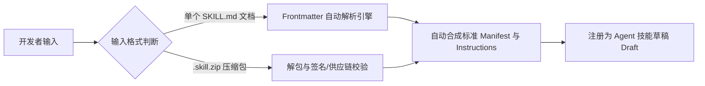
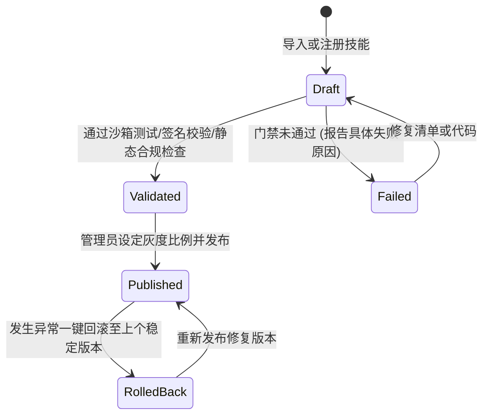

# Pivot 智能体技能体系与文档自动化落地综合技术方案

## 文档元数据
- **编写日期**：2026-08-31
- **版本**：v1.0.0
- **适用场景**：Pivot 全自主 Agent、纯内网 Air-Gapped 环境、桌面端 / Web 端运行
- **涉及核心服务**：`agent-skills.js`, `agent-skill-packages.js`, `agent-releases.js`, `local-device-bridge.js`, `apps-workbench-export.js`, `document-processing/exporters/`

---

## 目录
1. [方案背景与核心目标](#一-方案背景与核心目标)
2. [第一篇：Agent 技能（Skill）体系架构与格式演进](#二-第一篇agent-技能skill体系架构与格式演进)
   - 2.1 现行企业级 `.skill.zip` 格式规范
   - 2.2 行业主流 Markdown 技能与企业级安全技能的对比
   - 2.3 渐进式轻量化演进方案（支持单文件 `SKILL.md`）
3. [第二篇：技能作用域（Scope）与组织共享治理体系](#三-第二篇技能作用域scope与组织共享治理体系)
   - 3.1 三级作用域体系与可见性定义
   - 3.2 为什么普通用户导入默认仅自己可见
   - 3.3 技能全生命周期发布、灰度与回滚机制
4. [第三篇：Agent 自动生成文档落地至用户本机的技术方案](#四-第三篇agent-自动生成文档落地至用户本机的技术方案)
   - 4.1 现有文档生成底座能力分析
   - 4.2 运行环境差异（桌面端 vs 网页端）与落地机制
   - 4.3 方案 A：桌面端全自动直写（Electron + 本机桥接通道）
   - 4.4 方案 B：Web 端近全自动下载（Artifact 产物 + 自动触发流）
   - 4.5 安全边界与合规防护（Jail 白名单、防覆盖、审计）
5. [第四篇：演进路线图与实施规划](#五-第四篇演进路线图与实施规划)

---

## 一、 方案背景与核心目标

在 Pivot 智能化与自主 Agent 的持续演进中，针对智能体能力扩展（Skills）与最终业务产物（Documents/Files）的生成与交付，面临以下核心诉求：
1. **降低技能开发与接入门槛**：平衡行业流行的轻量级 Prompt 文档模式（如 `SKILL.md`）与企业内网环境下的代码安全、权限隔离硬约束。
2. **规范技能资产的多租户与组织级共享**：明确个人技能、团队共享与组织公共资产的权限边界、审批发布流程与灰度分发机制。
3. **实现业务文档“大模型生成即落地本机”的全自动体验**：打通从大模型智能分析、结构化排版到直接保存至用户本地物理目录（如 Word、Excel、PDF 等）的闭环链路，并确保操作系统与数据安全。

---

## 二、 第一篇：Agent 技能（Skill）体系架构与格式演进

### 2.1 现行企业级 `.skill.zip` 格式规范

目前项目中构建了完善的离线技能供应链与执行机制（见 `server/services/agent-skill-packages.js` 与 `server/services/agent-skills.js`）：

```
my-analysis-skill.skill.zip
├── SKILL.yaml (或 SKILL.json / SKILL.yml，核心清单，必选)
├── INSTRUCTIONS.md (说明与提示词指南，可选)
├── SKILL.sig (或 package.sig，RSA-SHA256 离线签名，签名模式下必选)
├── package-lock.json / requirements.txt (依赖锁定文件，声明依赖时必选)
└── scripts/ (测试或自定义逻辑执行脚本，可选)
```

#### 包内核心规格约束
- **体积与文件限制**：压缩包默认上限 100MB，解压后上限 256MB，文件数不超过 128 个。
- **路径与符号链接安全**：严格执行 `safeEntryPath` 规范化，禁止包含 `../` 路径穿越、绝对路径与空字节。
- **供应链黑名单**：严禁包含敏感凭证（`.env`, `.git/config`, `id_rsa`, `credentials.json`），且 `package.json` 禁止定义 npm 生命周期钩子（`preinstall`, `postinstall` 等）。

#### 清单文件（`SKILL.yaml`）规范示例
```yaml
id: "corp.skills.financial_report"      # 技能唯一标识 (正则: ^[a-zA-Z0-9][a-zA-Z0-9._-]{1,127}$)
name: "financial_report_analysis"       # 技能名称
version: "1.2.0"                        # 语义化版本号 (SemVer)
title: "财务报表智能分析"                # 展示标题
description: "分析项目财务报表并生成风险摘要" # 详细描述
publisher: "Pivot Financial Team"       # 发布者信息
scope: "user"                           # 作用域 ('user' | 'shared' | 'global')

# 权限最小化硬约束（系统 PEP 在调用层拦截）
permissions:
  - "filesystem.read_workspace"
  - "code.duckdb_query"

# 工具调用声明
tools:
  - "tool.duckdb.query"
  - "tool.python.execute"

# 输入/输出元数据
inputs:
  financial_excel: { type: "file", extensions: [".xlsx", ".csv"], required: true }
outputs:
  analysis_report: { type: "file", format: "docx" }

# 固定回归测试声明（发布门禁使用）
tests:
  - name: "query-syntax-check"
    script: "console.log('Validation passed');"
```

---

### 2.2 行业主流 Markdown 技能与企业级安全技能的对比

| 维度 | 主流的 Markdown Skill（Prompt 型） | Pivot 现行的 Skill Package（企业级安全型） |
| :--- | :--- | :--- |
| **典型代表** | Claude Code, OpenAI Assistants, Cursor Rules | Pivot 内网自主 Agent, 金融/企业私有化部署 |
| **载体形态** | 单个 `SKILL.md`（头部 Frontmatter + Markdown 正文） | `.skill.zip` 压缩包（包含 `SKILL.yaml` + `INSTRUCTIONS.md` + 签名 + 脚本） |
| **本质定位** | **“给大模型看的操作指南与上下文 Prompt”** | **“运行时的受控能力包与沙箱安全资产”** |
| **权限控制** | **软约束**（依赖 Prompt 约束 LLM，LLM 可能会幻觉越权） | **硬约束（PEP）**（底层拦截器按声明严格限制工具/文件/网络调用） |
| **安全机制** | 信任开发者，无签名与审查 | 离线 RSA 数字签名、SHA256 防篡改、供应链路径穿越防护 |
| **生命周期** | 即写即用，无状态 | 草稿（Draft）➔ 沙箱回归测试 ➔ 审批 ➔ 金丝雀灰度发布 ➔ 一键回滚 |

---

### 2.3 渐进式轻量化演进方案（支持单文件 `SKILL.md`）

为了兼顾主流开发者习惯与企业安全要求，设计**渐进式多层级 Skill 兼容模型**：



#### 统一 `SKILL.md` 格式规范
支持开发者直接编写单个 Markdown 文件：
```markdown
---
id: financial_review
name: 财务分析助手
version: 1.0.0
title: 财务分析自动化助手
description: 自动读取上传的财报并生成风险诊断报告。
permissions:
  - filesystem.read_workspace
  - code.duckdb_query
tools:
  - tool.duckdb.query
---

# 财务分析技能操作指南

当用户提供财报数据时，请按如下流程执行：
1. **数据清洗**：调用 DuckDB 查询去除空值与异常负值；
2. **指标计算**：计算资产负债率、流动比率与毛利率；
3. **输出排版**：按公文规范输出 Markdown 格式的风险摘要。
```

- **处理逻辑**：
  1. 系统识别 Markdown 顶部的 YAML Frontmatter，提取 `id`、`name`、`version` 等元数据生成 `manifest_yaml`；
  2. 将正文内容自动作为 `instructions_md` 保存；
  3. 未显式声明权限时，默认给予最安全的最小只读权限；
  4. 开发模式下免除强制数字签名要求，实现秒级热生效。

---

## 三、 第二篇：技能作用域（Scope）与组织共享治理体系

### 3.1 三级作用域体系与可见性定义

在系统底层（`server/services/agent-skills.js` 与 `server/services/agent-releases.js`），技能划分了三级作用域：

```
                    ┌───────────────────────────────┐
                    │      Global / Organization     │
                    │   (全组织/系统通用，管理员发布)  │
                    └──────────────┬────────────────┘
                                   │
                    ┌──────────────▼────────────────┐
                    │        Team / Shared          │
                    │   (部门/同租户共享，管理员审批) │
                    └──────────────┬────────────────┘
                                   │
                    ┌──────────────▼────────────────┐
                    │       User / Personal         │
                    │    (个人私有沙箱，开发者自用)   │
                    └───────────────────────────────┘
```

1. **个人级（`personal` / `user`）**：
   - 存储所有者键值：`owner_key = "user:<userId>"`；
   - 仅创建者本人可见、可调试、可执行；
   - 普通用户导入或注册技能后，默认进入此作用域。
2. **团队级（`team` / `shared`）**：
   - 存储所有者键值：`owner_key = "scope:shared"` 或关联至特定租户 `tenant_id`；
   - 同团队或同部门成员在工作台及 Agent 对话中可见并可选用；
   - 需由管理员（`admin` 或 `root`）进行发布操作。
3. **组织/全局级（`organization` / `global`）**：
   - 存储所有者键值：`owner_key = "scope:global"`；
   - 企业全员可见的公共标准工具库（如全局法规库检索、统一公文排版）；
   - 需严格执行组织级发布审批门禁。

---

### 3.2 为什么普通用户导入默认仅自己可见？

1. **防止未经审计的脚本或提示词污染组织**：普通用户可能编写了未经沙箱验证的脚本或存在提示词注入隐患，严格隔离在个人空间可保证企业安全。
2. **支持个性化定制与命名重叠**：不同业务人员可以创建同名的个人技能（例如用户 A 与用户 B 各自拥有一个 `my-excel-parser`），彼此隔离互不干扰。

---

### 3.3 技能全生命周期发布、灰度与回滚机制

企业级共享技能必须通过受控发布流水线：



1. **自动化门禁验证（Validation Gate）**：
   - 清单格式与字段合法性；
   - RSA 签名防篡改校验；
   - 依赖锁定文件（Lockfile）完整性；
   - 独立 Jail 沙箱中运行声明的回归测试用例。
2. **金丝雀灰度发布（Canary Rollout）**：
   - 支持按比例分发（`rollout_percent`：如 10% ➔ 50% ➔ 100%）；
   - 支持指定部门范围（`target_units`）或指定试用人员（`target_user_ids`）；
   - 运行时基于 `hash(userId + releaseId) % 100` 实现确定性灰度命中。
3. **企业共享技能目录（Shared Catalog）**：
   - 发布成功的技能同步暴露在 `GET /api/agents/skills/catalog`；
   - 供全组织用户搜索、查看说明与直接调用。

---

## 四、 第三篇：Agent 自动生成文档落地至用户本机的技术方案

### 4.1 现有文档生成底座能力分析

Pivot 系统内部已经拥有成熟的多格式文档生成引擎：
- **公文/DOCX 渲染引擎**（`client/chat/apps-workbench-export.js` & `server/services/official-writing.js`）：支持基于 OpenXML 规范生成带密级、版头、发文字号、红头、正文、表格、版记的合规 `.docx` 文件。
- **文档处理与导出服务**（`server/services/document-processing/exporters/index.js`）：内置 `buildDocx`，可将清洗抽取的数据组装为排版规范的 Word 文档。
- **任务产物管理**（`server/services/agent-artifacts.js`）：Agent 支持将执行结果归档为结构化产物（Artifacts）。

---

### 4.2 运行环境差异（桌面端 vs 网页端）与落地机制

```mermaid
flowchart TD
    UserReq([用户提出需求: "请分析本周工单并生成周报.docx 到我本地"]) --> AgentCore[Agent 任务规划与内容生成]
    AgentCore --> DocEngine[文档排版引擎合成 DOCX 二进制数据]
    DocEngine --> EnvDispatch{检测当前运行环境}

    EnvDispatch -- "Electron 桌面端 (推荐)" --> LocalBridge[通过 Local Device Bridge 桥接]
    LocalBridge --> AuthCheck{校验本机目录授权}
    AuthCheck -- 授权有效 --> FsWrite[Node.js 原生 fs.writeFile 写入目标目录]
    AuthCheck -- 未授权 --> PromptAuth[弹出系统文件夹选择授权对话框] --> FsWrite
    FsWrite --> DesktopNotify[界面提示完成, 提供 '打开文件' / '定位文件夹' 按钮]

    EnvDispatch -- "Web 浏览器端" --> ArtifactStore[保存至服务端 Agent Artifacts]
    ArtifactStore --> SSEEvent[推送 agent.artifact_ready 事件至浏览器]
    SSEEvent --> AutoBlob[前端自动拉取二进制并触发浏览器下载流]
    AutoBlob --> BrowserDownload[文件自动保存至系统 Downloads 目录]
```

---

### 4.3 方案 A：桌面端全自动直写（Electron + 本机桥接通道）

在 Electron 桌面端（见 `desktop/main.js` 与 `server/services/local-device-bridge.js`），借助本地桥接通道与 Node.js 物理权限，可实现真正的“模型全自动直写”。

#### 1. 目录预授权机制（基于现有的 `pivot-local-auth`）
- 用户首次在桌面端设置“本机工作目录”（如 `D:\PivotWorkspace\` 或 `C:\Users\HP\Desktop\AgentOutput`）；
- 系统记录授权状态 `local_output_dir`，锁定安全根路径。

#### 2. Agent 本机文件写入工具定义
在 Local Device MCP 工具库中注册写入工具：
```javascript
{
    name: 'local_fs.save_document',
    title: '保存文档至本机目录',
    description: '将大模型生成的文档内容（DOCX/Excel/Markdown/PDF）直接写入用户授权的本机目录。',
    inputSchema: {
        type: 'object',
        properties: {
            filename: { type: 'string', description: '保存的文件名，如 2026Q3财务报告.docx' },
            format: { type: 'string', enum: ['docx', 'xlsx', 'md', 'pdf', 'txt'] },
            content: { type: 'string', description: '文档正文内容或结构化数据 JSON' },
            subDirectory: { type: 'string', description: '工作目录下的可选子目录' }
        },
        required: ['filename', 'format', 'content']
    }
}
```

#### 3. 执行时序与实现
1. **Agent 生成文档**：Agent 调用 `local_fs.save_document`，传入排版数据与文件名；
2. **通道执行**：桌面主进程接收 IPC 请求，调用公文/文档生成引擎组装出 DOCX 二进制 Buffer；
3. **安全物理写入**：
   ```javascript
   const targetDir = authorizedRootPath;
   const safeFilename = path.basename(input.filename);
   const finalPath = path.join(targetDir, safeFilename);
   await fs.promises.writeFile(finalPath, docxBuffer);
   ```
4. **交互体验增强**：
   Agent 在消息流中输出卡片，利用 Electron 提供的 `shell.openPath` 与 `shell.showItemInFolder`，用户可直接点击：
   - 📄 **「立即打开文档」**
   - 📁 **「在文件夹中查看」**

---

### 4.4 方案 B：Web 端近全自动下载（Artifact 产物 + 自动触发流）

在标准 Web 浏览器端，受制于浏览器跨进程沙箱限制（无法在无交互情况下向任意磁盘路径写入），采用以下优化体验流程：
1. **服务端产物归档**：Agent 完成文档渲染后，调用 `createOrUpdateRunArtifact` 生成专属下载链接；
2. **前端自动触发流**：前端接收到任务完成通知后，创建虚拟锚点自动拉取 Blob 数据并触发下载：
   ```javascript
   const blob = new Blob([buffer], { type: 'application/vnd.openxmlformats-officedocument.wordprocessingml.document' });
   const url = URL.createObjectURL(blob);
   const a = document.createElement('a');
   a.href = url;
   a.download = '2026Q3财务分析报告.docx';
   document.body.appendChild(a);
   a.click();
   a.remove();
   URL.revokeObjectURL(url);
   ```
3. 文件将自动保存到操作系统的默认 `Downloads` 文件夹中。

---

### 4.5 安全边界与合规防护

为防止 Agent 因幻觉或恶意 Prompt 注入破坏用户操作系统，必须设立三道防线：

1. **Jail 目录白名单约束**：
   - Agent 写入路径必须由 `path.resolve` 与 `safeEntryPath` 严格校验，确保处于用户授权的 `authorizedRootPath` 范围内；
   - 严禁写入 `C:\Windows`, `Program Files`, 操作系统根分区或用户敏感目录。
2. **同名冲突与覆盖保护策略**：
   - 默认采用自动版本重命名策略（如 `财务报表_(1).docx`, `财务报表_(2).docx`）；
   - 若需显式覆盖，需在 Agent 执行计划中触发用户审批弹窗。
3. **全链路审计日志**：
   - 每次物理写入操作均在 `agent_tool_audits` 中记录时间戳、用户 ID、任务 ID、目标路径、文件类型与 SHA256 校验和，确保企业合规可追溯。

---

## 五、 第四篇：演进路线图与实施规划

```
                      【演进路线图】

   阶段 1：技能轻量化与统一      阶段 2：本机直写能力闭环      阶段 3：组织级生态与治理
  ┌──────────────────────┐    ┌──────────────────────┐    ┌──────────────────────┐
  │ • 支持 SKILL.md 单文件│    │ • 桌面端 local_fs 工具│    │ • 共享技能市场 Catalog│
  │ • Frontmatter 自动解析│ ──►│ • DOCX 本机无感直写  │ ──►│ • 团队级金丝雀灰度监控│
  │ • 零配置开发模式生效  │    │ • '打开文件' 快捷交互 │    │ • 审计追溯与版本回滚  │
  └──────────────────────┘    └──────────────────────┘    └──────────────────────┘
```

### 详细阶段规划

#### 阶段 1：技能开发轻量化（降低 80% 接入成本）
- [ ] 在 `server/services/agent-skills.js` 中新增 `parseSkillMarkdown(markdownContent)` 方法，支持自动拆分 Frontmatter 元数据与正文提示词；
- [ ] 前端 Agent Harness 界面支持拖拽单个 `.md` 文件或直接粘贴 Markdown 注册技能；
- [ ] 开发环境下默认放宽数字签名强制校验。

#### 阶段 2：桌面端文档直写与交互闭环（实现端到端全自动）
- [ ] 在 `desktop/main.js` 与 `local-device-mcp.js` 中接入 `local_fs.save_document` 写入通道；
- [ ] 集成 `buildDocx` 与 `apps-workbench-export.js` 的排版能力至本地写入管道；
- [ ] 聊天前端新增文件生成完成卡片，集成 Electron `shell.showItemInFolder` 动作。

#### 阶段 3：企业级共享与发布治理（完善多租户能力）
- [ ] 完善组织级共享技能目录（Shared Catalog）的前端筛选、搜索与一键试用；
- [ ] 增强灰度发布可观测性看板（按部门/用户维度的执行成功率与评分反馈统计）。

---

## 结论

本方案通过**“轻量 Markdown 格式解析 + 企业级沙箱签名兜底”**解决了技能体系复杂难用的痛点，通过**“三级 Scope 作用域与灰度流水线”**保障了企业多租户的安全共享治理，并通过**“桌面端 Local Device Bridge 本机受控直写”**实现了大模型全自动生成并保存 Word 等文档到用户本机的流畅业务闭环。
