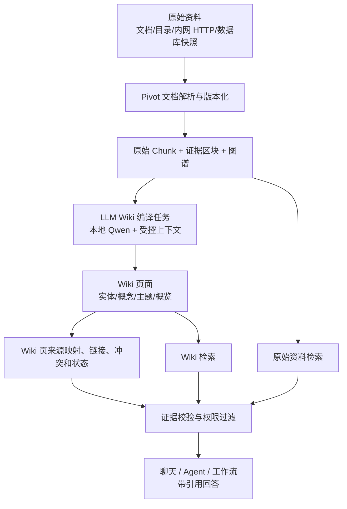

# Pivot 知识库 LLM Wiki 融合实施方案

> 文档状态：核心实施已完成 / 试点验收待执行
>
> 适用版本：Pivot v0.1.198 及后续版本
>
> 适用环境：无互联网或受限网络的组织内网；本地 Qwen、内网 Embedding 与 PostgreSQL/pgvector 部署

> 实施状态（v0.1.198）：Phase 1 至 Phase 3 的核心能力已落地，包括受控数据模型、来源映射、候选编译、审核发布、失效重建、双通道问答、显式范围、只读 Markdown 导入和中文工作台入口。编译器兼容本地 Qwen 的 JSON 围栏、中文字段和 `S1` 受控来源编号；仅使用 Qwen3.8 时，公共模型调用层才会将 system 指令归并为唯一首条，以兼容其严格模板，其他模型保持原有消息顺序，且不会放宽来源 manifest 校验。综合页详情视图支持标准工作区分页展示、自适应防溢出布局与全量核验状态中文化，杜绝双重垂直与横向滚动条。Phase 4 的多专题库扩展、真实业务验收和只读 MCP bridge 仍遵循本文门槛按试点推进，不能用代码完成状态替代。

---

## 1. 决策摘要

Pivot 可以融合 LLM Wiki 思路，但不应直接用第三方 LLM Wiki 替换现有知识库或把其生成内容当作权威事实。

建议采用以下定位：

```text
原始资料（人维护、不可被 Wiki 改写、可审计）
    ↓ 受控解析、审核、索引
Pivot LLM Wiki 编译层（本地 Qwen 维护、可重建、可回链）
    ↓ 语义/图谱检索与来源校验
Pivot 问答、Agent、工作流与知识图谱
```

最终目标不是建设第二套孤立知识库，而是在现有 Pivot RAG 之上增加一层**派生的、结构化的、相互链接的知识综合页**：

- 原始制度、文档、表格、网页快照仍是答案的证据源与合规依据；
- LLM Wiki 页面负责跨文档总结、主题导航、实体关系、冲突提示和高信号概览；
- Wiki 页的每个事实性段落必须能回链到经过权限过滤的原始文档区块；
- 无来源、冲突、过期或低置信度 Wiki 内容不能单独支持高风险答案；
- Wiki 编译失败绝不影响现有文档检索和知识问答。

这一模式借鉴 Microsoft LLM Wiki 的“原始资料、LLM 维护 Wiki、结构约定”三层模型，但 Pivot 使用本地 Qwen 和自身治理体系实现，不依赖 GitHub Copilot、VS Code 扩展或公网服务。Microsoft 版本同时暴露 core/MCP 能力，可作为外部 Markdown/MCP 兼容参考，而非生产运行时依赖。[^microsoft-llmwiki]

---

## 2. 现有能力与融合边界

### 2.1 可直接复用的 Pivot 能力

| 现有能力 | 当前实现基础 | LLM Wiki 中的用途 |
| --- | --- | --- |
| 专题库、标签和共享范围 | `knowledge_collections`、文档访问控制 | Wiki Space 的权限上限和原始资料范围 |
| 文档版本与来源定位 | `knowledge_documents`、`knowledge_document_versions`、`knowledge_blocks` | Wiki 页的来源锚点、版本失效检测 |
| 局域网目录增量同步 | `knowledge_sources`、`local_dir`、`syncKnowledgeSource` | 可选导入外部 Markdown Wiki 或原始资料目录 |
| 混合 RAG、引用和质量反馈 | `rag-index`、`knowledge_citations`、`rag_feedback` | Wiki/原始资料双通道检索与可验证引用 |
| 图谱实体与关系 | `knowledge_entities`、`knowledge_relations`、`knowledge_entity_mentions` | 生成 Wiki 页的主题候选、导航和冲突发现辅助信号 |
| 索引暂存、任务队列和恢复 | `knowledge_ingestion_jobs`、索引 staging | Wiki 编译任务的可恢复执行与原子发布 |
| 访问和安全控制 | collection/document 访问过滤、审计日志、模型预算 | 避免 Wiki 生成、检索或来源回链越权 |

### 2.2 明确不做的事情

1. 不以 Wiki 页面替换原始文档，也不允许 Wiki 编译器修改原始文件。
2. 不在首次用户提问时临时“写 Wiki”；编译只发生在资料变更后的异步任务或管理员触发任务中。
3. 不默认接入外网 LLM、GitHub Copilot、第三方 SaaS 或公网 Git 仓库。
4. 不把未复核的 LLM 结论升级为制度、规定或正式知识。
5. 不在第一期直接开放 Wiki 的任意写入 MCP 工具给普通聊天；写入由后台受控作业完成。
6. 不因为 Wiki 存在就取消原始资料检索、文档版本校验、引用、权限或审批。

---

## 3. 目标架构

### 3.1 三层数据模型



| 层 | 所有者 | 是否可改写 | 可信等级 | 生命周期 |
| --- | --- | --- | --- | --- |
| 原始资料 | 用户、资料管理员、受控同步源 | 仅由原来源或正式文档治理变更 | 权威证据 | 版本化、可审核、可删除 |
| 证据区块和图谱 | Pivot 解析器 | 可由索引重建 | 派生索引 | 随文档版本失效或重建 |
| Wiki 页面 | Pivot Wiki 编译器 | 仅后台作业/管理员发布流程 | 派生综合 | 可重建、可审核、可回滚 |
| 回答上下文 | 路由与检索器 | 临时 | 取决于来源状态 | 单次请求 |

### 3.2 Wiki Space

一个 `Wiki Space` 绑定到一个或多个已有 Pivot 专题库。它不是新的权限体系：

- Space 的有效可见范围 = 绑定专题库范围的交集，并且每次检索仍执行用户级原始文档访问过滤；
- 每个 Space 有独立的编译模型（自动编译时必须显式指定）、提示词版本、最大页面数、最大来源数、自动编译策略和发布策略；
- Space 可以是 `personal`、`unit` 或 `organization`，但不能比其任意原始专题库更开放；
- 同一原始文档可参与多个 Space；生成的 Wiki 页不可跨 Space 共享，除非管理员创建具有明确来源和权限的独立发布副本。

建议首期仅支持“一个 Space 绑定一个专题库”。多专题库 Space 在来源访问交集、冲突治理和跨部门数据边界验证完成后再启用。

### 3.3 Wiki 页面类型

| 页面类型 | 用途 | 典型内容 | 允许作为最终依据 |
| --- | --- | --- | --- |
| `overview` | 专题库导览 | 范围、术语、重要主题、最近变更 | 否，需回查来源 |
| `topic` | 跨文档主题综合 | 流程、适用条件、例外、来源摘要 | 仅来源完整且低风险时辅助 |
| `entity` | 人员、组织、系统、产品、制度实体 | 定义、别名、关系、关联主题 | 否，需回查来源 |
| `concept` | 业务概念或方法论 | 定义、边界、相关概念 | 仅来源完整且低风险时辅助 |
| `conflict` | 冲突与待确认事项 | 相互矛盾的规则、版本差异 | 绝不直接作为答案依据 |
| `change_digest` | 文档变更汇总 | 新增/修改/删除资料的影响 | 仅用于导航和审核 |

页面以 Markdown 保存，但文档元数据、来源映射、链接、状态和版本必须持久化在 PostgreSQL；不能只依赖 Markdown 文件名或 WikiLink 文本做运行时权限判断。

---

## 4. 数据模型与迁移设计

### 4.1 新增表

建议新增单一迁移 `knowledge_llm_wiki_foundation`，包含以下表。所有主键、时间、软删除、用户字段和 JSONB 类型按现有知识产品迁移规范实现。

#### `knowledge_wiki_spaces`

| 字段 | 含义 |
| --- | --- |
| `id` | Space 主键 |
| `owner_user_id` | 创建者 |
| `collection_id` | 首期绑定的专题库 |
| `name`、`description` | 对用户可见的名称和说明 |
| `scope`、`allowed_units`、`allowed_user_ids` | 不得超出专题库的发布范围 |
| `status` | `draft` / `active` / `paused` / `deleted` |
| `compile_policy_json` | 模型、预算、最大候选、自动编译和审核策略 |
| `prompt_version` | Wiki 编译提示词版本 |
| `last_compiled_at`、`last_published_at` | 编译与发布状态 |

#### `knowledge_wiki_pages`

| 字段 | 含义 |
| --- | --- |
| `id`、`space_id` | 页面身份和所属 Space |
| `page_type`、`slug`、`title` | 页面分类与稳定地址；`UNIQUE(space_id, slug)` |
| `summary`、`content_markdown` | 可检索摘要和 Markdown 正文 |
| `content_hash`、`version_no` | 幂等编译和回滚 |
| `status` | `draft` / `review` / `published` / `stale` / `superseded` / `deleted` |
| `confidence` | 仅表示编译覆盖/来源完整度，不表示事实正确率 |
| `source_coverage_json` | 来源数、缺失来源数、冲突数和最新来源版本摘要 |
| `generated_by`、`model_version`、`prompt_version` | 可追溯生成信息 |
| `published_by`、`published_at` | 人工或策略发布记录 |

#### `knowledge_wiki_page_sources`

该表是最重要的事实约束。每一条来源映射至少定位到原始文档版本和区块。

| 字段 | 含义 |
| --- | --- |
| `wiki_page_id` | Wiki 页面 |
| `document_id`、`version_id`、`block_id`、`chunk_id` | 原始证据定位；至少 `document_id + version_id` 必填 |
| `wiki_section_anchor` | Wiki 中声明事实所在段落/标题锚点 |
| `source_locator_json` | 页码、章节、单元格、字符范围等定位 |
| `support_type` | `supports` / `defines` / `contradicts` / `supersedes` / `background` |
| `excerpt_hash` | 防止来源内容变化后把旧映射当作有效依据 |
| `verified_status` | `unverified` / `auto_checked` / `human_verified` / `invalid` |

#### `knowledge_wiki_page_links`

保存已解析的 WikiLink，不在查询时解析全文：

`from_page_id`、`to_page_id`、`relation_type`、`anchor`、`created_at`，并要求同一 Space 内链接。链接仅用于导航和检索扩展，不能扩大来源或权限范围。

#### `knowledge_wiki_compile_runs`

记录编译队列和可恢复执行：

`id`、`space_id`、`trigger_type`、`requested_by`、`input_manifest_hash`、`status`、`stage`、`summary_json`、`error_code`、`started_at`、`completed_at`。

触发类型至少包括：`source_changed`、`manual`、`scheduled`、`review_retry`、`full_rebuild`。

### 4.2 来源失效规则

发生以下任一事件时，不能继续把旧 Wiki 页作为可靠内容：

1. 原始文档当前版本与 `knowledge_wiki_page_sources.version_id` 不一致；
2. 对应区块、chunk 或页码锚点消失；
3. 原始文档被删除、撤销发布、权限收紧或专题库移除；
4. 来源摘要哈希、正文摘录哈希或编译输入清单不一致；
5. 页面中存在未解决的 `contradicts` 来源。

处理策略：

```text
来源改变
  → 关联页面标为 stale
  → 从 Wiki 检索结果中降权或排除
  → 入队增量重编译
  → 新页面通过来源校验后原子替换 published 版本
```

删除原始资料时必须沿用现有文档/引用的事务与审计边界：先标记关联 Wiki 页失效，再删除或归档原始版本；禁止保留看似仍可引用、实际来源已不可访问的 Wiki 内容。

---

## 5. 编译流程

### 5.1 触发与输入收敛

编译不是面向整库的无界 Agent 任务。每次任务先根据专题库、近期变更、图谱实体、文档质量和最大预算生成有限输入清单。

```text
原始文档新版本/删除/审核变更
  → 计算受影响的实体、主题和既有 Wiki 页
  → 选取受影响文档的已发布区块 Top-K
  → 形成固定输入 manifest（文档版本、block、hash、权限范围）
  → 本地 Qwen 生成候选 Wiki 页面或补丁
  → 机器校验来源、链接、结构和冲突
  → 草稿/审核/发布
```

首期限制建议：

| 项目 | 初始限制 |
| --- | --- |
| 单 Space 一次编译原始文档数 | 20 |
| 单页面来源区块数 | 3–12 |
| 单次编译候选页面数 | 10 |
| 页面正文长度 | 1,000–6,000 中文字符 |
| 单页面链接数 | 20 |
| 自动重试 | 1 次，指数退避 |
| 失败回退 | 保留已发布页面；不覆盖为失败输出 |

这些数值必须注册为类型化配置，后续按目标内网的 Qwen 上下文、吞吐和业务质量调优。

### 5.2 模型输出契约

禁止让模型直接写数据库或文件。模型只输出受限 JSON：

```json
{
  "pageType": "topic",
  "slug": "travel-expense-reimbursement",
  "title": "差旅费用报销",
  "summary": "适用范围、审批与凭证要求的综合说明。",
  "markdown": "## 适用范围\n...",
  "claims": [
    {
      "sectionAnchor": "适用范围",
      "statement": "...",
      "sourceRefs": [
        { "documentId": 101, "versionId": 7, "blockId": 390, "supportType": "supports" }
      ]
    }
  ],
  "links": [
    { "slug": "invoice-requirements", "relationType": "related_to" }
  ],
  "conflicts": []
}
```

服务端必须验证：

- `slug`、页面类型、Markdown 大小和链接数符合白名单；
- 每条 `sourceRef` 归属当前 input manifest，且用户/Space 有读取权；
- 事实性正文段落至少有一条 `supports` 或 `defines` 来源；
- 不能写入模型指令、脚本、外链图片、未受控 HTML 或任意文件路径；
- 输出不能覆盖已有页面，必须以候选版本提交；
- 页面不能伪造“已批准”“现行规定”等状态，状态只能由服务端元数据决定。

### 5.3 冲突处理

当来源版本或规则彼此矛盾时，编译器生成 `conflict` 记录，而不是自行裁决：

```text
检测到冲突
  → 当前 topic 页标记 conflict_count > 0
  → 生成/更新 conflict 页面，列出来源与版本
  → 常规问答提示“知识库存在待确认的不同口径”
  → 高风险/制度类问答拒绝用 Wiki 补全，转原始文档和人工审核
```

---

## 6. 检索与回答策略

### 6.1 双通道检索

新增 `knowledge_wiki` 检索通道，但不取代现有原始 Chunk 检索：

```text
用户问题
  → 权限过滤
  → 问题类型门控
      ├─ 综合/导航/跨资料关系：Wiki + 原始资料并行检索
      ├─ 制度/合规/精确条款：原始资料优先，Wiki 仅导航
      ├─ 冲突/过期主题：原始资料 + 冲突提示
      └─ 普通写作：不检索
  → 证据校验、去重、上下文预算
  → 带来源回答
```

Wiki 页可用于：

- 快速识别相关专题、实体、概念和候选原始资料；
- 将分散文档的共同点、差异和依赖关系组织为可读结构；
- 对长对话提供稳定的主题概览，降低直接注入大量原始 chunk 的概率；
- 在图谱导航时提供实体/主题的自然语言解释。

Wiki 页不得用于：

- 代替审批规则、合同条款、财务制度的精确原文；
- 忽略原始版本、有效期、发布状态或权限；
- 在没有可访问来源时生成带有事实断言的回答。

### 6.2 排序与上下文预算

建议使用固定、可观测的融合顺序：

1. 原始资料精确匹配、标题/编号/版本匹配；
2. 原始 Chunk 的混合检索（现有词法、向量、RRF、MMR）；
3. 已发布且来源完整的 Wiki 页检索；
4. WikiLink/图谱邻域扩展，仅从当前用户可访问的页面与原始资料中扩展；
5. 依据来源新鲜度、冲突、发布状态和引用完整度降权；
6. 在模型上下文中优先放原始证据，再放 Wiki 综合说明。

建议的上下文上限：

| 内容 | 默认上限 | 规则 |
| --- | --- | --- |
| 原始证据区块 | 4–8 个 | 高风险问题至少保留原始区块 |
| Wiki 页 | 1–3 页 | 只取 `published` 且来源完整页面 |
| 单页 Wiki 正文 | 3,000 tokens | 先摘要后正文 |
| 图谱邻域 | 20 节点 / 40 边 | 仅作导航，不直接注入所有节点文本 |

### 6.3 引用呈现

最终回答需要区分两种引用：

```text
【综合页】差旅费用报销（由 3 份资料综合）
  └─ 【原始依据】2026 差旅管理制度，第 3.2 节
  └─ 【原始依据】费用报销审批流程，版本 7，第 4 节
```

- 用户点击 Wiki 引用可查看页面、最后编译时间、来源覆盖、冲突状态；
- 用户点击原始依据可跳转现有的文档/版本/区块定位；
- 只展示当前用户有权访问的来源；
- 如果某个 Wiki 页的来源因权限不可见，页面必须从该用户结果中排除，不能仅隐藏来源后继续展示摘要。

---

## 7. 外部 LLM Wiki 兼容方式

### 7.1 首选：原生 Pivot Wiki 编译器

这是生产首选。它使用 Pivot 自有的文档版本、权限、模型、审计和知识图谱，能稳定实现来源回链和多租户隔离。

### 7.2 可选：只读 Markdown 导入适配器

已有外部 LLM Wiki/Obsidian/Foam/Markdown 资料库时，可通过现有 `local_dir` 同步能力导入到隔离专题库：

```text
外部 Wiki 目录（只读挂载）
  → Pivot local_dir Source
  → Markdown 导入与版本化
  → 解析 YAML front matter、Markdown 链接、WikiLinks
  → 标记为 external_wiki_import
  → 作为“参考综合资料”，而不是原始权威资料
```

适配器需识别：`index.md`、`overview.md`、`hot.md`、页面 front matter、Markdown/WikiLinks、标签与显式 source references。兼容目标只能声明“兼容 Markdown 目录形态”，不能宣称已认证某一上游项目的所有版本或插件设置。`llmwiki-serve` 的文档同样将多个上游项目描述为 Markdown 输出兼容目标，而不是官方集成认证。[^llmwiki-serve]

导入的外部 Wiki 必须满足：

- 目录通过安全路径白名单，只读扫描；
- 外部 Wiki 页落入独立专题库和独立标签，默认不与正式制度资料混合；
- 未提供可解析原始来源时，页面只能作为导航/背景知识；
- 同步删除、版本变化和软删除沿用现有 `knowledge_sources` 审计；
- 首期不把外部 Markdown 页反向写回其目录。

### 7.3 可选：MCP 只读桥接

部分 LLM Wiki 提供 MCP 的 `query`、`read_page`、`list_pages` 等能力。首期只允许使用只读工具：

| 操作 | 首期策略 |
| --- | --- |
| `wiki_status` / `wiki_query` / `wiki_read_page` | 可作为管理员配置的只读外部工具 |
| `wiki_list_sources` / `wiki_read_index` | 仅用于同步诊断或导航 |
| `wiki_write_page` / `wiki_update_page` / `wiki_ingest_*` | 默认拒绝；后续须走专用审批与发布流程 |

Microsoft LLM Wiki 的 core 包通过 stdio MCP 暴露读写工具和资源；Pivot 当前外部 MCP 服务以服务器可达的 HTTP JSON-RPC/Streamable HTTP 路径为主。因此如需接入其 stdio 服务，应部署独立的、受限权限的本地桥接进程，而不能让 Web 请求直接派生任意本机命令。[^microsoft-llmwiki]

---

## 8. 安全、权限与治理

### 8.1 不可突破的边界

1. 编译输入、Wiki 检索、链接扩展和引用展示必须使用同一用户身份执行访问过滤。
2. 模型生成上下文只包含当前 Space 内、当前用户可见且已发布的来源区块。
3. 编译任务不得读取其他专题库、其他用户私有资料或被删除/撤销发布版本。
4. Wiki 页无权扩大专题库共享范围；页面的 `scope` 必须被服务端派生而非由模型输出。
5. 所有模型提示词、生成请求、页面候选、发布和来源失效动作写入审计，但审计不保存超出治理许可的原始全文。
6. 外部 Markdown 目录、MCP 地址、凭据和 Git 工作区均需执行现有路径安全、SSRF、凭据加密和网络策略检查。

### 8.2 发布策略

| 场景 | 默认策略 |
| --- | --- |
| 个人低风险笔记 | 自动生成 `draft`，用户确认后 `published` |
| 团队操作手册 | 自动生成 `review`，资料管理员发布 |
| 制度、合规、财务、合同 | 默认不自动发布；必须人工审核并保留来源版本 |
| 冲突页面 | 仅 `review`，不可进入标准问答依据 |
| 已失效来源页面 | `stale`，从正常检索排除 |

### 8.3 模型和成本治理

- 使用具备本地部署与权限的 Qwen 模型；每个 Space 指定模型配置，不继承不受控的聊天默认模型；
- 使用现有模型并发、Token 预算、超时、取消和用量统计能力；
- 编译任务的最大输入、输出、并发、重试和每日预算独立配置；
- 模型不可用时保留旧 Wiki 页和原始 RAG，不允许把失败输出发布；
- 编译内容先经过结构/来源校验，模型“自称成功”不构成发布条件。

---

## 9. API、后台任务与前端设计

### 9.1 服务端接口

建议新增 `/api/knowledge/wiki` 路由组：

| 接口 | 权限 | 功能 |
| --- | --- | --- |
| `GET /spaces` | 当前用户 | 列出可访问 Space 与状态 |
| `POST /spaces` | 专题库管理者 | 创建 Space，绑定已有专题库 |
| `PATCH /spaces/:id` | Space 管理者 | 更新策略、暂停/恢复 |
| `POST /spaces/:id/compile` | Space 管理者 | 手动触发增量或全量编译 |
| `GET /spaces/:id/runs` | 可访问用户 | 查看已脱敏的任务状态 |
| `GET /pages/:id` | 当前用户 | 读取页面和当前可访问来源摘要 |
| `POST /pages/:id/publish` | 审核者 | 发布候选页 |
| `POST /pages/:id/reject` | 审核者 | 驳回并记录原因 |
| `POST /pages/:id/rebuild` | Space 管理者 | 从当前来源重建 |
| `GET /search` | 当前用户 | Wiki/原始资料融合检索，返回可验证引用 |

不提供“聊天前端直接写 Wiki 页面”的 API。未来如需支持编辑，应走带版本、Diff、审核和来源校验的草稿接口。

### 9.2 后台任务状态机

```text
queued
  → collecting_sources
  → generating_candidate
  → validating_sources
  → indexing_page
  → awaiting_review | publishing
  → completed

任意阶段 → failed | cancelled
```

任务重启恢复需要租约、幂等输入 manifest、页面内容哈希和可重试错误码。已有的知识索引队列/暂存交换模式应复用，不新增仅存在于进程内存的队列。

### 9.3 前端交互

知识库工作台新增“Wiki 综合”子页面：

1. Space 列表：绑定专题库、覆盖率、待审核数、冲突数、上次编译时间。
2. 页面列表：类型、来源覆盖、状态、新鲜度、冲突、最后发布人。
3. 页面详情：正文、反向链接、原始来源、版本 Diff、编译清单和审核记录。
4. 编译面板：仅展示预估页面数、来源数、Token 预算和风险提示；用户不能勾选越权来源。
5. 问答凭据：已采用 Wiki 时显示“综合页”和“原始依据”两类紧凑凭据，不展示内部提示词或模型思考。

---

## 10. 分阶段实施计划

### Phase 0：设计冻结与样本准备（1 周）

- [ ] 选择一个低风险、单专题库试点（建议：研发手册或内部操作指南；不选财务/合同）。
- [ ] 定义 Wiki 页面 Markdown 模板、事实段落来源规则、冲突规范和审核角色。
- [ ] 冻结 30–50 个真实问题、期望来源、不可回答问题和冲突问题；不将用户原文写入公开测试文件。
- [ ] 确认试点专题库的权限、保留期限和原始资料质量。

**退出条件**：试点范围、验收集、审核责任人和本地模型预算得到确认。

### Phase 1：数据底座与只读浏览（2 周）

- [x] 新增 Wiki Space、页面、来源、链接、编译运行记录迁移及 service。
- [x] 实现 Markdown/front matter/WikiLink 解析、页面版本和来源失效标记。
- [x] 实现只读 Space/Page/Source API、权限过滤、审计和基础前端浏览。
- [x] 实现外部 Markdown 目录只读导入适配器，默认与正式资料隔离。
- [x] 补充迁移、权限、来源删除、跨用户隔离、路径安全和 API 合约测试。

**退出条件**：可人工导入一组带来源映射的 Wiki 页面；任何用户均无法读取其无权访问的页面或来源。

### Phase 2：本地 Qwen 编译与审核（2–3 周）

- [x] 实现编译输入 manifest、模型 JSON 契约、结构校验、来源校验与候选版本。
- [x] 接入现有模型预算、并发、超时、取消和用量审计。
- [x] 实现来源变更触发 `stale`、受控自动编译和增量重建。
- [x] 实现 `draft/review/published` 发布流程、冲突页面和审核 Diff API。
- [x] 增加生成失败、无来源、虚构链接、过长输出、来源越权、删除回滚的回归测试。

**退出条件**：本地 Qwen 可以只生成草稿；无来源或来源越权输出无法发布；旧页面在编译失败时保持可用。

### Phase 3：融合检索与回答（2 周）

- [x] 新增 Wiki 专用全文索引与原始 RAG 双通道融合器。
- [x] 实现原始资料强制回查、冲突页隔离、过期页排除和来源引用渲染。
- [x] 在聊天自适应路由中增加 Wiki 作为知识检索内部策略，而不是额外要求用户授权的工具。
- [x] 加入 `@专题库`、`@Wiki Space` 的显式范围选择；显式选择优先于自动路由但不绕过权限。
- [ ] 在真实试点验收集上比较原始 RAG 与 RAG+Wiki 的答案可用性、引用准确率、检索延迟和 Token 消耗。

**退出条件**：综合问题有可验证提升；制度/高风险问题不因 Wiki 而弱化原始证据要求。

### Phase 4：受控自动化与多专题库（后续）

- [x] 实现资料变更后的事件驱动增量编译；默认关闭，需显式模型和管理员配置后启用。
- [x] 提供按 Space 的编译、过期、审核、来源和评测指标接口及工作台摘要。
- [ ] 仅在单专题库真实试点满足门槛后，支持多专题库 Space 与跨部门治理。
- [ ] 在目标内网完成只读 MCP bridge 的安全评估；任何写入 MCP 能力需另行安全评审。

---

## 11. 验收指标与门槛

不要使用“模型生成了很多 Wiki 页”作为成功标准。首期验收应记录：

| 指标 | 测量方式 | 首期门槛建议 |
| --- | --- | --- |
| 来源完整率 | 已发布页面中有有效来源映射的事实段落占比 | ≥ 98% |
| 来源可访问率 | 测试用户能够访问的页面来源占比 | 100% |
| 失效收敛时间 | 原始资料版本变更到关联页标记 stale 的时间 | ≤ 5 分钟（事件驱动）或一个同步周期 |
| 引用准确率 | 人工抽检 Wiki 结论是否由所列来源支持 | ≥ 95% |
| 冲突漏报率 | 已知冲突样本中未形成提示的比例 | ≤ 5% |
| 综合问答可用性 | 盲评对比原始 RAG 与 RAG+Wiki | 不低于原始 RAG，且有显著试点收益 |
| 高风险证据合规率 | 制度/合规问答是否仍附原始依据 | 100% |
| 编译失败隔离 | 编译失败是否影响既有 RAG | 0 影响 |
| 额外检索延迟 | P95 相对原始 RAG 增量 | 由试点 SLA 决定，建议 ≤ 300ms |

所有指标按专题库、语言、页面类型和用户权限范围拆分；平均值掩盖少数专题库退化时不得扩大范围。

---

## 12. 风险与缓解

| 风险 | 影响 | 缓解 |
| --- | --- | --- |
| Wiki 幻觉或过度综合 | 误导回答 | 来源段落强制映射、草稿审核、原始资料优先 |
| 来源版本变化 | 旧结论继续被引用 | 版本/摘要哈希、stale 标记、增量重编译 |
| 跨专题库或跨部门泄漏 | 高风险数据暴露 | Space 权限上限、逐请求来源过滤、不可跨 Space 链接 |
| 编译成本过高 | 挤占 Qwen 生成能力 | 异步队列、独立并发/Token 预算、增量输入 manifest |
| Wiki 页面数量膨胀 | 检索和维护退化 | 页面上限、重复检测、过期/孤立页清理、质量报告 |
| 外部 Markdown 目录不可信 | 提示注入、恶意链接 | 当作不可信文档、解析净化、只读导入、无来源降级 |
| MCP bridge 变成本机代码执行入口 | 主机安全风险 | 只读最小工具集、固定命令和路径、独立低权限进程、审批后再开放写入 |

---

## 13. 实施前检查清单

- [ ] 试点专题库已完成权限、资料归属和保留期确认。
- [ ] 本地 Qwen 编译模型、上下文窗口、并发和每日预算可用。
- [ ] 资料管理员可审核 Wiki 草稿和冲突页面。
- [ ] 文档版本/区块定位可以稳定提供引用锚点。
- [ ] 知识库评测集增加综合问答、不可回答、冲突、权限和来源变更案例。
- [x] 所有新表、任务和 API 通过 PostgreSQL 迁移、软删除、审计、权限与隔离测试。
- [ ] 试点报告证明 Wiki 不降低高风险问答的原始证据合规率。

---

### 13.1 开发机完成证据（v0.1.198）

- 已实际应用 `202609300001_knowledge_llm_wiki_foundation` 和兼容迁移 `202609300002_knowledge_llm_wiki_external_compat`；后者确保已部署底座也能补齐外部 Markdown 投影及全文索引。
- 定向自动化验证覆盖 34 项，包括迁移、候选来源绑定、无来源/越权/超长/不安全 Markdown 输出拒绝、旧发布页失败保留、来源失效、共享范围收紧、文档级 ACL、只读 Markdown 投影、Worker 租约/取消、双通道检索和 `@Wiki Space` 范围。
- 已通过配置注册、PostgreSQL 迁移、raw SQL 基线、死导出、架构边界、开发规范、环境模板和安全 HTML 门禁；该证据只证明开发实现可交付，不能替代 Phase 0/3/4 的真实资料、人工审核、模型吞吐与业务验收。
- 已覆盖 Qwen 常见输出形态（说明文字、JSON 围栏、中文字段和 `S1` 来源编号）；兼容层只在来源能映射到当前编译清单时接受候选。失败运行保存安全脱敏的候选/校验摘要，并在工作台显示中文原因。
- 已覆盖 Qwen3.8 严格聊天模板：仅使用 Qwen3.8 时，system 指令会在上下文预算和 `/no_think` 注入前合并成唯一首条，保留 user、assistant 与工具消息顺序；其他模型保持原有分段 system 语义。
- 知识库综合页详情视图接入标准工作区分页组件 `renderWorkspacePagination`，每页稳定展示 6 条来源记录，配合 `table-layout: fixed; width: 100%` 自适应列宽与 `overflow-x: hidden`，彻底杜绝双重垂直滚动条与横向溢出；补齐来源核验状态（`auto_checked` 自动核验、人工核验、存疑冲突等）全量枚举映射并加宽列空间，消除字符截断。

---

## 14. 参考资料

[^microsoft-llmwiki]: [Microsoft LLM Wiki README](https://github.com/microsoft/llmwiki/blob/main/README.md)：说明原始资料、LLM 维护 Wiki、结构约定三层模型，以及 core 包的 MCP 读写工具和 VS Code/Copilot 运行前提。访问日期：2026-09-30。

[^llmwiki-serve]: [llmwiki-serve Architecture](https://github.com/knowledge-bridge-labs/llmwiki-serve/blob/main/docs/architecture.md)：说明对 LLM Wiki/Obsidian 等 Markdown 目录的兼容应被视为输出形态兼容，而非上游项目认证；并说明图谱投影和本地只读服务边界。访问日期：2026-09-30。
