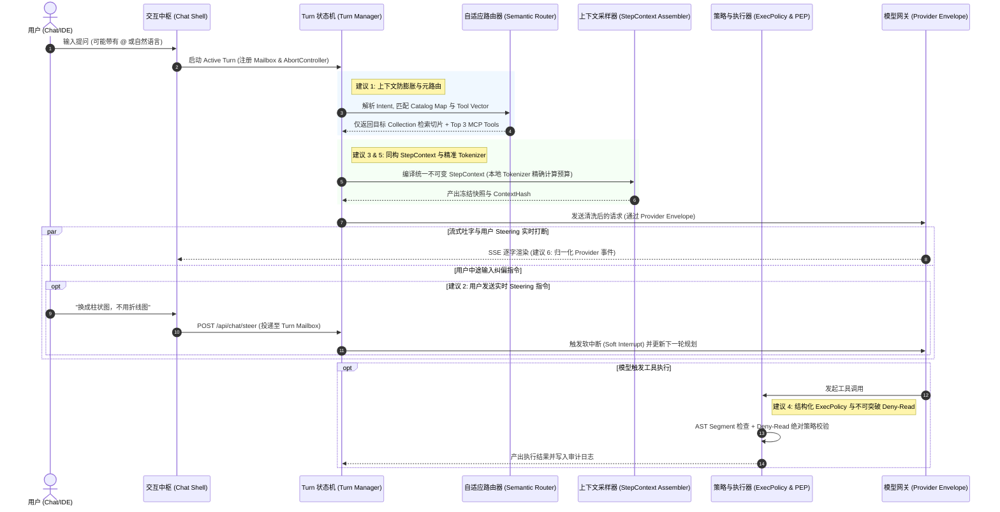

# Pivot 对照 Codex Harness 六项进阶对齐建议与实施路线

> **文档性质**：系统架构深化设计 / 进阶对齐指南  
> **基准报告**：[`Pivot对照CodexHarness策略研究.md`](./Pivot对照CodexHarness策略研究.md)  
> **更新时间**：2026年9月  
> **适用范围**：Pivot 会话核心 (`server/routes/chat/`)、Agent 执行面 (`server/services/agent-runtime/`)、安全与策略 (`server/services/agent-policy.js` 等)、桌面端运行时 (`desktop/agent-runtime/`)

---

## 目录
- [一、 审计背景与深化动因](#一-审计背景与深化动因)
- [二、 六项进阶对齐建议详细设计](#二-六项进阶对齐建议详细设计)
  - [建议 1：上下文防膨胀与自适应元路由 (Adaptive Meta-Routing & Pruning)](#建议-1上下文防膨胀与自适应元路由-adaptive-meta-routing--pruning)
  - [建议 2：Chat Turn 生命周期与实时转向打断机制 (Turn Steering & Interruptions)](#建议-2chat-turn-生命周期与实时转向打断机制-turn-steering--interruptions)
  - [建议 3：跨入口 StepContext 与窗口快照完全同构归一 (Universal StepContext Serialization)](#建议-3跨入口-stepcontext-与窗口快照完全同构归一-universal-stepcontext-serialization)
  - [建议 4：结构化 ExecPolicy 与绝对 Deny-Read 安全约束 (AST Segment Parsing & Non-bypassable Deny-Read)](#建议-4结构化-execpolicy-与绝对-deny-read-安全约束-ast-segment-parsing--non-bypassable-deny-read)
  - [建议 5：本地高精度 Tokenizer 实时预判与精准滑动压缩 (Local Tokenizer Calibration & Precise Compaction)](#建议-5本地高精度-tokenizer-实时预判与精准滑动压缩-local-tokenizer-calibration--precise-compaction)
  - [建议 6：Provider 全生命周期原子事件枚举与状态机归一 (Comprehensive Provider Event Lifecycle)](#建议-6provider-全生命周期原子事件枚举与状态机归一-comprehensive-provider-event-lifecycle)
- [三、 架构交互时序与核心流转图](#三-架构交互时序与核心流转图)
- [四、 Pivot 对应工程改造与文件落地清单](#四-pivot-对应工程改造与文件落地清单)
- [五、 演进优先级与三阶段实施规划](#五-演进优先级与三阶段实施规划)
- [六、 质量验收标准与测试矩阵](#六-质量验收标准与测试矩阵)

---

## 一、 审计背景与深化动因

在《Pivot对照CodexHarness策略研究.md》的全面审计中，已确认 Pivot 在生产级 Agent 底座上达成了多项重大突破：**不可变 `AgentStepContext` 快照、WorldState 窗口版本链、统一 `ToolOrchestrator`、只读并发/写入屏障调度器、PostgreSQL 追加写入事实事件日志（`agent_events`）与 Outbox、多 Agent `AgentControl` 治理**。

然而，审计报告同时在“差距”、“最值得借鉴开发的能力”和“剩余工程风险”章节中指出：若要使 Pivot 从“优秀的业务 Agent 平台”真正演进为**具备顶级 Harness 韧性、高确定性与极致交互体验的工业级中枢**，仍需在会话动态控制、上下文预算防膨胀、全入口一致性及深层命令安全策略等 6 个核心维度进行系统性深化。

---

## 二、 六项进阶对齐建议详细设计

### 建议 1：上下文防膨胀与自适应元路由 (Adaptive Meta-Routing & Pruning)

#### 1.1 Codex Harness 做法
Codex 在应对几十万行代码和成百上千文件时，坚决反对粗暴全量拼装。其底层构建了 **Repo Map（基于 AST 的精简符号骨架地图）+ Jaccard 相似度启发式**，在模型推理前动态计算最相关的代码片段，实现“上下文即时切片合成（JIT Context Synthesis）”。

#### 1.2 Pivot 现状与痛点
审计报告 3.15 明确指出：“**动态上下文膨胀风险已存在：MCP、RAG、长期记忆、附件、Skill 会无脑叠加**”。
* 用户若勾选过多知识库或启用海量 MCP 工具，Prompt Token 会迅速膨胀到数千甚至数万，引发模型注意力分散（Lost in the middle）或同类工具相互干扰。

#### 1.3 对齐实施方案
直接落地《[Pivot对话自适应感知与动态路由改造综合方案.md](../../Pivot对话自适应感知与动态路由改造综合方案.md)》：
1. **构建 Knowledge Catalog Map**：借鉴 Repo Map 理念，为系统全部 Collection 自动生成轻量级语义骨架，常驻内存向量表；
2. **置信度门禁（Confidence Gating）**：非信息性输入（如闲聊或纯文本润色）跳过 RAG 检索；
3. **两阶段定向 Chunk 召回**：先元路由锁定 Top 1~2 个 Collection，再做精准向量召回；
4. **JIT Tool Discovery**：海量 MCP 工具根据 Query 语义向量检索，仅将最匹配的 3~5 个工具动态注入当前 Request，将 Prompt Token 消耗削减 60% 以上。

---

### 建议 2：Chat Turn 生命周期与实时转向打断机制 (Turn Steering & Interruptions)

#### 2.1 Codex Harness 做法
Codex 将多轮对话抽象为严密的 Turn 状态机：`start` -> `steer` -> `interrupt` -> `recovery`。
* **Steering 转向机制**：当大模型正在流式输出长文本，或者正在执行多步工具调用循环时，用户随时发送的纠偏输入（如“不对，只要统计前三行”或“换一种图表类型”）**不是作为全新独立 HTTP 会话排队，而是作为动态输入即时注入正在活动的 Turn Mailbox**，引导模型实时改变推理轨迹。

#### 2.2 Pivot 现状与痛点
* Pivot 目前的 Agent Run 有完备的状态机，但普通的 **Chat 对话仍是经典 Web 请求响应模型**；
* 用户在生成过程中若发现方向跑偏，只能生硬地点击“停止生成”，历史上下文丢失当前轮次的推演链，必须重写提问另起一轮。

#### 2.3 对齐实施方案
1. **抽象统一 `TurnContext`**：
   ```javascript
   // 内存与 Redis/PG 维护的活跃 Turn 对象
   class ActiveChatTurn {
       constructor(turnId, sessionId) {
           this.turnId = turnId;
           this.sessionId = sessionId;
           this.mailbox = []; // 接收实时转向指令
           this.abortController = new AbortController();
           this.status = 'running'; // running | steering | interrupted | completed
       }
   }
   ```
2. **引入 `turn/steer` 端点与 SSE 通道协作**：
   - 当收到 `/api/chat/steer` 请求时，若当前 Turn 正在进行工具调用或模型思考，将用户的 steering 文本作为 `user_feedback` 插入下一轮规划观察数组；
   - 若模型正在吐出最终文字，则触发优雅截断（Soft Interrupt），并保留已生成的前文无缝续写。

---

### 建议 3：跨入口 StepContext 与窗口快照完全同构归一 (Universal StepContext Serialization)

#### 3.1 Codex Harness 做法
无论是来自 CLI 终端、Web 界面、IDE 插件还是自动化脚本，进入 Harness 的每一次采样（Step），其生成的 `StepContext` 数据契约、字段排序、序列化格式和哈希计算算法完全 100% 同构。

#### 3.2 Pivot 现状与痛点
审计报告指出：“*Agent streaming、JSON planner、DAG 节点已实现 hash 一致；Chat 持久化了等价 context snapshot，desktop 每个工具步骤也落盘了 hash；但三者尚未完全复用同一对象序列化，统一审计字段仍存在入口差异*”。

#### 3.3 对齐实施方案
1. **消除双轨序列化实现**：
   - 废除 `chat-context-state-store.js` 内部特异的序列化逻辑；
   - 统一由 `server/services/agent-step-context.js` 中的 `compileStepContext()` 与 `serializeStepContext()` 接管所有入口（Agent Run、Chat Session、Desktop Runtime）；
2. **统一审计协议与窗口回放 API**：
   - 统一数据库 `chat_context_windows` 与 `agent_context_windows` 的字段命名规范与哈希生成函数；
   - 提供跨入口一致的快照回放服务：`getStepContextByHash(contextHash)`。

---

### 4. 建议 4：结构化 ExecPolicy 与绝对 Deny-Read 安全约束 (AST Segment Parsing & Non-bypassable Deny-Read)

#### 4.1 Codex Harness 做法
Codex 针对可能执行 Shell 命令的环境，设计了两道不可突破的代码级防线：
1. **命令 AST 分段解析（Command Segment Parsing）**：不依赖死板的字符串匹配，而是解析 Bash/PowerShell 的命令抽象语法树（AST），对每个管道符、重定向和子 Shell 建立 `Allow / Prompt / Forbidden` 组合规则；
2. **绝对 Deny-Read 不变量（Non-bypassable Deny-Read）**：将“敏感凭证与文件保护”作为绝对约束。即便一条命令在沙箱失败后尝试降级或请求用户提权审批，**任何形式的提权与重试都绝对不能突破 Deny-Read 规则**。

#### 4.2 Pivot 现状与痛点
* Pivot 目前主要依靠 Workspace Jail（工作区路径校验）、符号链接越权阻断以及 OS 级 cgroup/Job Object；
* 审计报告指出：“*没有报告所述独立 deny-read 优先级不变量；目前工作区 Jail 更偏路径边界，不能表达‘命令允许但某类文件读取始终禁止’，缺乏结构化 ExecPolicy*”。

#### 4.3 对齐实施方案
1. **新增 `server/services/agent-exec-policy.js`**：
   - 在执行桌面端或服务端命令时，引入轻量 AST 解析器（解析 shell command segment）；
   - 定义三段式规则判决表：`{ segments: [...], verdict: 'ALLOW' | 'APPROVAL_REQUIRED' | 'DENIED' }`；
2. **建立不可绕过的 Deny-Read 过滤器**：
   - 即使命令获得管理员审批执行，在底层 I/O 层级强制对 `.env`、`id_rsa`、私钥、系统关键配置实施物理阻断；
   - 任何重试机制（Retry Policy）遇到 `DENIED_READ` 错误直接永久熔断，严禁自动升级沙箱绕过。

---

### 建议 5：本地高精度 Tokenizer 实时预判与精准滑动压缩 (Local Tokenizer Calibration & Precise Compaction)

#### 5.1 Codex Harness 做法
Codex 使用与底层模型架构完全严格对齐的本地 Tokenizer（如 `tiktoken`、BPE 编码器），在推理前精确到单 Token 进行预算切分与动态滑动窗口裁剪。

#### 5.2 Pivot 现状与痛点
* Pivot 的 `estimateTokens()` 与 `buildContextMeta()` 目前采用基于中英文字符加权的比率估算；
* 虽在 v0.1.24 落地了 `provider-usage-calibration.js` 来异步记录偏差，但前置组装上下文时仍存在估算误差，在长文档会话压缩时可能导致“过早归档”或“微量溢出导致上游报错”。

#### 5.3 对齐实施方案
1. **在服务端引入轻量级本地 Tokenizer 引擎**：
   - 为 OpenAI 系列、Claude 系列及 Qwen/DeepSeek 系列分别配置轻量化 BPE 离线词表映射；
2. **闭环校准联动机制**：
   - 上下文预组装时，调用本地快速 Tokenizer 计算精确 Token 长度；
   - 请求完成后，将 Provider 真实返回的 `usage` 回写校验；
   - 动态微调该模型族的校准系数，彻底告别字符经验估算。

---

### 建议 6：Provider 全生命周期原子事件枚举与状态机归一 (Comprehensive Provider Event Lifecycle)

#### 6.1 Codex Harness 做法
Codex 对所有大模型供应商的流式输出构建了一套完整的、全枚举的状态机，包括但不限于：
* `item.created` / `item.done`
* `response.output_item.added`
* `rate_limit_warning`
* `safety_buffering`
* `reasoning_summary` / `reasoning_delta`
* `model_verification`

#### 6.2 Pivot 现状与痛点
* Pivot 目前已覆盖了主要的 `model.requested`、`model.delta`、`model.completed` 和工具调用增量解析；
* 对于 Responses API 的部分长尾流式事件（如安全缓冲、验证阶段、限流前置告警等），尚未形成标准化的全枚举事件流，上游差异容易造成前端渲染层打补丁。

#### 6.3 对齐实施方案
1. **在 `server/services/agent-provider-envelope.js` 中定义统一事件枚举字典**：
   ```javascript
   const ProviderEventTypes = Object.freeze({
       ITEM_CREATED: 'provider.item.created',
       DELTA_TEXT: 'provider.delta.text',
       DELTA_REASONING: 'provider.delta.reasoning',
       DELTA_TOOL_ARGS: 'provider.delta.tool_args',
       SAFETY_BUFFERED: 'provider.safety.buffered',
       RATE_LIMITED: 'provider.rate_limited',
       ITEM_DONE: 'provider.item.done',
       COMPLETED: 'provider.completed'
   });
   ```
2. **统一事件归一化中继器**：
   - 无论上游是 OpenAI Responses、Anthropic Messages 还是本地 Ollama，在流入系统内部前统一转译为标准事件，再写入 `agent_events` 表并推入 SSE 通道。

---

## 三、 架构交互时序与核心流转图



---

## 四、 Pivot 对应工程改造与文件落地清单

| 建议项 | 改造模块 / 文件 | 改造动作 | 核心工程改动 |
| :--- | :--- | :---: | :--- |
| **建议 1<br>(自适应元路由)** | `server/services/semantic-router.js`<br>`server/services/chat-context-assembler.js` | **[新增]**<br>**[改造]** | 建立知识库与工具的内存向量索引，实现两阶段精准召回与 Top-K 工具动态装配。 |
| **建议 2<br>(Turn Steering)** | `server/services/chat-turn-manager.js`<br>`server/routes/chat/index.js` | **[新增]**<br>**[改造]** | 建立内存 Turn 注册表，暴露 `/api/chat/turns/:id/steer` 端点，支持多步生成中途纠偏。 |
| **建议 3<br>(StepContext归一)**| `server/services/agent-step-context.js`<br>`server/services/chat-context-state-store.js` | **[改造]**<br>**[改造]** | 废弃 Chat 独立序列化，全入口共用单一同构序列化函数与快照哈希校验算法。 |
| **建议 4<br>(ExecPolicy & Deny-Read)** | `server/services/agent-exec-policy.js`<br>`server/services/agent-sandbox.js` | **[新增]**<br>**[改造]** | 实现命令 AST 分段判定，并在沙箱与执行器中建立不可被任何重试绕过的 Deny-Read 约束。 |
| **建议 5<br>(精准 Tokenizer)** | `server/services/rag-tokenizer.js`<br>`server/services/provider-usage-calibration.js` | **[改造]**<br>**[改造]** | 引入常用模型族离线 BPE 词表映射，将字符经验估算升级为本地毫秒级精准 Token 计量。 |
| **建议 6<br>(Provider 事件归一)**| `server/services/agent-provider-envelope.js`<br>`server/services/model-stream-service.js` | **[改造]**<br>**[改造]** | 建立全枚举 Provider 事件字典，将 Responses/Messages 各类细分流式事件统一定义并分发。 |

---

## 五、 演进优先级与三阶段实施规划

```
┌─────────────────────────────────────────────────────────────────────────┐
│                    Pivot 对齐演进三阶段实施路线图                       │
├─────────────────────────────────────────────────────────────────────────┤
│ 【阶段一 (P0)：核心体验与防膨胀闭环】                                    │
│ 1. 落地建议 1 (自适应元路由): 彻底解决用户手动选知识库/工具的痛点，降低成本 │
│ 2. 落地建议 3 (全入口 StepContext 归一): 消除 Chat/Agent/Desktop 序列化缝隙│
├─────────────────────────────────────────────────────────────────────────┤
│ 【阶段二 (P1)：交互韧性与精准计量深化】                                  │
│ 3. 落地建议 2 (Chat Turn Steering): 支持流式生成与多步执行中的实时交互纠偏  │
│ 4. 落地建议 5 (高精度 Tokenizer 实时校准): 消除滑动窗口压缩的估算误差    │
├─────────────────────────────────────────────────────────────────────────┤
│ 【阶段三 (P2)：极致安全与协议全枚举】                                    │
│ 5. 落地建议 4 (结构化 ExecPolicy 与 Deny-Read): 夯实命令执行的绝对安全屏障 │
│ 6. 落地建议 6 (Provider 细分事件全状态机): 支撑复杂上游流式事件标准规范化   │
└─────────────────────────────────────────────────────────────────────────┘
```

---

## 六、 质量验收标准与测试矩阵

每项建议在落地时，均须通过严格的 PostgreSQL-only 自动化回归与契约测试：

1. **自适应元路由验收**：
   - 验证无勾选状态下，自然语言涉及专业制度时，两阶段路由器对目标 Collection 的精准命中率 $\ge 90\%$；闲聊提问时不触发多余向量查询。
2. **Turn Steering 转向验收**：
   - 在 Mock SSE 长文本生成中途发送 `/steer` 指令，验证上游连接能够优雅响应，并成功在下一观察帧中看到纠偏指令生效。
3. **StepContext 同构验收**：
   - 运行针对 Chat 与 Agent 的交叉快照测试，确保同一 prompt/tool 编译出的 `contextHash` 在不同入口具有绝对幂等性。
4. **Deny-Read 安全验收**：
   - 构造复合命令测试用例（如管道连接、环境变量注入尝试读取 `.env`），验证即便带有合法管理员 Token，底层 I/O 依然能返回非绕过的 `DENIED_READ` 并终止执行。
5. **Tokenizer 精度验收**：
   - 对照 Provider 返回的真实 usage 字段，检验本地 Tokenizer 预估误差在 2% 以内。

---

## 七、 结语

通过系统化落地这 6 项进阶建议，Pivot 将在已有的坚实工程底座之上，完全补齐与 Codex Harness 在**动态交互能力、上下文自适应合成、同构一致性以及深层安全不变量**上的全部差距，真正达成兼具工业级安全受控与世界顶级流畅体验的下一代 AI 智能中枢。
